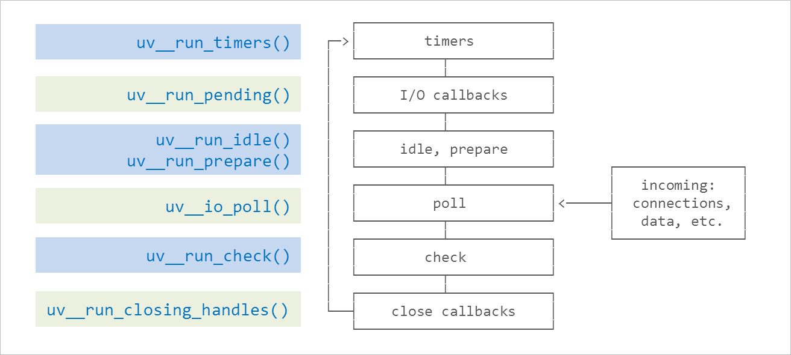

### 变量和类型

#### 1.`JavaScript`规定了几种语言类型

7种，

undefined,null,Number,Boolean,

String,Object,Symbol

#### 2.`JavaScript`对象的底层数据结构是什么

Null (js中的数据在底层是以二进制存储，如果前三位为0，那么就会判定为object，而null的所有都为0)

**js基本类型数据都是直接按值存储在栈中的**(Undefined、Null、不是new出来的布尔、数字和字符串)

**js引用类型数据被存储于堆中** (如对象、数组、函数等，它们是通过拷贝和new出来的），引用类型的数据的地址指针存储于栈中，地址指针指向堆中的数据

Object>HeapObject（存储）>JSReceiver(用于原型查找)->(FixedArrayBase->FixedArray)+JSObject->JSArray+JSCollection+(JSFunction>JSMap+JSSet)

#### 3.`Symbol`类型在实际开发中的应用、可手动实现一个简单的`Symbol`

应用场景：1.使用Symbol来作为对象属性名（key）

2.使用Symbol来替代常量

3.使用Symbol定义类的私有属性和方法

symbol 类型的key不能被Object.keys和for---of

#### 4.`JavaScript`中的变量在内存中的具体存储形式

`JavaScript` 中的变量分为基本类型和引用类型:

基本类型: 保存在栈内存中的简单数据段，它们的值都有固定的大小，保存在栈空间，通过按值访问

引用类型: 保存在堆内存中的对象，值大小不固定，栈内存中存放的该对象的访问地址指向堆内存中的对象，`JavaScript` 不允许直接访问堆内存中的位置，因此操作对象时，实际操作对象的引用

#### 5.基本类型对应的内置对象，以及他们之间的装箱类型的拆箱操作

String，Number，Boolean

```
// 隐式装箱： 每当读取一个基本类型的值时，后台会创建一个该基本类型所对应的对象。
  // 在这个基本类型上调用方法，其实是在这个基本类型对象上调用方法。
  // 这个基本类型的对象是临时的，它只存在于方法调用那一行代码执行的瞬间，执行方法后立刻被销毁。
  let num=123;
  num.toFixed(2); // '123.00'//上方代码在后台的真正步骤为
  var c = new Number(123);
  c.toFixed(2);
  c = null;
  // 显式装箱: 通过内置对象 Boolean、Object、String 等可以对基本类型进行显示装箱。
  var obj = new String('123');
```

#### 6.理解值类型和引用类型

赋值传引用地址，值类型直接赋值

#### 7.`null`和`undefined`的区别

undefined类型表示未定义，值只有一个undefined，

undefined是一个变量，而非关键字。

而Null只有一个值，null，表示空值，是关键字，可以通过null关键字来获取null值

#### 8.至少可以说出三种判断`JavaScript`数据类型的方式，以及他们的优缺点，如何准确的判断数组类型

typeof 

instanceof

constructor

Object,prototype.toString.call([])=='[object Array]'

Array.isArray()

#### 9.可能发生隐式类型转换的场景以及转换原则，应如何避免或巧妙应用

- isNaN ()
- 自增/自减运算符：`++`、`—-`
- 正号/负号：`+a`、`-a`
- 加号：`+`
- 运算符：`-`、`*`、`/`
- ==在不同类型时进行隐式类型转换
  - 会先判断是否在对比 null 和 undefined，是的话就会返回 true
  - 判断两者类型是否为 string 和 number，是的话就会将字符串转换为 number
  - 判断其中一方是否为 boolean，是的话就会把 boolean 转为 number 再进行判断
  - 判断其中一方是否为 object 且另一方为 string、number 或者 symbol，是的话就会把 object 转为原始类型再进行判断
  - 两边都是对象的话，那么只要不是同一对象的不同引用，都为false

- 逻辑运算符：`&&`、`||`、`！` 。非布尔值进行**与或**运算时，会先将其转换为布尔值，然后再运算，但运算结果是**原值**。具体可以看下一篇文章《运算符》。

- 关系运算符：`<`、`>` `<=` `>=`等。关系运算符，得到的运算结果都是布尔值：要么是true，要么是false。

#### 10.出现小数精度丢失的原因，`JavaScript`可以存储的最大数字、最大安全数字，`JavaScript`处理大数字的方法、避免精度丢失的方法

- 精度丢失原因，说是 `JavaScript` 使用了 `IEEE 754` 规范，二进制储存十进制的小数时不能完整的表示小数
- 能够表示的最大数字 `Number.MAX_VALUE` 等于 `1.7976931348623157e+308` ,最大安全数字 `Number.MAX_SAFE_INTEGER` 等于 `9007199254740991`
- 避免精度丢失
  - 计算小数时，先乘 `100` 或 `1000`，变成整数再运算
  - 如果值超出了安全整数，有一个最新提案，`BigInt` 大整数，它可以表示任意大小的整数，注意只能表示整数，而不受安全整数的限制

### 原型和原型链

#### 1.理解原型设计模式以及`JavaScript`中的原型规则

**原型模式** ：是指原型实例指向创建对象的种类，并通过拷贝这些原型创建新的对象，是一种用来创建对象的模式，也就是创建一个对象作为另一个对象的prototype属性。

创建方式：**Object.create(prototype, optionalDescriptorObjects)** ②prototype

 **原型原则**：

①所有的引用类型（数组，对象，函数）都有对象属性，都可以自由扩展属性。null除外；

②所有的引用类型（数组，对象，函数）都有对象属性，对象均有`__proto__`属性，属性值是一个普通的对象，`__proto__`的含义是隐式原型;

③所有的函数，均有一个prototype属性，属性值是一个普通的对象，`prototype`的含义是显式原型;

④所有的引用类型（数组，对象，函数）的属性`__proto__`指向它的构造函数prototype值

⑤当获得一个对象的属性时，首先在对象本身查找，如果没有会去它的`__proto__`中查找

#### 2.`instanceof`的底层实现原理，手动实现一个`instanceof`

将对象的`__proto__`指向与构造函数的prototype判断

```js

function new_instance_of(leftVaule, rightVaule) { 
    let rightProto = rightVaule.prototype; // 取右表达式的 prototype 值
    leftVaule = leftVaule.__proto__; // 取左表达式的__proto__值
    while (true) {
    	if (leftVaule === null) {
            return false;	
        }
        if (leftVaule === rightProto) {
            return true;	
        } 
        leftVaule = leftVaule.__proto__ 
    }

```

#### 4.实现继承的几种方式以及他们的优缺点

**构造函数**：`Parent.call(this)`，优点：可以继承父类属性，避免引用类型的属性被所有子类共享，可以向父类构造函数里传参；缺点：无法继承Parent原型链上的属性和方法，②方法都在构造函数中定义，每次创建实例都会创建一遍方法

**原型链继承**：`Child.prototype=new Parent()`把prototype设置为父类的实例，缺点：①无法向父类构造函数里传参数②父类原型上的引用属性被所有子类共享，

**组合继承**:可以继承父类属性及原型链属性，也可向父类构造函数传参数，融合了构造函数和原型链继承的优点，缺点：父类构造函数被调用了两次

```
function Child(){
   Parent.call(this)
}
Child.prototype=new Parent();
//优化
function Child(){
   Parent.call(this)
}
Child.prototype=Parent.prototype;//缺点：因为原型上有个属性constructor，子类的实例constructor也是parent，无法区分实例对象是父类还是子类，子类原型上添加属性影响父类

```

**寄生继承**: 优点可以添加方法和属性

```
function createChild(p){
   var o=Object.create(p);
   o.newMethod=function(){
   }
   return o;
}
```

**寄生组合继承**

```
function object(o) {
  function F() {}
  F.prototype = o;
  return new F();
}
function inheritPrototype(subClass,superClass){
	var p=object(superClass.prototype);
	p.constructor=subClass;
	subClass.prototype=p;
}
function Child(){
   Parent.apply(this,arguments);
}
inheritPrototype(Child, Parent);
```

优点：只调用了一次Parent构造函数，并且因此避免了在 Parent.prototype 上面创建不必要的、多余的属性。与此同时，原型链还能保持不变；

**ES6 class** **extends**

```js
class Parent {
    constructor(x,y){
        this.x = x;
        this.y = y;
    }
    toString(){

    }
}

class Child extends Parent{
    constructor(x,y,color){
        super(x,y);
        this.color = color;
    }
    toString(){
        return super.toString();
    }
}
/*
* 通过extends关键字继承了Parent类所有的属性和方法。
* 子类的constructor方法 和 toString方法中都出现了super关键字,
* 在这里表示父类的构造函数，用来新建父类的this对象。
* 子类必须在constructor方法中调用super方法，因为子类的this对象必须通过父类的构造函数完成创建，
* 并且得到与父类同样的实例属性和方法。如果不调用，子类就得不到this对象，就不能进行二次加工。
* 要注意的一个地方是，在子类的构造函数中，只有调用super才可以使用this关键字，
* 所以this关键字要放到super关键字之后，
* 是因为子类实例的构建，基于父类实例，只有super方法能调用父类实例。
*/
/*
* ES5的继承实质是先创建子类的实例对象this，然后再将父类的方法添加到this上面(Parent.apply(this))
* ES6的继承实质是先将父类实例对象的属性和方法加到this上面(所以需先调用super方法)，然后再用子类构造函数修改this
*/

class Child extends Parent{

}
//等同于
class Child extends Parent{
    constructor(...args){
        super(...args);
    }
}
/*
* 如果子类没有定义constructor方法，这个方法会被默认添加，
* 也就是说不管有没有显示的定义，子类都有constructor方法。
*/
class Parent {

}

class Child extends Parent{
    constructor(){
        super();
    }
}

/*
* super这个关键字既可以当做函数使用，也可以当做对象使用
* 作为函数调用时，代表父类的构造函数，子类构造函数必须执行一次super函数
* super虽然代表了父类Parent的构造函数，但是返回的是子类Child的实例
* 即super内部的this指的是Child，super在这里就相当于：
* Parent.prototype.constructor.call(this)
* super作为函数使用时，super()只能用在子类的构造函数中*/

class Parent {
    outPut(){
        console.log(1)
    }
}

class Child extends Parent{
    constructor(){
        super();
        console.log(super.outPut())
    }
}

/*
* super作为对象时，在普通方法中指向父类的原型对象，静态方法中指向父类
* super在普通方法中代表Parent.prototype,所以super.outPut()就相当于
* Parent.prototype.outPut()
* 注意，父类实例上的方法或属性是无法通过super调用的*/
```


#### 5.至少说出一种开源项目(如`Node`)中应用原型继承的案例

Vue中

#### 6.可以描述`new`一个对象的详细过程，手动实现一个`new`操作符

①创建一个空对象

②将父类构造函数this指针指向创建的Object

③如何父类构造函数有返回的对象，返回该对象，否则，就返回新建的对象

```
function myNewOpt(Obj,args){
    var o=Object.create(Obj.prototype);
    Obj.apply(o,args);
    return o;
}
```


#### 7.理解`es6 class`构造以及继承的底层实现原理

```
class Parent {
    constructor(name,age){
        this.name = name;
        this.age = age;
    }
    speakSomething(){
        console.log("I can speek chinese");
    }
}
```

class在babel编译后，

```
"use strict";

var _createClass = function () {
    function defineProperties(target, props) {
        for (var i = 0; i < props.length; i++) {
            var descriptor = props[i];
            descriptor.enumerable = descriptor.enumerable || false;
            descriptor.configurable = true;
            if ("value" in descriptor) descriptor.writable = true;
            Object.defineProperty(target, descriptor.key, descriptor);
        }
    }

    return function (Constructor, protoProps, staticProps) {
        if (protoProps) defineProperties(Constructor.prototype, protoProps);
        if (staticProps) defineProperties(Constructor, staticProps);
        return Constructor;
    };
}();

function _classCallCheck(instance, Constructor) {
    if (!(instance instanceof Constructor)) {
        throw new TypeError("Cannot call a class as a function");
    }
}

var Parent = function () {
    function Parent(name, age) {
        _classCallCheck(this, Parent);

        this.name = name;
        this.age = age;
    }

    _createClass(Parent, [{
        key: "speakSomething",
        value: function speakSomething() {
            console.log("I can speek chinese");
        }
    }]);

    return Parent;
}();
```

在子类构造时，先调用父类构造函数设置this的属性和方法，然后子类构造中扩展修改this，底层实现使用了寄生组合继承

**继承**

```js
class Parent {
    static height = 12
    constructor(name,age){
        this.name = name;
        this.age = age;
    }
    speakSomething(){
        console.log("I can speek chinese");
    }
}
Parent.prototype.color = 'yellow'


//定义子类，继承父类
class Child extends Parent {
    static width = 18
    constructor(name,age){
        super(name,age);
    }
    coding(){
        console.log("I can code JS");
    }
}

var c = new Child("job",30);
c.coding()
```

转码之后的代码变成了这样

```js
"use strict";

var _createClass = function () {
    function defineProperties(target, props) {
        for (var i = 0; i < props.length; i++) {
            var descriptor = props[i];
            descriptor.enumerable = descriptor.enumerable || false;
            descriptor.configurable = true;
            if ("value" in descriptor) descriptor.writable = true;
            Object.defineProperty(target, descriptor.key, descriptor);
        }
    }

    return function (Constructor, protoProps, staticProps) {
        if (protoProps) defineProperties(Constructor.prototype, protoProps);
        if (staticProps) defineProperties(Constructor, staticProps);
        return Constructor;
    };
}();

function _possibleConstructorReturn(self, call) {
    if (!self) {
        throw new ReferenceError("this hasn't been initialised - super() hasn't been called");
    }
    return call && (typeof call === "object" || typeof call === "function") ? call : self;
}

function _inherits(subClass, superClass) {
    if (typeof superClass !== "function" && superClass !== null) {
        throw new TypeError("Super expression must either be null or a function, not " + typeof superClass);
    }
    subClass.prototype = Object.create(superClass && superClass.prototype, {
        constructor: {
            value: subClass,
            enumerable: false,
            writable: true,
            configurable: true
        }
    });
    if (superClass) Object.setPrototypeOf ? Object.setPrototypeOf(subClass, superClass) : subClass.__proto__ = superClass;
}

function _classCallCheck(instance, Constructor) {
    if (!(instance instanceof Constructor)) {
        throw new TypeError("Cannot call a class as a function");
    }
}

var Parent = function () {
    function Parent(name, age) {
        _classCallCheck(this, Parent);

        this.name = name;
        this.age = age;
    }

    _createClass(Parent, [{
        key: "speakSomething",
        value: function speakSomething() {
            console.log("I can speek chinese");
        }
    }]);

    return Parent;
}();

Parent.height = 12;

Parent.prototype.color = 'yellow';

//定义子类，继承父类

var Child = function (_Parent) {
    _inherits(Child, _Parent);

    function Child(name, age) {
        _classCallCheck(this, Child);

        return _possibleConstructorReturn(this, (Child.__proto__ || Object.getPrototypeOf(Child)).call(this, name, age));
    }

    _createClass(Child, [{
        key: "coding",
        value: function coding() {
            console.log("I can code JS");
        }
    }]);

    return Child;
}(Parent);

Child.width = 18;


var c = new Child("job", 30);
c.coding();
```

原理：

```
function F(){}
F.prototype = superClass.prototype
subClass.prototype = new F()
subClass.prototype.constructor = subClass
```

### 作用域和闭包

#### 1.理解词法作用域和动态作用域

词法作用域是由写代码时将变量和块作用域写在哪里决定的，函数的词法作用域由函数声明所处位置决定的

查找 词法作用域查找只会查找一级标识符

遮蔽 从内逐级向外查找作用域，直到遇到第一个匹配的标识符为止，在多层嵌套作用域内定义同名标识符，产生遮蔽效应

动态作用域是运行时确定的，关注函数从何处调用

注js只有词法作用域，只是this的某种机制像动态作用域

```
function foo(){
    console.log(a);//3(而不是2！)//动态作用域是应该是3，但是运行js代码输出的还是2
}
function bar(){
    var a=3;
    foo();
}
var a=2;
bar();
```


#### 2.理解`JavaScript`的作用域和作用域链

全局作用域

局部作用域

全局变量的作用域是全局的，在代码的任何地方都是有定义的。然而函数的参数和局部变量只在函数体内有定义。另外局部变量的优先级要高于同名的全局变量,也就是说当局部变量与全局变量重名时，局部变量会覆盖全局变量。

作用域链

作用域链就是由多个作用域组成的，当在自身作用域内找不到该变量的时候，会沿着作用域链逐步向上查找，若在全局作用域内部仍找不到该变量，则会抛出异常。

#### 3.理解`JavaScript`的执行上下文栈，可以应用堆栈信息快速定位问题

执行期上下文

当**函数执行**时（准确来说，是在函数发生预编译的前一刻），会创建一个执行期上下文的内部对象。一个执行期上下文定义了一个函数执行时的环境。

每调用一次函数，就会创建一个新的上下文对象，他们之间是相互独立且独一无二的。当函数执行完毕，它所产生的执行期上下文会被销毁。

#### 4.`this`的原理以及几种不同使用场景的取值

this代表函数调用相关联的对象，通常称之为执行上下文。

1. 作为函数直接调用，非严格模式下，this指向window，严格模式下，this指向undefined；
2. 作为某对象的方法调用，this通常指向调用的对象。
3. 使用apply、call、bind 可以绑定this的指向。
4. 在构造函数中，this指向新创建的对象
5. 箭头函数没有单独的this值，this在箭头函数创建时确定，它与声明所在的上下文相同。

#### 5.闭包的实现原理和作用，可以列举几个开发中闭包的实际应用

闭包的概念：指有权访问另一个函数作用域中的变量的函数，一般情况就是在一个函数中包含另一个函数。

闭包的作用：访问函数内部变量、保持函数在环境中一直存在，不会被垃圾回收机制处理

产生闭包：

将一个函数作为另一个函数的返回值

将函数作为实参传递给另一个函数调用

变量私有化

应用：防抖函数，计数器

#### 6.理解堆栈溢出和内存泄漏的原理，如何防止

**内存泄漏**：**占用的内存**没有及时释放。

注意，内存泄露的次数积累多了，就容易导致内存溢出。

**常见的内存泄露**：

- 1.意外的全局变量

- 2.没有及时清理的计时器或回调函数

- 3.闭包

#### 7.如何处理循环的异步操作

for循环

递归处理异步函数

#### 8.理解模块化解决的实际问题，可列举几个模块化方案并理解其中原理

**CommonJS规范**，NodeJS使用，加载时运行，输出值的拷贝，会缓存结果，模块可多次加载，但只有第一次加载运行一次

**AMD**，Asynchronous Moudle Definition “异步模块定义”，需要在声明的时候指定所有的依赖，通过形参传递依赖到模块内容中，特点：提前执行（异步加载依赖先执行）+延迟执行

```
define(id?, dependencies, factory);
//使用
require('id')
```

**CMD**，与AMD主要区别在于定于模块与依赖引入部分。支持动态引入，特点：延迟执行（运行到需加载，根据顺序执行）

```
define(funtion(require, exports, moudle) {}

require
require.async
```

**ES6 Module** 编译时运行，输出值的引用

### 执行机制

#### 1.为何`try`里面放`return`，`finally`还会执行，理解其内部机制

当try和finally里都有return时，会忽略try的return，而使用finally的return。

- JVM 采用异常表的方式来处理 try catch 的跳转逻辑
- finally 的实现采用拷贝 finally 语句块的方式来实现 finally 一定会执行的语义逻辑

#### 2.`JavaScript`如何实现异步编程，可以详细描述`EventLoop`机制

一个 Event Loop 中，可以有一个或者多个任务队列(task queue)，一个任务队列便是一系列有序任务(task)的集合；**每个任务都有一个任务源(task source)，源自同一个任务源的 task 必须放到同一个任务队列，从不同源来的则被添加到不同队列。** setTimeout/Promise 等API便是任务源，而进入任务队列的是他们指定的具体执行任务。

浏览器为了能够使得JS内部(macro)task与DOM任务能够有序的执行，**会在一个(macro)task执行结束后，在下一个(macro)task 执行开始前，对页面进行重新渲染**，流程如下：

    (macro)task->渲染->(macro)task->...

microtask（又称为微任务），**可以理解是在当前 task 执行结束后立即执行的任务**。也就是说，在当前task任务后，下一个task之前，在渲染之前，执行所有microtask

*   执行一个宏任务（栈中没有就从事件队列中获取）
*   执行过程中如果遇到微任务，就将它添加到微任务的任务队列中
*   宏任务执行完毕后，立即执行当前微任务队列中的所有微任务（依次执行）
*   当前宏任务执行完毕，开始检查渲染，然后GUI线程接管渲染
*   渲染完毕后，JS线程继续接管，开始下一个宏任务（从事件队列中获取）

#### 3.宏任务和微任务分别有哪些

**宏任务**(macro)task主要包含：script(整体代码)、setTimeout、setInterval、I/O、UI交互事件、postMessage、MessageChannel、setImmediate(Node.js 环境)

**微任务**：Promise.then、MutationObserver(在指定的DOM发生变化时被调用)、process.nextTick(Node.js 环境)

#### 4.可以快速分析一个复杂的异步嵌套逻辑，并掌握分析方法

理解好任务队列，宏任务和微任务

#### 5.使用`Promise`实现串行

在promise中返回一个promise对象就是一个串行。

```js
//实现Promise串行
function makePromise(value){
    return new Promise(resolve=>{
        setTimeout(()=>{
            resolve(value)
        },Math.random()*1000)
    })
}
function print(value){
    console.log(value);
}

let promises = [1, 3, 4, 5, 6].map((item, index) => {
    return makePromise(item)
  });
  // 串行执行
let parallelPromises = promises.reduce(
    (total, currentValue) => total.then(() => currentValue.then(print)),Promise.resolve()
  )
  parallelPromises
.then(() => {
  console.log('total then done')
})
.catch(() => {
  console.log('done')
})
```


#### 6.`Node`与浏览器`EventLoop`的差异



- **timers 阶段**：这个阶段执行timer（`setTimeout`、`setInterval`）的回调

- **I/O callbacks 阶段**：执行一些系统调用错误，比如网络通信的错误回调

- **idle, prepare 阶段**：仅node内部使用

- **poll 阶段**：获取新的I/O事件, 适当的条件下node将阻塞在这里，当已有超时timer，执行它的回调函数

- **check 阶段**：执行 `setImmediate()` 的回调

- **close callbacks 阶段**：执行 `socket` 的 `close` 事件回调

  

浏览器环境下，`microtask`的任务队列是每个`macrotask`执行完之后执行。

而在Node.js中，`microtask`会在事件循环的各个阶段之间执行，也就是一个阶段执行完毕，就会去执行`microtask`队列的任务。

在nodejs中递归的调用`process.nextTick()`会导致I/O starving，官方推荐使用`setImmediate()`

#### 7.如何在保证页面运行流畅的情况下处理海量数据


#### 8.js的单线程模式

单线程，js的主要用途是与用户互动，以及操作DOM，如果使用多线程，容易产生复杂的同步问题。

- 所有的同步任务都在主线程上执行，形成一个执行栈，
- 主线程之外，存在一个任务队列，当异步任务有了运行结果，则会在任务队列中放置一个事件
- 一旦”执行栈”中的所有同步任务执行完毕，系统就会读取”任务队列”，看看里面有哪些事件。那些对应的异步任务，于是结束等待状态，进入执行栈，开始执行。

 - 主线程不断重复上面的第三步。

### 语法和API

#### 1.理解`ECMAScript`和`JavaScript`的关系

`JavaScript`包括核心语法，DOM，BOM，而核心语法实际上就是指ECMAScript，而JS又是不断在发展的, 而这个发展实际上最主要的就是ECMAScript版本的更新, 而DOM 和 BOM的更新较少, 因此, 可以认为 ECMAScript是JavaScript的参照, 而JavaScript是ECMAScript的一个实现. 

例如ECMAScript2015简称ES6

#### 2.熟练运用`es5`、`es6`提供的语法规范

#### 3.熟练掌握`JavaScript`提供的全局对象（例如`Date`、`Math`）、全局函数（例如`decodeURI`、`isNaN`）、全局属性（例如`Infinity`、`undefined`）

#### 4.熟练应用`map`、`reduce`、`filter` 等高阶函数解决问题

#### 5.`setInterval`需要注意的点，使用`settimeout`实现`setInterval`

回调函数在计时之后才开始执行, 如果主线程执行时间过长，时间间隔未必准确，

```js
function myInterval(callback,delay){
    function interval(){
        setTimeout(interval, delay);
        callback();
      }
      setTimeout(interval, delay)
}
```

#### 6.`JavaScript`提供的正则表达式`API`、可以使用正则表达式（邮箱校验、`URL`解析、去重等）解决常见问题

手机号码正则表达式
正则验证手机号，忽略前面的0，支持130-139，150-159。忽略前面0之后判断它是11位的。

```js
/^0*1(3|5)\d{9}$/
```

使用正则表达式实现删除字符串中的空格

```js
funtion trim(str) {
  let reg = /^\s+|\s+$/g
  return str.replace(reg, '');
}
```

限制文本框只能输入数字和两位小数点等等

```js
/^\d*\.\d{0,2}$/
```

只能输入小写的英文字母和小数点，和冒号，正反斜杠(：./\)

```js
/^[a-z\.:\/\\]*$/
```

替换小数点前内容为指定内容
例如：infomarket.php?id=197 替换为 test.php?id=197

```js
var reg = /^[^\.]+/;
var target = '---------';
str = str.replace(reg, target)
```

只匹配中文的正则表达式

```js
/[\u4E00-\u9FA5\uf900-\ufa2d]/ig
```

返回字符串的中文字符个数
先去掉非中文字符，再返回length属性。

```js
function cLength(str){
  var reg = /[^\u4E00-\u9FA5\uf900-\ufa2d]/g;
  //匹配非中文的正则表达式
  var temp = str.replace(reg,'');
  return temp.length;
}
```

正则表达式取得匹配IP地址前三段
只要匹配掉最后一段并且替换为空字符串就行了

```js
function getPreThrstr(str) {
  let reg = /\.\d{1,3}$/;
  return str.replace(reg,'');
}
```

匹配<ul>与</ul>之间的内容

```js
/<ul>[\s\S]+?</ul>/i
```


用正则表达式获得文件名
c:\images\tupian\006.jpg
可能是直接在盘符根目录下，也可能在好几层目录下，要求替换到只剩文件名。
首先匹配非左右斜线字符0或多个，然后是左右斜线一个或者多个。

```js
function getFileName(str){
  var reg = /[^\\\/]*[\\\/]+/g;
  // xxx\ 或是 xxx/
  str = str.replace(reg,'');
  return str;
}
```


绝对路径变相对路径
"http://23.123.22.12/image/somepic.gif"转换为："/image/somepic.gif"

```js
var reg = /http:\/\/[^\/]+/;
str = str.replace(reg,"");
```


用户名正则
用于用户名注册，，用户名只 能用 中文、英文、数字、下划线、4-16个字符。

```js
/^[\u4E00-\u9FA5\uf900-\ufa2d\w]{4,16}$/
```


匹配英文地址
规则如下:
包含 "点", "字母","空格","逗号","数字"，但开头和结尾不能是除字母外任何字符。

```js
/^[a-zA-Z][\.a-zA-Z,0-9]*[a-zA-Z]$/
```


正则匹配价格
开头数字若干位，可能有一个小数点，小数点后面可以有两位数字。

```js
/^\d+(\.\d{2})?$/
```


身份证号码的匹配
身份证号码可以是15位或者是18位，其中最后一位可以是X。其它全是数字

```js
/^(\d{14}|\d{17})(X|x)$/
```


单词首字母大写
每单词首字大写，其他小写。如blue idea转换为Blue Idea，BLUE IDEA也转换为Blue Idea

```js
function firstCharUpper(str) {
  str = str.toLowerCase();
  let reg = /\b(\w)/g;
  return str.replace(reg, m => m.toUpperCase());
}
```


正则验证日期格式
yyyy-mm-dd格式
4位数字，横线，1或者2位数字，再横线，最后又是1或者2位数字。

```js
/^\d{4}-\d{1,2}-\d{1,2}$/
```


去掉文件的后缀名
www.abc.com/dc/fda.asp 变为 www.abc.com/dc/fda

```js
function removeExp(str) {
  return str.replace(/\.\w$/,'')
}
```


验证邮箱的正则表达式
开始必须是一个或者多个单词字符或者是-，加上@，然后又是一个或者多个单词字符或者是-。然后是点“.”和单词字符和-的组合，可以有一个或者
多个组合。

```js
/^[\w-]+@\w+\.\w+$/
```


正则判断标签是否闭合
例如：p的内容，同样也是没闭合的标签。


标签可能有两种方式闭合， 或者是<p> xxx </p>。

```js
/<([a-z]+)(\s*\w*?\s*=\s*".+?")*(\s*?>[\s\S]*?(<\/\1>)+|\s*\/>)/i
```


正则判断是否为数字与字母的混合
不能小于12位，且必须为字母和数字的混

```js
/^(([a-z]+[0-9]+)|([0-9]+[a-z]+))[a-z0-9]*$/i
```


将阿拉伯数字替换为中文大写形式

```js
function replaceReg(reg,str){
  let arr=["零","壹","贰","叁","肆","伍","陆","柒","捌","玖"];
  let reg = /\d/g;
  return str.replace(reg,function(m){return arr[m];})
}
```

去掉标签的所有属性
<td style="width: 23px; height: 26px;" align="left">***</td>
变成没有任何属性的
<td>***</td>
思路：非捕获匹配属性，捕获匹配标签，使用捕获结果替换掉字符串。正则如下：

#### 7.`JavaScript`异常处理的方式，统一的异常处理方案

Javascript 异常处理的演进https://zhuanlan.zhihu.com/p/25245932

**Promise 异常处理**

不仅是 reject，抛出的异常也会被作为拒绝状态被 Promise 捕获。在微任务中抛出的异常能够被捕获，宏任务中抛出异常无法被捕获，因为已经离开了函数的执行上下文

```js
function fetch(callback) {
    return new Promise((resolve, reject) => {
        throw Error('用户不存在')
    })
}

fetch().then(result => {
    console.log('请求处理', result) // 永远不会执行
}).catch(error => {
    console.log('请求处理异常', error) // 请求处理异常 用户不存在
})
```

```js
function fetch(callback) {
    return new Promise((resolve, reject) => {
        setTimeout(() => {
             throw Error('用户不存在')
        })
    })
}

fetch().then(result => {
    console.log('请求处理', result) // 永远不会执行
}).catch(error => {
    console.log('请求处理异常', error) // 永远不会执行
})

// 程序崩溃
// Uncaught Error: 用户不存在
```

Promise 的异常处理有了比较清晰的答案，只要注意在 macrotask 级别回调中使用 reject，就没有抓不住的异常。

**Async Await 异常**

不论是同步、异步的异常，await 都不会自动捕获，但好处是可以自动中断函数，我们大可放心编写业务逻辑，而不用担心异步异常后会被执行引发雪崩.

我们可以使用 try catch 捕获异常。

因为此时的异步其实在一个作用域中，通过 generator 控制执行顺序，所以可以将异步看做同步的代码去编写，包括使用 try catch 捕获异常。

try..catch

但无法捕获异步的错误

##### 业务场景 统一的异常处理方案：

我们来编写类级别装饰器，专门捕获 async 函数抛出的异常：

```text
const asyncClass = (errorHandler?: (error?: Error) => void) => (target: any) => {
    Object.getOwnPropertyNames(target.prototype).forEach(key => {
        const func = target.prototype[key]
        target.prototype[key] = async (...args: any[]) => {
            try {
                await func.apply(this, args)
            } catch (error) {
                errorHandler && errorHandler(error)
            }
        }
    })
    return target
}
```

将类所有方法都用 try catch 包裹住，将异常交给业务方统一的 errorHandler 处理：

```text
const successRequest = () => Promise.resolve('a')
const failRequest = () => Promise.reject('b')

const iAsyncClass = asyncClass(error => {
    console.log('统一异常处理', error) // 统一异常处理 b
})

@iAsyncClass
class Action {
    async successReuqest() {
        const result = await successRequest()
        console.log('successReuqest', '处理返回值', result)
    }

    async failReuqest() {
        const result = await failRequest()
        console.log('failReuqest', '处理返回值', result) // 永远不会执行
    }

    async allReuqest() {
        const result1 = await successRequest()
        console.log('allReuqest', '处理返回值 success', result1)
        const result2 = await failRequest()
        console.log('allReuqest', '处理返回值 success', result2) // 永远不会执行
    }
}

const action = new Action()
action.successReuqest()
action.failReuqest()
action.allReuqest()
```

我们也可以编写方法级别的异常处理：

```text
const asyncMethod = (errorHandler?: (error?: Error) => void) => (target: any, propertyKey: string, descriptor: PropertyDescriptor) => {
    const func = descriptor.value
    return {
        get() {
            return (...args: any[]) => {
                return Promise.resolve(func.apply(this, args)).catch(error => {
                    errorHandler && errorHandler(error)
                })
            }
        },
        set(newValue: any) {
            return newValue
        }
    }
}
```

业务方用法类似，只是装饰器需要放在函数上：

```text
const successRequest = () => Promise.resolve('a')
const failRequest = () => Promise.reject('b')

const asyncAction = asyncMethod(error => {
    console.log('统一异常处理', error) // 统一异常处理 b
})

class Action {
    @asyncAction async successReuqest() {
        const result = await successRequest()
        console.log('successReuqest', '处理返回值', result)
    }

    @asyncAction async failReuqest() {
        const result = await failRequest()
        console.log('failReuqest', '处理返回值', result) // 永远不会执行
    }

    @asyncAction async allReuqest() {
        const result1 = await successRequest()
        console.log('allReuqest', '处理返回值 success', result1)
        const result2 = await failRequest()
        console.log('allReuqest', '处理返回值 success', result2) // 永远不会执行
    }
}

const action = new Action()
action.successReuqest()
action.failReuqest()
action.allReuqest()
```

在 nodejs 端，记得监听全局错误，兜住落网之鱼：

```text
process.on('uncaughtException', (error: any) => {
    logger.error('uncaughtException', error)
})

process.on('unhandledRejection', (error: any) => {
    logger.error('unhandledRejection', error)
})
```

在浏览器端，记得监听 window 全局错误，兜住漏网之鱼：

```text
window.addEventListener('unhandledrejection', (event: any) => {
    logger.error('unhandledrejection', event)
})
window.addEventListener('onrejectionhandled', (event: any) => {
    logger.error('onrejectionhandled', event)
})
```

