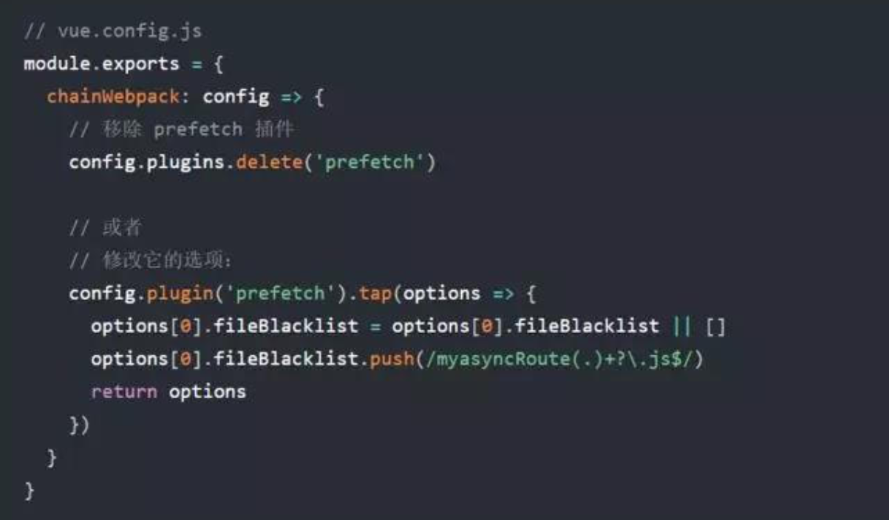
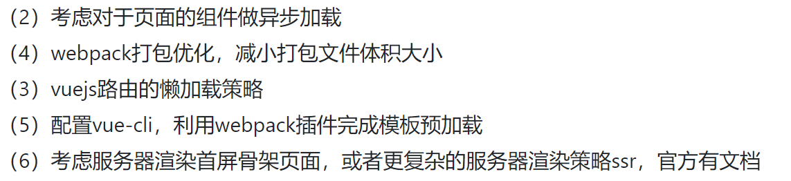
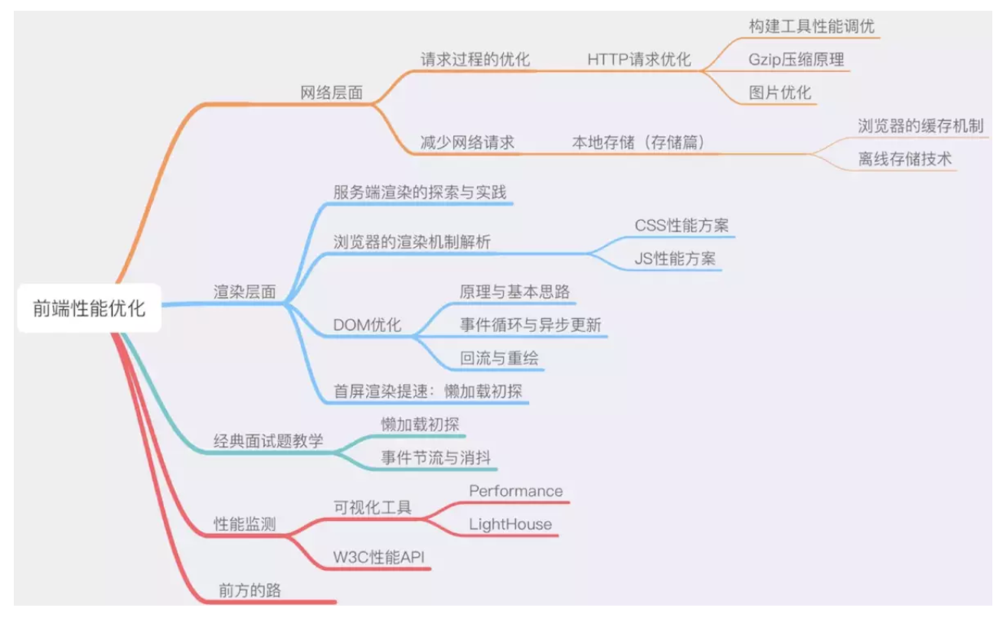

# 白屏优化

### 如何监测白屏时间

`window.performance.getEntriesByType('paint')` 来获取 **First Paint** （FP：文档中任意元素首次渲染时间）和 **First Contentful Paint** （FCP：也就是我们常说的 *白屏时间* ）

```javascript
performance.timing.loadEventEnd-performance.timing.navigationStart
```


### 解决方案

#### 方案1. meta标签

```javascript
<!-- 在入口文件index.html中，头部添加meta标签 -->
<meta http-equiv="Expires" content="0">
<meta http-equiv="Pragma" content="no-cache">
<meta http-equiv="Cache-control" content="no-cache">
<meta http-equiv="Cache" content="no-cache">
```

#### 方案2. 时间戳区分

```javascript
// webpack.prod.conf.js
const Version = new Date().getTime();

output: {
    path: config.build.assetsRoot,
    filename: utils.assetsPath('js/[name].[chunkhash].'+_Version+'js'),
    chunkFilename: utils.assetsPath('js/[id].[chunkhash].'+_Version+'js')
}
```

#### 方案3. 服务端配置

```javascript
// nginx端配置
location = /index.html {
    add_header Cache-Control "no-cache, no-store";
    # add_header Cache-Control no-store;
    # add_header Pragma no-cache;
}
```

#### 方案对比

| 方案 | 操作难度            | 优缺点                                         |
| :--- | :------------------ | :--------------------------------------------- |
| 1    | html文件简单修改    | 基本上没用                                     |
| 2    | webpack配置简单修改 | 跟hash值文件名一个性质，不解决痛点             |
| 3    | 服务端加配置，简单  | 解决部分缓存问题，不解决全部；白屏问题依旧存在 |

#### 方案4.路由懒加载

在 router.js文件中，原来的静态引用方式，如：

import ShowBlogs from '@/components/ShowBlogs'

routes:[ path: 'Blogs', name: 'ShowBlogs', component: ShowBlogs ]

改为：

 routes:[ 
 		path: 'Blogs',
 		name: 'ShowBlogs',
 		component: () => import('./components/ShowBlogs.vue')
 	]
如果是在 vuecli 3中，我们还需要多做一步工作
因为 vuecli 3默认开启 prefetch(预先加载模块)，提前获取用户未来可能会访问的内容
在首屏会把这十几个路由文件，都一口气下载了
所以我们要关闭这个功能，在 vue.config.js中设置:




#### 方案5.ui框架按需加载

以ElementUI为例：

借助 [babel-plugin-component](https://github.com/QingWei-Li/babel-plugin-component)，我们可以只引入需要的组件，以达到减小项目体积的目的。

首先，安装 babel-plugin-component：

```bash
npm install babel-plugin-component -D
```

然后，将 .babelrc 修改为：

```json
{
  "presets": [["es2015", { "modules": false }]],
  "plugins": [
    [
      "component",
      {
        "libraryName": "element-ui",
        "styleLibraryName": "theme-chalk"
      }
    ]
  ]
}
```

接下来，如果你只希望引入部分组件，比如 Button 和 Select，那么需要在 main.js 中写入以下内容：

```javascript
import Vue from 'vue';
import { Button, Select } from 'element-ui';
import App from './App.vue';

Vue.component(Button.name, Button);
Vue.component(Select.name, Select);
/* 或写为
 * Vue.use(Button)
 * Vue.use(Select)
 */

new Vue({
  el: '#app',
  render: h => h(App)
});
```


#### 方案6.gzip压缩

安装 compression-webpack-plugin

cnpm i compression-webpack-plugin -D
1
在 vue.congig.js中引入并修改 webpack配置:

```javascript
const CompressionPlugin = require('compression-webpack-plugin')

configureWebpack: (config) => {
        if (process.env.NODE_ENV === 'production') {
            // 为生产环境修改配置...
            config.mode = 'production'
            return {
                plugins: [new CompressionPlugin({
                    test: /\.js$|\.html$|\.css/, //匹配文件名
                    threshold: 10240, //对超过10k的数据进行压缩
                    deleteOriginalAssets: false //是否删除原文件
                })]
            }
        }
```

#### 方案7.使用cdn

打包时，把vue、vuex、vue-router、axios等，换用国内的bootcdn直接引入到根目录的index.html。
在webpack设置中添加externals，忽略不需要打包的库。

```
module.exports = {
  context: path.resolve(__dirname, '../'),
  entry: {
    app: './src/main.js'
  },
  externals:{
    'vue':'Vue',
    'vue-router':'VueRouter',
    'vuex':'Vuex'
  },
  // 格式为'aaa':'bbb'，其中，aaa表示要引入的资源的名字，bbb表示该模块提供给外部引用的名字，由对应的库自定。例如，vue为Vue，vue-router为VueRouter
```


在index.html中使用cdn引入

<script src="//cdn.bootcss.com/vue/2.2.5/vue.min.js"></script>  
<script src="//cdn.bootcss.com/vue-router/2.3.0/vue-router.min.js"></script>
<script src="//cdn.bootcss.com/vuex/2.2.1/vuex.min.js"></script>  
<script src="//cdn.bootcss.com/axios/0.15.3/axios.min.js"></script> 
去掉原有的引用，否则还是会打包
```
//去掉import，如：
//import Vue from 'vue'
//import Router from 'vue-router'

//去掉Vue.use(XXX)，如：
//Vue.use(Router)
```

#### 方案8.压缩代码

使用UglifyJsPlugin插件来压缩代码和移除console

```javascript
new UglifyJsPlugin({
      uglifyOptions: {
        compress: {
          warnings: false,
          drop_console:true,
          pure_funcs:['console.log']
        }
      },
      sourceMap: config.build.productionSourceMap,
      parallel: true
    }),
```



#### 解决方案9. echarts 依赖优化

##### 部分引用

//引入基本模板
 let echarts = require(‘echarts/lib/echarts‘)

// 引入饼状图组件
require(‘echarts/lib/chart/pie‘)
// 引入提示框和title组件，图例
require(‘echarts/lib/component/tooltip‘)
require(‘echarts/lib/component/title‘)
require('echarts/lib/component/legend')
Vue.prototype.$echarts = echarts //引入组件

##### 直接使用CDN第三方资源，从打包文件中去掉echarts依赖

首先在`index.html`中引入`echarts`的外部CDN（如果需要地图组件，也需要一并引入）

```
//index.html


<script src="https://cdn.bootcss.com/echarts/4.1.0/echarts.min.js"></script>


复制代码
```

然后在`webpack.base.config.js`中,做如下改动

```
//webpack.base.config.js   module.exports中增加externals对象


module.exports = {


    externals: {


        "echarts": "echarts"        //默认是配置引用的库（这里是echarts）暴露出的全局变量


    },


}
```

#### 新思路

  在一些论坛中，在某些特定情况下（如混合开发App，原生嵌入webview还在h5)，可在原生端尝试解决：

- 加载webview前清除缓存再加载；
- 销毁webview前清除缓存；

  效果如何，有待验证。

## 前端优化

降低请求量：合并资源，减少HTTP 请求数，minify / gzip 压缩，webP，lazyLoad。

加快请求速度：预解析DNS，减少域名数，并行加载，CDN 分发。

缓存：HTTP 协议缓存请求，离线缓存 manifest，离线数据缓存localStorage。

渲染：JS/CSS优化，加载顺序，服务端渲染，pipeline。

