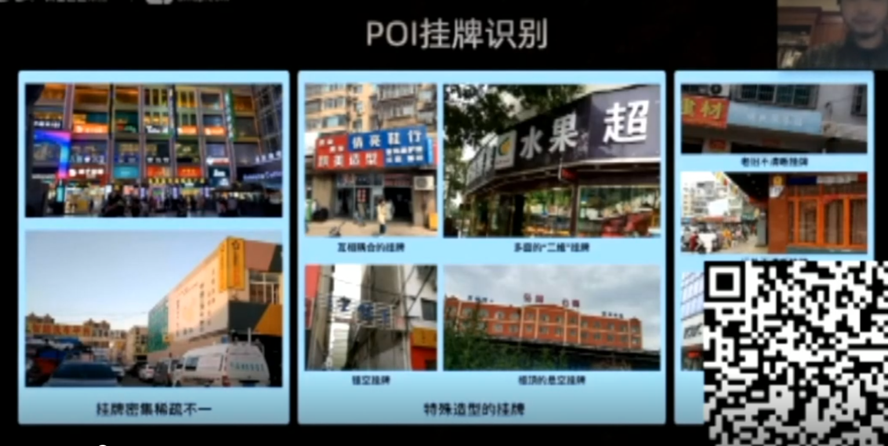
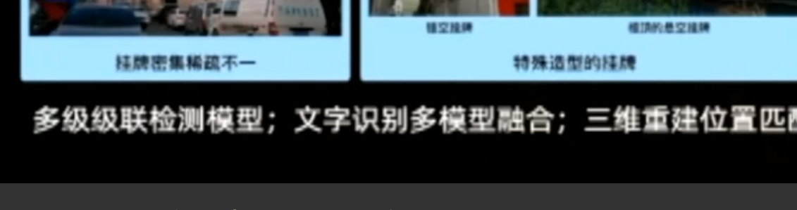
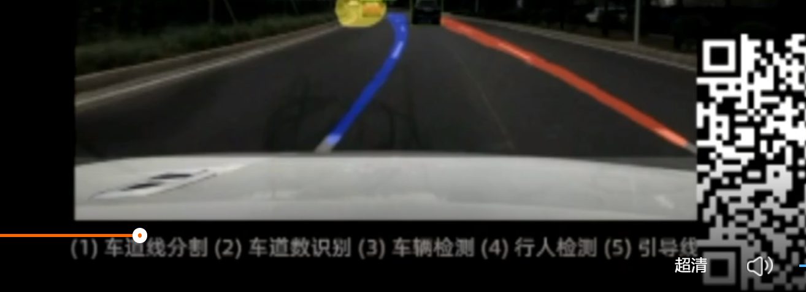

### 阿里巴巴技术公开课--视觉技术

SLAM点云

定位、路径规划、路况

#### 地图制作流程

资料采集-自动识别-人工修正

道路标志识别，

挑战：

1、实际问题：图像质量差，反光，遮挡等等

畸变：相机自标定，多源图像匹配，获得图像内参和外参

图像质量：增强

2、实际问题：小目标检测

context，上下文，扩大范围，看到一些属性

3、实际问题：变化检测

目标检测，假设

场景匹配：深度学习特征

车道归属：识别+几何分析

#### 高精度地图

完备，无错误，精细表示

识别：识别精度要求高

位置精度要求高

训练样本有限

点云+图像算法

深度学习和传统

复用常规地图数据

数据回流和模型

先验知识

GPS不准：城市峡谷

视觉定位：越来越多的车配有相机

利用图像、视频定位：

SLAM/VIO：相对位置

三维重建稀疏特征

深度学习

#### AR导航

如何导航最方便

换道提醒，行人检测，变灯提醒，行人预测

难点：做低成本应用

用单相机，计算性能：1/5手机，

多任务图像识别

解决性能问题：

模型压缩、小型化，

训练调整和提高，

先验信息

多任务模型，共享计算

检测+快速跟踪

地图制作，搜索推荐，路径规划，数据挖掘，高精地图，视觉定位

#### 如何在工业界成功

了解最新技术

开源代码，上手尝试

知其所以然

以战代练

技术深度，

动手能力，

理解实际问题，

Think BIG大方向，如何根本上解决

表达和交流

自省，了解自己长处和短处

好奇心

热情

#### 问题

1.点云识别和图像识别有什么区别

图像组织形式更规整，卷积操作等比较容易做

点云：三维信息，信息稀疏，计算量大，依托点云本身的组织采用一些深度学习的方法

2.自动驾驶：是不是必须要高精度地图，工业界还是必须的。

3.如何在室内定位中做视觉定位呢？

4.地图视觉技术有没有大的发展趋势，

静态地图信息，动态信息也很重要，积水积雪，路况