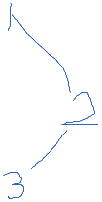

### 腾讯-腾讯视频一面

#### 1.自我介绍

#### 2.项目

动态路由

用户头像上传，

登录注册挑战，cookie，CSRF

应用场景题，实现一个时钟，setInterval不准确，requestAnimalFrame

不同国家后台提供北京时间的接口，如何保证你的组件时间准确

#### 3.基础

http跨域，如何解决跨域

Vue双向绑定原理

事件冒泡

#### 4.两道笔试题

考察知识点，原型链

实现一个日期语义化，根据数据输出例如 “十一点二十五分”

5.面试官介绍部门情况

VUE，React，官网视频，APP投票，小程序，中台

### 腾讯-腾讯视频二面

#### 1、项目

md5加密，设置参数

#### 2、图片懒加载

实现思路

```
 var clock; //函数节流
            $(window).on('scroll',function(){
                if(clock){
                    clearTimeout(clock);
                }
                clock = setTimeout(function(){
                    start()
                    clock=null;
                },200)
            })
            
            function start(){
                 $('.container img').not('[data-isLoading]').each(function () {
                    if (isShow($(this))) {
                        loadImg($(this));
                    }
                })
            }


            // 判断图片是否出现在视窗的函数
            function isShow($node){
                return $node.offset().top <= $(window).height()+$(window).scrollTop();
            }

            // 加载图片的函数，就是把自定义属性data-src 存储的真正的图片地址，赋值给src
            function loadImg($img){
                    $img.attr('src', $img.attr('data-src'));

                    // 已经加载的图片，我给它设置一个属性，值为1，作为标识
                    // 弄这个的初衷是因为，每次滚动的时候，所有的图片都会遍历一遍，这样有点浪费，所以做个标识，滚动的时候只遍历哪些还没有加载的图片
                    $img.attr('data-isLoading',1);
            }
```

onload 在图片等资源全部加载完才执行

jQuery的ready是HTML中的dom 结构完成后执行的

#### 3、一道笔试题

### 腾讯-微信支付一面

#### 1、项目

登录注册是怎么做的

cookie localstorage sessionStorage

很多需求是甲方提的，有哪些是你主动加的

element-UI theme 如何实现换肤

https://blog.csdn.net/young_Emily/article/details/78591261

#### 2、CSS

水平垂直居中

#### 3、JS

基本的数据类型

模块化有哪些，优缺点

NodeJS高并发的原理

代码规范

WEB安全，有哪些攻击，如何防御

https SSL实现过程

#### 4.题目



说出中序遍历结果

正则 提取数字

“abcdeeeeee1dddd2dddd3”,写出正则表达式 提取所有数字   /\d+/g

### 腾讯-微信支付二面

专业是地理信息系统，那你看过计算机网络基础吗，

说下TCP和UDP的区别吗

现在有很多公司用UDP做精确传输，是为什么？

地址栏输入一个URL会发生什么，尽可能的详细

Web安全 XSS 和CSRF，和防护

有个H5页面，登录注册，如何设计，能用到你刚说的，登录之后怎么办

MD5加密安全吗？

从登录成功到发请求，需要注意什么

做个使用队实现栈的函数的题

### 阿里-一面

#### 新零售事业群-业务平台事业部

为什么学习前端

主要从哪里学习前端知识

TCP三次握手

为什么不是两次

路由控制，前端控制路由安全吗？去看看现在大公司都是怎么做路由控制的

最近有学什么新知识吗？

Websocket

Nodejs有哪些经验，借鉴意见

HTTP和Websocket的区别

HTTP2.0特性，看没看过头部压缩

ES6有哪些新特性

节流防抖

订阅-发布模式

有没有博客？

有没有参加过开源项目

和身边的同学比有哪些优势

有哪些问题问我

### 阿里-笔试

三道题

1.字符串匹配，返回str2在str1中的位置

2.数组中出现次数大于K的元素，返回数组，按出现次数的大小排序输出

3.青蛙上楼梯 一次1个台阶或2个台阶，求有多少种上法

### 美团一面

到店事业群

自我介绍

nodejs 和websocket

VUE和原生js那个效率高

ES6

webpack

babel

uglifyjs

element-ui

三种模块引入的方式

webpack 打包，自己配过吗

还有那些优势

最近在学什么

一个算法题

美团技术栈：MRN，react+vue+小程序+nodejs，tools，electron,

### 美团二面

聊项目

HTML5.6语义化标签有哪些，aside含义

CSS 有哪些行内元素

foo={a:'b'} bar={a:'b'}

 foo==bar 

foo===bar 

{a:'b'}=={a:'b'} 

{a:'b'}==={a:'b'}

### 360笔试

#### HTML以及网络

1. HTML属性

   属性和属性值大小写不敏感，但万维网联盟推荐使用小写

   属性值应该始终被包括在引号中，最常用的是双引号，单引号也没问题

   属性的命名规则：

2. 属性锚点：a标签可以通过name属性定义锚点，其他的标签主要的ID

3. IPV6支持：单播，组播，任意播

4. Map对象的属性 get,set ,delete,has

5. 执行结果

   ```js
   new Promise((resolve,reject)=>{
       console.log(1);
       resolve(1.1);
   }).then(res=>{
      console.log(res)
   })
   setTimeout(()=>{
      console.log(2)
   },0)
   console.log(3)
   //1
   //3
   //1.1
   //2
   ```

6. WebAssembly:是一种可以使用非 JavaScript 编程语言编写代码并且能在浏览器上运行的技术方案。像 C++ 和 Rust 这样的广泛使用的编译语言可能是与 WebAssembly 关联最紧密的语言。但是，[各种各样的其他语言](https://link.zhihu.com/?target=https%3A//github.com/appcypher/awesome-wasm-langs)可以编译为 WebAssembly 或拥有它们的 WebAssembly 虚拟机。此外，尽管 WebAssembly 为其执行环境[假定了某些先决条件](https://link.zhihu.com/?target=https%3A//webassembly.org/docs/portability/)，但它被设计为在各种操作系统和指令集体系结构上有效执行。因此，WebAssembly 代码可以使用多种语言编写，并可以在多种操作系统和处理器类型上运行。代码在虚拟机中运行。因此，每个 WebAssembly 模块都在沙盒环境中执行，并使用故障隔离技术将其与宿主机运行时环境分开。这意味着，对于其它部分而言，应用程序独立于其宿主机环境的其余部分执行，如果不调用适当的 API，就无法摆脱沙箱。

7. ContextType:text/plain, text/css, text/html, application/x-javscript, application/json,

   #### CSS

8. 选择器语法：

   自己的模糊的语法，div+p选择紧接在 <div> 元素之后的所有 <p> 元素。

   | 选择器                                                       | 例子                  | 例子描述                                            | CSS  |
   | :----------------------------------------------------------- | :-------------------- | :-------------------------------------------------- | :--- |
   | [.*class*](https://www.w3school.com.cn/cssref/selector_class.asp) | .intro                | 选择 class="intro" 的所有元素。                     | 1    |
   | [#*id*](https://www.w3school.com.cn/cssref/selector_id.asp)  | #firstname            | 选择 id="firstname" 的所有元素。                    | 1    |
   | [*](https://www.w3school.com.cn/cssref/selector_all.asp)     | *                     | 选择所有元素。                                      | 2    |
   | [*element*](https://www.w3school.com.cn/cssref/selector_element.asp) | p                     | 选择所有 <p> 元素。                                 | 1    |
   | [*element*,*element*](https://www.w3school.com.cn/cssref/selector_element_comma.asp) | div,p                 | 选择所有 <div> 元素和所有 <p> 元素。                | 1    |
   | [*element* *element*](https://www.w3school.com.cn/cssref/selector_element_element.asp) | div p                 | 选择 <div> 元素内部的所有 <p> 元素。                | 1    |
   | [*element*>*element*](https://www.w3school.com.cn/cssref/selector_element_gt.asp) | div>p                 | 选择父元素为 <div> 元素的所有 <p> 元素。            | 2    |
   | [*element*+*element*](https://www.w3school.com.cn/cssref/selector_element_plus.asp) | div+p                 | 选择紧接在 <div> 元素之后的所有 <p> 元素。          | 2    |
   | [[*attribute*\]](https://www.w3school.com.cn/cssref/selector_attribute.asp) | [target]              | 选择带有 target 属性所有元素。                      | 2    |
   | [[*attribute*=*value*\]](https://www.w3school.com.cn/cssref/selector_attribute_value.asp) | [target=_blank]       | 选择 target="_blank" 的所有元素。                   | 2    |
   | [[*attribute*~=*value*\]](https://www.w3school.com.cn/cssref/selector_attribute_value_contain.asp) | [title~=flower]       | 选择 title 属性包含单词 "flower" 的所有元素。       | 2    |
   | [[*attribute*\|=*value*\]](https://www.w3school.com.cn/cssref/selector_attribute_value_start.asp) | [lang\|=en]           | 选择 lang 属性值以 "en" 开头的所有元素。            | 2    |
   | [:link](https://www.w3school.com.cn/cssref/selector_link.asp) | a:link                | 选择所有未被访问的链接。                            | 1    |
   | [:visited](https://www.w3school.com.cn/cssref/selector_visited.asp) | a:visited             | 选择所有已被访问的链接。                            | 1    |
   | [:active](https://www.w3school.com.cn/cssref/selector_active.asp) | a:active              | 选择活动链接。                                      | 1    |
   | [:hover](https://www.w3school.com.cn/cssref/selector_hover.asp) | a:hover               | 选择鼠标指针位于其上的链接。                        | 1    |
   | [:focus](https://www.w3school.com.cn/cssref/selector_focus.asp) | input:focus           | 选择获得焦点的 input 元素。                         | 2    |
   | [:first-letter](https://www.w3school.com.cn/cssref/selector_first-letter.asp) | p:first-letter        | 选择每个 <p> 元素的首字母。                         | 1    |
   | [:first-line](https://www.w3school.com.cn/cssref/selector_first-line.asp) | p:first-line          | 选择每个 <p> 元素的首行。                           | 1    |
   | [:first-child](https://www.w3school.com.cn/cssref/selector_first-child.asp) | p:first-child         | 选择属于父元素的第一个子元素的每个 <p> 元素。       | 2    |
   | [:before](https://www.w3school.com.cn/cssref/selector_before.asp) | p:before              | 在每个 <p> 元素的内容之前插入内容。                 | 2    |
   | [:after](https://www.w3school.com.cn/cssref/selector_after.asp) | p:after               | 在每个 <p> 元素的内容之后插入内容。                 | 2    |
   | [:lang(*language*)](https://www.w3school.com.cn/cssref/selector_lang.asp) | p:lang(it)            | 选择带有以 "it" 开头的 lang 属性值的每个 <p> 元素。 | 2    |
   | [*element1*~*element2*](https://www.w3school.com.cn/cssref/selector_gen_sibling.asp) | p~ul                  | 选择前面有 <p> 元素的每个 <ul> 元素。               | 3    |
   | [[*attribute*^=*value*\]](https://www.w3school.com.cn/cssref/selector_attr_begin.asp) | a[src^="https"]       | 选择其 src 属性值以 "https" 开头的每个 <a> 元素。   | 3    |
   | [[*attribute*$=*value*\]](https://www.w3school.com.cn/cssref/selector_attr_end.asp) | a[src$=".pdf"]        | 选择其 src 属性以 ".pdf" 结尾的所有 <a> 元素。      | 3    |
   | [[*attribute**=*value*\]](https://www.w3school.com.cn/cssref/selector_attr_contain.asp) | a[src*="abc"]         | 选择其 src 属性中包含 "abc" 子串的每个 <a> 元素。   | 3    |
   | [:first-of-type](https://www.w3school.com.cn/cssref/selector_first-of-type.asp) | p:first-of-type       | 选择属于其父元素的首个 <p> 元素的每个 <p> 元素。    | 3    |
   | [:last-of-type](https://www.w3school.com.cn/cssref/selector_last-of-type.asp) | p:last-of-type        | 选择属于其父元素的最后 <p> 元素的每个 <p> 元素。    | 3    |
   | [:only-of-type](https://www.w3school.com.cn/cssref/selector_only-of-type.asp) | p:only-of-type        | 选择属于其父元素唯一的 <p> 元素的每个 <p> 元素。    | 3    |
   | [:only-child](https://www.w3school.com.cn/cssref/selector_only-child.asp) | p:only-child          | 选择属于其父元素的唯一子元素的每个 <p> 元素。       | 3    |
   | [:nth-child(*n*)](https://www.w3school.com.cn/cssref/selector_nth-child.asp) | p:nth-child(2)        | 选择属于其父元素的第二个子元素的每个 <p> 元素。     | 3    |
   | [:nth-last-child(*n*)](https://www.w3school.com.cn/cssref/selector_nth-last-child.asp) | p:nth-last-child(2)   | 同上，从最后一个子元素开始计数。                    | 3    |
   | [:nth-of-type(*n*)](https://www.w3school.com.cn/cssref/selector_nth-of-type.asp) | p:nth-of-type(2)      | 选择属于其父元素第二个 <p> 元素的每个 <p> 元素。    | 3    |
   | [:nth-last-of-type(*n*)](https://www.w3school.com.cn/cssref/selector_nth-last-of-type.asp) | p:nth-last-of-type(2) | 同上，但是从最后一个子元素开始计数。                | 3    |
   | [:last-child](https://www.w3school.com.cn/cssref/selector_last-child.asp) | p:last-child          | 选择属于其父元素最后一个子元素每个 <p> 元素。       | 3    |
   | [:root](https://www.w3school.com.cn/cssref/selector_root.asp) | :root                 | 选择文档的根元素。                                  | 3    |
   | [:empty](https://www.w3school.com.cn/cssref/selector_empty.asp) | p:empty               | 选择没有子元素的每个 <p> 元素（包括文本节点）。     | 3    |
   | [:target](https://www.w3school.com.cn/cssref/selector_target.asp) | #news:target          | 选择当前活动的 #news 元素。                         | 3    |
   | [:enabled](https://www.w3school.com.cn/cssref/selector_enabled.asp) | input:enabled         | 选择每个启用的 <input> 元素。                       | 3    |
   | [:disabled](https://www.w3school.com.cn/cssref/selector_disabled.asp) | input:disabled        | 选择每个禁用的 <input> 元素                         | 3    |
   | [:checked](https://www.w3school.com.cn/cssref/selector_checked.asp) | input:checked         | 选择每个被选中的 <input> 元素。                     | 3    |
   | [:not(*selector*)](https://www.w3school.com.cn/cssref/selector_not.asp) | :not(p)               | 选择非 <p> 元素的每个元素。                         | 3    |
   | [::selection](https://www.w3school.com.cn/cssref/selector_selection.asp) | ::selection           | 选择被用户选取的元素部分。                          |      |

9. media属性有哪些

10. UDP协议的应用层协议

11. Date初始化

     case '1':

    ​         date = new Date("2020-03-30T 10:10:10Z");//这个格式无法初始化

    ​        target.innerHTML = date.toDateString();

    ​        break;

    case '2':

    ​         date = new Date("2020-03-30 10:10:10");

    ​        target.innerHTML = date.toDateString();

    ​        break;

    case '3':

    ​         date = new Date("2020/03/30 10:10:10");

    ​        target.innerHTML = date.toDateString();

    ​        break;

     case '4':

    ​         date = new Date("2020/03/30");

    ​        target.innerHTML = date.toDateString();

    ​        break;

12. 标准模式下全局变量

    nodejs 使用global

    浏览器window

    web worker 中，只有self可用。

    frames在浏览器环境中访问全局对象的另一种方法

    this 在浏览器中，程序顶层使用this关键字来引用全局对象。

    全局对象引用方法实现跨平台变得很困难，因此有提案引入globalThis的标准属性，准备纳入ES2020标准

13. img 有哪些属性：必须属性：alt,src，可选的属性：align, border, height, hspace, ismap, longdesc, usemap, vspace, width

14. P问题，NP问题，NPC问题，NPC问题是NP完全问题

    http://www.matrix67.com/blog/archives/105

    P问题，一个问题能够在多项式的时间里解决它

    NP问题是可以在多项式的时间里验证一个解的问题，（在多项式时间里猜出一个解的问题）

    NPC满足的条件：首先是一个NP问题，然后所有的NP问题问题都可以约化它

15. 箭头函数

### 阿里-复试（37min）

自我介绍

介绍一下你觉得做的不错的项目，讲动态路由被打断，讲一下地图相关的

讲一下你的技术选型，openlayer，ARCGIS，mapGIS区别，为什么选

Echarts主要用到了哪些，对比D3.js，Echarts有哪些问题

看过Echarts的源码吗？说了一点位置计算

聚类了解吗，讲了前端聚类，后端聚类

抽稀呢？额，前端没做过 道格拉斯-普克算法

专题图表的碰撞检测判断，性能呢说一下行政区划改变，下钻的实现，

考一些JS基础说一下如何判断一个对象是数组

Array.isArray()实现原理

Array.map和Array.forEach的区别

相同点：①都是循环遍历数组中的每一项②都支持三个参数，item，index，arr③匿名函数中的this 都是指向window

④只能遍历数组，⑤都不会改变数组

不同点：map返回一个新的数组，数组中的元素为原始数组调用函数处理后的值；forEach用来调用数组的每个元素，将元素传给回调函数；map方法不会对空数组检测，map方法不会改变原始数组，forEach对于空数组是不会调用回调函数的

### 腾讯一面（34分钟）

自我介绍

介绍一下你做的项目

遇到的问题

有哪些印象深刻的bug,如何解决的

介绍一下JS的单线程模式，或者说异步方式有哪些

讲一下Vue中深入过的一些原理或者做项目中的一些问题

我简单说了一下双向绑定和diff算法

为Vue的发布订阅者模式，有哪些优点

职业规划发展，可以做Python或者C++之类的吗

实习时间，地点

给我介绍了一下他们部门的情况

### 阿里-交叉面

介绍一下你的项目，前端工作，如何学习的，

技术选型类似，技术选型是如何考虑的

实验室同学是怎么评价你的，

Vue有了解哪些深层的原理吗，双向绑定，diff算法，

项目中印象深刻的点，

### **360一面**

如何学习前端的

看没看过新的标准

有没有看过地图框架的源码，事件是怎么处理的呢

你的优势是什么

有没有自己感兴趣做过一些什么项目

之前面试有没有什么不会的问题，主要想考察有没有深入的去理解

图片懒加载：

如果不知道图片宽高，如何计算占位图片的大小

希望自己有兴趣去学

HTML2canvas底层原理

它打印的是静态图片，如何生成GIF，或者是视频

建议：保持好奇心，自己去实践，有自己感兴趣去做一个项目，能够考虑性能，稳定性，

### 美团三面

```js
var a = 'asdkfjaslkdfjlasdjf';
a.maxSubString();//最长不重复子序列长度
```

寄存器，CPU，GPU

window.a=1;

 function foo1(){

var b=2;

console.log(b+this.a)

}

function foo(){

var a=4;

foo1();

}

fool();

### 阿里HR面

介绍一个项目，难点和如何解决

在团队协调中，总结一些日后工作值得借鉴的经验，这里答得点太小了，HR建议我在好好总结一些

期望工作的城市，

选择公司主要考虑的因素，倾向于选择哪个公司

辅修双学位，学双学位的原因，如何分配时间，

兴趣爱好

### 360二面

一，做地理信息系统的，介绍一些项目的技术细节

二、如何做一些本地存储，localstorage，sessionstorage，cookie，格式化数据IndexDB，浏览器提供的file API

三、团队协作，git 方面的协作

四、VUE框架的设计和理解，es6提供的Proxy，原理

五、如何后台打包的

六、业务方向和成长路线，

提问：奇舞团是主要做什么的，哪些内容

### 360hr面

10min

自我介绍

介绍一个最得意的项目，介绍项目难点

参加了前端星，项目承担了什么，如果之后遇到急着上线，选择重功能还是重展示

经过前面几轮面试，了解这个部门是主要做什么的吗？

### 腾讯HR面

自我介绍，生活历练，项目中遇到哪些难点

项目开展中是如何沟通的

自己的优点和缺点

职业规划

实习时间

家庭

还有哪些offer

转正以后的薪资期望是多少

提问：

#### 百度

javascript 基础

1. 闭包的作用，

2. reduce的用法，用reduce做数组降维

3. 写一下节流和防抖，说下区别，应用场景

4. Promise
5. 同步异步代码，
6. 数组方法，哪些改变原数组，哪些不改变

```
//line=readline()
//print(line)
console.log('Hello World!');
apply，call，bind
function debouce(fn,delay){
    let timer=null;
    let context = this;
    let args = arguments;
    return new function(context,arguments){
        if(timer){
            clearTimeOut(timer);
        }
        timer=setTimeOut(())=>{
               fn.apply(context,arguments);              
        },delay)
        
    }
}
array.reduce(sum,item,){
      
}

sort,splice,unshift,pop,add,push
map,forEach,slice,filter,
    
function down(origin,res=[]){
   // let res=[];
   // origin.reduce((item,index,array)=>{
        
   // },res,)
    for(let i=0;i<origin.length;i++){
        if(Array.isArray(origin[i])){
            down(origin[i],Object.assign([],res));
        }else{
            res.push(origin[i]);
        }
    }
    return res;              
}
let p=new promise((resolve,reject)=>{
    if(!res.success){
        reject(res.message)
    }
    resolve()
    
})
p.then((res)=>{})
.catch((error)=>{
    
})

async function async1() {
console.log('async1 start');
await async2();
console.log('async1 end');
}
async function async2() {
console.log('async2');
}
console.log('script start');
setTimeout(()=>{
console.log('setTimeout');
},0)
async1();
new Promise((resolve)=>{
console.log('promise1');
resolve();
}).then(()=>{
console.log('promise2');
});
console.log('script end');
// script start
// async1 start
// async2
// promise1
// script end
// async1 end
// promise2
// setTimeout

```

// 

变量保护

#### 腾讯文档面试

CSS动画的性能优化

Https，

setTimeout,node的setTimeout

```
new Promise((resolve)=>{
   console.log(1);
   setTimeOut(()=>{console.log(2)},0);
   Promise.resolve().then(()=>{
   console.log(3);
   })
   resolve();
}().then(()=>{console.log(4)});
console.log(5);
// 1,5,3,4,2
```

js,

vue 双向绑定的原理和问题

二分查找，数组合并去重