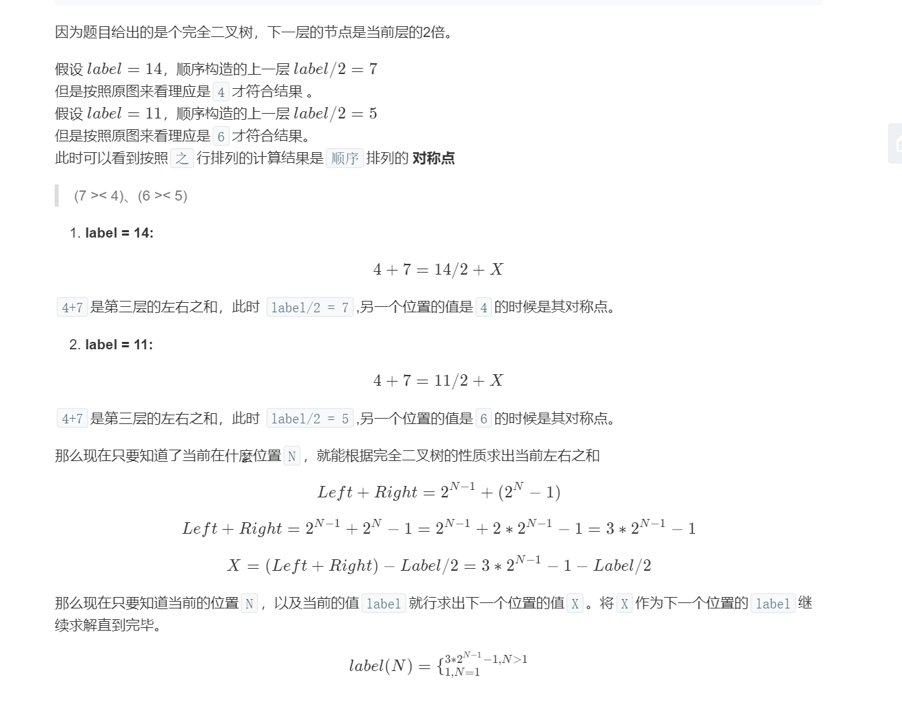
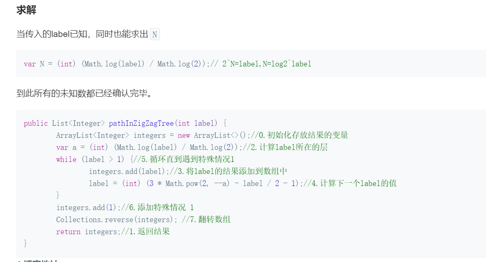

#### 重建二叉树

输入某二叉树的前序遍历和中序遍历的结果，请重建该二叉树。假设输入的前序遍历和中序遍历的结果中都不含重复的数字。

 

例如，给出

前序遍历 preorder = [3,9,20,15,7]
中序遍历 inorder = [9,3,15,20,7]
返回如下的二叉树：

    3
   / \
  9  20
    /  \
   15   7


限制：

0 <= 节点个数 <= 5000

```javascript
/**
 * Definition for a binary tree node.
 * function TreeNode(val) {
 *     this.val = val;
 *     this.left = this.right = null;
 * }
 */
/**
 * @param {number[]} preorder
 * @param {number[]} inorder
 * @return {TreeNode}
 */
var buildTree = function(preorder, inorder) {
    if(preorder.length!=inorder.length||preorder.length==0){
        return null;
    }
    var root=new TreeNode(preorder[0]);
    if(preorder.length==1){
        return root;
    }
    var rootValue=preorder[0];
    var inIndex=inorder.indexOf(rootValue);
    root.left=buildTree(preorder.slice(1,inIndex+1),inorder.slice(0,inIndex));
    root.right=buildTree(preorder.slice(inIndex+1),inorder.slice(inIndex+1));
    return root;
};

function reConstructBinaryTree(pre, vin)
{
    // write code here
    if(!pre||pre.length===0){
        return pre;
    }else if(pre.length===1){
        var root=new TreeNode(pre[0]);
        return root;
    }else{
        var rootValue=pre[0];
        var rootIndex=vin.indexOf(rootValue);
         
        var root=new TreeNode(rootValue);
        var leftChildVin=vin.slice(0,rootIndex);  //中序遍历的左子树
        var leftChildPre=pre.slice(1,rootIndex+1);  //先序遍历的坐左子树
         
        var leftTree= reConstructBinaryTree(leftChildPre,leftChildVin);  //递归左子树
        if(leftTree.val){
            root.left=leftTree;
        }
        var rightChildPre=pre.slice(rootIndex+1);
        var rightChildVin=vin.slice(rootIndex+1);
         
        var rightTree= reConstructBinaryTree(rightChildPre,rightChildVin);  //递归左子树
        if(rightTree.val){
            root.right=rightTree;
        }
        return root;
    }
    
}

```

### 

#### [1038. 从二叉搜索树到更大和树](https://leetcode-cn.com/problems/binary-search-tree-to-greater-sum-tree/)

给出二叉**搜索**树的根节点，该二叉树的节点值各不相同，修改二叉树，使每个节点 `node` 的新值等于原树中大于或等于 `node.val` 的值之和。

提醒一下，二叉搜索树满足下列约束条件：

- 节点的左子树仅包含键**小于**节点键的节点。
- 节点的右子树仅包含键**大于**节点键的节点。
- 左右子树也必须是二叉搜索树。

 

**示例：**

****

```
输入：[4,1,6,0,2,5,7,null,null,null,3,null,null,null,8]
输出：[30,36,21,36,35,26,15,null,null,null,33,null,null,null,8]
```

 

**提示：**

1. 树中的节点数介于 `1` 和 `100` 之间。
2. 每个节点的值介于 `0` 和 `100` 之间。
3. 给定的树为二叉搜索树。

 

```
/**
 * Definition for a binary tree node.
 * function TreeNode(val) {
 *     this.val = val;
 *     this.left = this.right = null;
 * }
 */
/**
 * @param {TreeNode} root
 * @return {TreeNode}
 */
var sum=0;
var bstToGst = function(root,isFirst=true) {
    if(isFirst){
        sum=0;
    }
    if(root != null){
            if(root.right != null){
                bstToGst(root.right,false);
            }
            root.val += sum;
            sum = root.val;
            if(root.left != null){
                bstToGst(root.left,false);
            }
        }
        return root;
 
};
```

#### 广度遍历二叉树

从上到下打印出二叉树的每个节点，同一层的节点按照从左到右的顺序打印。

 

例如:
给定二叉树: [3,9,20,null,null,15,7],

    3
   / \
  9  20
    /  \
   15   7
返回：

[3,9,20,15,7]


提示：

节点总数 <= 1000

```JavaScript
/**
 * Definition for a binary tree node.
 * function TreeNode(val) {
 *     this.val = val;
 *     this.left = this.right = null;
 * }
 */
/**
 * @param {TreeNode} root
 * @return {number[]}
 */

var levelOrder = function(root) {
  if(root==null)return [];
    //bfs遍历即可
    let res=[];
    let qu=[root];
    while(qu.length>0){
        let p=qu.shift();
        res.push(p.val);
        if(p.left!==null)qu.push(p.left);
        if(p.right!==null)qu.push(p.right);
    }
    return res;
};
```


```

```



```javascript
/**
 * @param {number} label
 * @return {number[]}
 */
var pathInZigZagTree = function(label) {
    let result=[];
    let n=Math.floor(Math.log2(label));
    while(label>1){
       result.unshift(label);
       label=3*Math.pow(2,--n)-Math.floor(label/2)-1;
    }
    result.unshift(1);
    return result;
}; 
```



### 判断是否是二叉树的子结构

```javascript
/* function TreeNode(x) {
    this.val = x;
    this.left = null;
    this.right = null;
} */
function HasSubtree(pRoot1, pRoot2)
{
    // write code here
    if(pRoot2==null) return false;
    if(pRoot1==null && pRoot2!=null) return false;       
    let result=false
    if(pRoot1.val==pRoot2.val){
       result=isSameTree(pRoot1, pRoot2)
    }
    if(!result){
        result=HasSubtree(pRoot1.left,pRoot2)
        if(!result){
            result=HasSubtree(pRoot1.right,pRoot2)
        }
    }
    return result;
}
function isSameTree(root1,root2){
     if(root2==null) return true;
        if(root1==null && root2!=null) return false;
        if(root1.val==root2.val){
            return isSameTree(root1.left, root2.left) && isSameTree(root1.right, root2.right);
        }
        return false;
}
```

