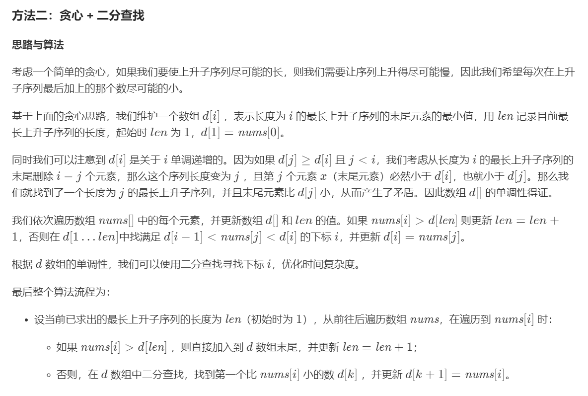

### 矩阵回字输出

输入一个矩阵，按照从外向里以顺时针的顺序依次打印出每一个数字，例如，如果输入如下4 X 4矩阵： 1 2 3 4 5 6 7 8 9 10 11 12 13 14 15 16 则依次打印出数字1,2,3,4,8,12,16,15,14,13,9,5,6,7,11,10.


### 最长子序列

#### 方法一：动态规划

思路与算法

定义 dp[i]dp[i] 为考虑前 ii 个元素，以第 ii 个数字结尾的最长上升子序列的长度，注意 {nums}[i]nums[i] 必须被选取。

我们从小到大计算 dp[]dp[] 数组的值，在计算 dp[i]dp[i] 之前，我们已经计算出 dp[0 ... i-1]dp[0…i−1] 的值，则状态转移方程为：

dp[i] = {max}(dp[j]) + 1, {其中} \, 0 \leq j < i \, {且} \, {num}[j]<{num}[i]
dp[i]=max(dp[j])+1,其中0≤j<i且num[j]<num[i]

即考虑往 dp[0 ... i-1]dp[0…i−1] 中最长的上升子序列后面再加一个 {nums}[i]nums[i]。由于 dp[j]dp[j] 代表 {nums}[0 ... j]nums[0…j] 中以 {nums}[j]nums[j] 结尾的最长上升子序列，所以如果能从 dp[j]dp[j] 这个状态转移过来，那么 {nums}[i]nums[i] 必然要大于 {nums}[j]nums[j]，才能将 {nums}[i]nums[i] 放在 {nums}[j]nums[j] 后面以形成更长的上升子序列。

最后，整个数组的最长上升子序列即所有 dp[i]dp[i] 中的最大值。

{LIS}_{{length}}= {max}(dp[i]), {其中} \, 0\leq i < n
LIS 
length
	
 =max(dp[i]),其中0≤i<n

```js
var lengthOfLIS = function(nums) {
    let len=nums.length
    let dp=new Array(len).fill(0);//以nums[i]结尾的最长子序列
    for(let i=0;i<len;i++){
        if(i==0){
            dp[i]=1;
        }else{
            let max=0;
           for(let j=0;j<i;j++){
               if(nums[j]<nums[i]&&dp[j]>max){
                   max=dp[j]
               }
           }
           dp[i]=max+1;
        }
    }
    console.log(dp.join(","))
    return Math.max(...dp)
};
```


复杂度分析

时间复杂度：O(n^2)，其中 nn 为数组 {nums}nums 的长度。动态规划的状态数为 nn，计算状态 dp[i]dp[i] 时，需要 O(n)O(n) 的时间遍历 dp[0 ... i-1]dp[0…i−1] 的所有状态，所以总时间复杂度为 O(n^2)O(n 
2
 )。

空间复杂度：O(n)，需要额外使用长度为 nn 的 dpdp 数组。

#### 方法二：贪心 + 二分查找



```js
var lengthOfLIS1=function(nums){
    let len=1;
    let n=nums.length;
    let d=new Array(n+1).fill(0);
    d[len]=nums[0];
    for(let i=0;i<n;i++){
        if(nums[i]>d[len]){
            d[++len]=nums[i];
        }else{
            let l = 1, r = len, pos = 0; 
            // 如果找不到说明所有的数都比 nums[i] 大，
            //此时要更新 d[1]，所以这里将 pos 设为 0
            //因为d是单调增的,所有可以用二分查找更快
            while(l<=r){
                let mid=(l+r)>>1;
                if(d[mid]<nums[i]){
                    l=mid+1;
                    pos=mid;
                }else{
                    r=mid-1;
                }
            }
            d[pos+1]=nums[i];
        }
    }
    return len;
}
```

复杂度分析

时间复杂度：O(nlog n)。数组nums 的长度为 n，我们依次用数组中的元素去更新 d 数组，而更新 d 数组时需要进行 O(log n)的二分搜索，所以总时间复杂度为 O(nlogn)。

空间复杂度：O(n)，需要额外使用长度为 n 的 d 数组。

