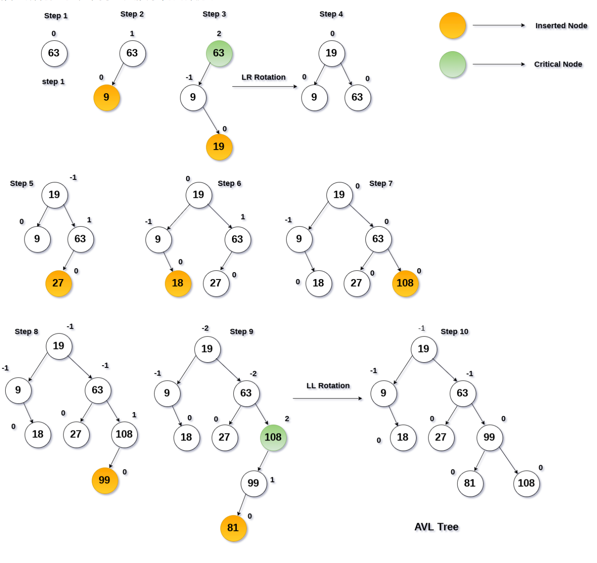
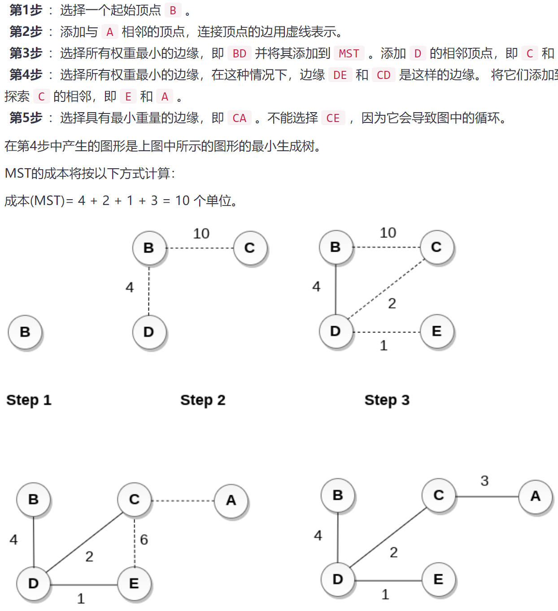
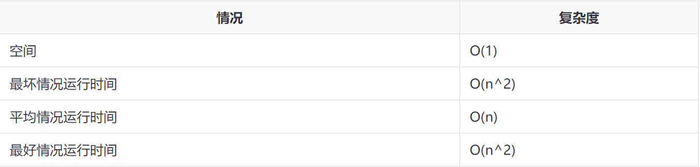
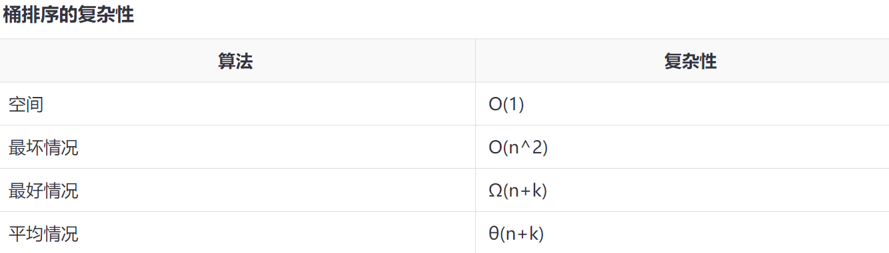
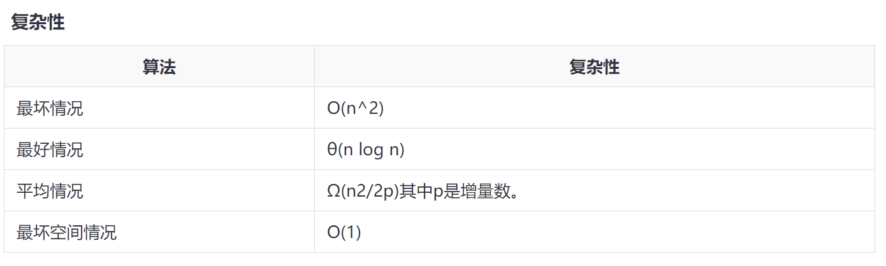

https://www.yiibai.com/data_structure/linked-list-implementation-of-queue.html

# 数组

# 链表

# 堆栈

# 队列

# 树

**表达式树**

用于评估简单的算术表达式。表达式树基本上是二叉树，其中内部节点由运算符表示，而叶节点由操作数表示。表达式树被广泛用于解决代数表达式，如`(a + b)*(a-b)`。 请考虑以下示例。

**竞赛树**

竞赛树用于记录两名比赛者之间每轮比赛的胜者。 比赛树也可以称为选择树或获胜者树。 外部节点表示正在播放匹配的比赛者，而内部节点表示所播放的匹配的胜者。 在最顶层，比赛的获胜者作为树的根节点出现。

例如，在4个比赛者之间进行的比赛树如下所示。 但是，左子树中的获胜者将与右子树的获胜者对战

## 二叉树

### 1严格二叉树

具有`(2n-1)`个节点。

### 2完全二叉树

如果所有叶子都位于相同的水平`d`，则称二元树是完全二叉树。完全二叉树是二叉树，在0级和d级之间的每个级别包含正好`2 ^ d`个节点。 具有深度`d`的完全二叉树中的节点总数是`2^d+1 -1`，其中叶节点是`2^d`而非叶节点是`2^d-1`。

### 3二叉搜索树

这也称为有序二叉树。

在二叉搜索树中，左子树中所有节点的值小于根的值。

类似地，右子树中所有节点的值大于或等于根的值。

此规则将递归地应用于根的所有左子树和右子树。

 在二叉搜索树中搜索元素需要`o(log2n)`时间

在最坏的情况下，搜索元素所花费的时间是`0(n)`。

| 1 [在二叉搜索树中搜索](https://www.yiibai.com/data_structure/searching-in-binary-search-tree.html) | 在二叉搜索树中查找某些特定元素的位置。                       |      |
| ------------------------------------------------------------ | ------------------------------------------------------------ | ---- |
| 2 [在二叉搜索树中插入](https://www.yiibai.com/data_structure/insertion-in-binary-search-tree.html) | 在适当的位置向二叉搜索树添加新元素，以便BST的属性不会违反。  |      |
| 3 [在二叉搜索树中删除](https://www.yiibai.com/data_structure/deletion-in-binary-search-tree.html) | 从二叉搜索树中删除某个特定节点。 然而，根据节点具有的子节点数，可以存在各种删除情况。 |      |

#### 1.搜索

```
1.搜索算法
将元素与树的根进行比较。

如果项目匹配，则返回节点的位置。

否则，检查数据项是否小于根的元素，如果是，则移动到左子树。

如果没有，则移至右子树。

递归地重复此过程，直到找到匹配。

如果未找到元素，则返回`NULL`。
search (ROOT, ITEM)
步骤1：
    IF ROOT -> DATA = ITEM OR ROOT = NULL
        返回ROOT
    ELSE
        IF ROOT <ROOT -> DATA
            返回search(ROOT -> LEFT，ITEM)
        ELSE
            返回search(ROOT - > RIGHT，ITEM)
        [IF结束]
  [IF结束]

```

#### 2.inserte()

为树分配内存。将数据部分设置为值并设置树的左右指针指向NULL。如果要插入的数据项将是树的第一个元素，则此节点的左和右节点将指向NULL。否则，检查数据项是否小于树的根元素，如果为真，则以根的左子树递归执行此操作。如果为false，则使用根的右子树递归执行此操作
第1步 : IF TREE = NULL
      为TREE分配内存 
      SET TREE -> DATA = ITEM 
     SET TREE -> LEFT = TREE -> RIGHT = NULL
     ELSE
      IF ITEM < TREE -> DATA
       Insert(TREE -> LEFT, ITEM)
     ELSE
      Insert(TREE -> RIGHT, ITEM)
     [IF结束]
     [IF结束]
    

```
 void insert(int item)  
{  
    struct node *ptr, *parentptr , *nodeptr;  
    ptr = (struct node *) malloc(sizeof (struct node));  
    if(ptr == NULL)  
    {  
        printf("can't insert");  
    }  
    else   
    {  
    ptr -> data = item;  
    ptr -> left = NULL;  
    ptr -> right = NULL;   
    if(root == NULL)  
    {  
        root = ptr;  
        root -> left = NULL;  
        root -> right = NULL;  
    }  
    else   
    {  
        parentptr = NULL;  
        nodeptr = root;   
        while(nodeptr != NULL)  
        {  
            parentptr = nodeptr;   
            if(item < nodeptr->data)  
            {  
                nodeptr = nodeptr -> left;   
            }   
            else   
            {  
                nodeptr = nodeptr -> right;  
            }  
        }  
        if(item < parentptr -> data)  
        {  
            parentptr -> left = ptr;   
        }  
        else   
        {  
            parentptr -> right = ptr;   
        }  
    }  
    printf("Node Inserted");  
    }  
}
```

​    

#### **3.删除节点**

分为三种情况：

1. 要删除的节点是叶节点

2. 要删除的节点只有一个子节点

3.  要删除的节点有两个子节点

   与上面的两种情况相比，这种情况有点复杂。 但是，要删除的节点被递归地替换为其有序后继或前导，直到将节点值(要删除)放置在树的叶子上。 在该过程之后，用`NULL`替换节点并释放分配的空间。

   ```
   Delete (TREE, ITEM)
   
   第1步 : IF TREE = NULL
         提示： "item not found in the tree" ELSE IF ITEM < TREE -> DATA
        Delete(TREE->LEFT, ITEM)
        ELSE IF ITEM > TREE -> DATA
      Delete(TREE -> RIGHT, ITEM)
        ELSE IF TREE -> LEFT AND TREE -> RIGHT
        SET TEMP = findLargestNode(TREE -> LEFT)
        SET TREE -> DATA = TEMP -> DATA
         Delete(TREE -> LEFT, TEMP -> DATA)
        ELSE
      SET TEMP = TREE
      IF TREE -> LEFT = NULL AND TREE -> RIGHT = NULL
         SET TREE = NULL
        ELSE IF TREE -> LEFT != NULL
        SET TREE = TREE -> LEFT
        ELSE
       SET TREE = TREE -> RIGHT
        [IF结束]
     FREE TEMP
   [IF结束]
   ```

   ```
   void deletion(Node*& root, int item)  
   {  
       Node* parent = NULL;  
       Node* cur = root;  
   
       search(cur, item, parent);  
       if (cur == NULL)  
           return;  
   
       if (cur->left == NULL && cur->right == NULL)  
       {  
           if (cur != root)  
           {  
               if (parent->left == cur)  
                   parent->left = NULL;  
               else  
                   parent->right = NULL;  
           }  
           else  
               root = NULL;  
   
           free(cur);       
       }  
       else if (cur->left && cur->right)  
       {  
           Node* succ  = findMinimum(cur- >right);  
   
           int val = succ->data;  
   
           deletion(root, succ->data);  
   
           cur->data = val;  
       }  
   
       else  
       {  
           Node* child = (cur->left)? Cur- >left: cur->right;  
   
           if (cur != root)  
           {  
               if (cur == parent->left)  
                   parent->left = child;  
               else  
                   parent->right = child;  
           }  
   
           else  
               root = child;  
           free(cur);  
       }  
   }  
   
   Node* findMinimum(Node* cur)  
   {  
       while(cur->left != NULL) {  
           cur = cur->left;  
       }  
       return cur;  
   }
   
   
   ```

   

### 4.平衡搜索树(AVL树)

AVL树可以定义为高度平衡二叉搜索树，其中每个节点与平衡因子相关联，该平衡因子通过从其左子树的子树中减去其右子树的高度来计算。

如果每个节点的平衡因子在`-1`到`1`之间，则称树是平衡的，否则，树将是不平衡的并且需要平衡。

**平衡系数(k)=高度(左(k)) - 高度(右(k))**

如果任何节点的平衡因子为`1`，则意味着左子树比右子树高一级。
如果任何节点的平衡因子为`0`，则意味着左子树和右子树包含相等的高度。
如果任何节点的平衡因子是`-1`，则意味着左子树比右子树低一级。

AVL树如下图所示。 可以看到，与每个节点相关的平衡因子介于`-1`和`+1`之间。 因此，它是AVL树的一个例子。

高度为`h`的二叉搜索树中的所有操作所花费的时间是`O(h)`。 但是，如果二叉搜索树变得偏斜(即最坏的情况)，它可以扩展到`O(n)`。 通过将该高度限制为`log n`，AVL树将每个操作的上限强加为`O(log n)`，其中`n`是节点的数量。

**复杂性**

| 算法 | 平均情况 | 最坏情况 |
| ---- | -------- | -------- |
| 空间 | o(n)     | o(n)     |
| 搜索 | o(log n) | o(log n) |
| 插入 | o(log n) | o(log n) |
| 删除 | o(log n) | o(log n) |

| 1 [插入](https://www.yiibai.com/data_structure/insertion-in-avl-tree.html) | AVL树中的插入的执行方式与在二叉搜索树中执行的方式相同。但是，它可能会导致违反AVL树属性，因此树可能需要平衡。可以通过应用旋转来平衡树。 |
| ------------------------------------------------------------ | ------------------------------------------------------------ |
| 2 [删除](https://www.yiibai.com/data_structure/deletion-in-avl-tree.html) | **删除也可以按照在二叉搜索树中执行的相同方式执行。 删除也可能会扰乱树的平衡，因此，使用各种类型的旋转来重新平衡树。** |

#### 插入

思路懂了，算法不会写

| 1    | [LL旋转](https://www.yiibai.com/data_structure/ll-rotation-in-avl-tree.html) | 新节点被插入到关键节点的左子树的左子树中。 |
| ---- | ------------------------------------------------------------ | ------------------------------------------ |
| 2    | [RR旋转](https://www.yiibai.com/data_structure/rr-rotation-in-avl-tree.html) | 新节点被插入到关键节点的右子树的右子树中。 |
| 3    | [LR旋转](https://www.yiibai.com/data_structure/lr-rotation-in-avl-tree.html) | 新节点被插入到关键节点的左子树的右子树中。 |
| 4    | [RL旋转](https://www.yiibai.com/data_structure/rl-rotation-in-avl-tree.html) | 新节点被插入到关键节点的右子树的左子树中。 |

**示例：** 通过以给定顺序插入以下元素来构造AVL树。

```
63, 9, 19, 27, 18, 108, 99, 81
```

从给定元素集构造AVL树的过程如下图所示。

在每一步，必须计算每个节点的平衡因子，如果发现它大于`2`或小于`-2`，那么需要一个旋转来重新平衡树。 旋转类型将通过插入元素相对于关键节点的位置来估计。



#### 删除

从AVL树中删除节点类似于二叉搜索树中删除节点。 删除可能会干扰AVL树的平衡因子，因此需要重新平衡树以保持AVL树平衡。 因此需要进行旋转。 两种类型的旋转是`L`旋转和`R`旋转。 在这里将讨论`R`旋转。`L`旋转是它们的镜像。

https://www.yiibai.com/data_structure/deletion-in-avl-tree.html

## B树

​					 				 				 				 			

B树是一种专用的M阶树，可广泛用于磁盘访问。 M阶树顺序的B树最多可以有`m-1`个键和M个子树。 使用B树的主要原因之一是它能够在单个节点中存储大量键，并且通过保持树的高度相对较小来存储大键值。

排序M的B树包含M阶树的所有属性。 此外，它还包含以下属性。

- B树中的每个节点最多包含`m`个子节点。
- 除根节点和叶节点外，B树中的每个节点至少包含`m/2`个子节点。
- 根节点必须至少有`2`个节点。
- 所有叶节点必须处于同一级别。

所有节点都不必包含相同数量的子节点，但每个节点必须具有`m/2`个节点数。


## B+树

# 图

## 广度优先搜索BFS

广度优先搜索是一种图遍历算法，它从根节点开始遍历图并探索所有相邻节点。 然后，它选择最近的节点并浏览所有未探测的节点。 对于每个最近的节点，该算法遵循相同的过程，直到找到目标为止。

下面给出了广度优先搜索的算法。算法从检查节点A及其所有邻居开始。在下一步中，搜索`A`的最近节点的邻居，并且在后续步骤中继续处理。 该算法探索所有节点的所有邻居，并确保每个节点只访问一次，并且没有访问任何节点两次。

**算法**

```
第1步：设置状态 = 1(就绪状态)
    对于G中的每个节点
第2步：将起始节点A排队
    并设置其状态 = 2
    (等待状态)
第3步：重复第4步和第5步，直到
    队列是空的
第4步：使节点N出列。处理它
    并设置其状态 = 3
    (处理状态)。
第5步：将所有邻居排队
      N处于就绪状态
 (其STATUS = 1)并设置它们状态 = 2
 (等待状态)
  [循环结束]
第6步：退出
```

最小路径`P`可以通过应用广度优先搜索算法找到，该算法将从节点`A`开始并将以`E`结束。算法使用两个队列，即`QUEUE1`和`QUEUE2`。 `QUEUE1`保存要处理的所有节点，而`QUEUE2`保存从`QUEUE1`处理和删除的所有节点

## 深度优先搜索DFS

深度优先搜索(DFS)算法从图`G`的初始节点开始，然后越来越深，直到找到目标节点或没有子节点的节点。该算法然后从死角回溯到尚未完全未探索的最新节点。

在DFS中使用的数据结构是堆栈。该过程类似于`BFS`算法。 在DFS中，通向未访问节点的边称为发现边，而通向已访问节点的边称为块边。

**算法**

```
第1步：为G中的每个节点设置STATUS = 1(就绪状态)
第2步：将起始节点A推入堆栈并设置其STATUS = 2(等待状态)
第3步：重复第4步和第5步，直到STACK为空
第4步：弹出顶部节点N.处理它并设置其STATUS = 3(处理状态)
第5步：将处于就绪状态(其STATUS = 1)的N的所有邻居推入堆栈并设置它们
    STATUS = 2(等待状态)
    [循环结束]
第6步：退出
```

生成树可以定义为连通的无向图`G`的子图，该图是通过从图中移除所需数量的边而产生的树。 换句话说，生成树是连接和无向图`G`的非循环子图，其将所有顶点连接在一起。 图`G`可以具有多个生成树。

## 1. 最小生成树

可以在加权图中为每个边分配权重。 但是，最小生成树是具有最小总权重的生成树。 换句话说，最小生成树是在某个特定图的所有其他生成树中包含最小权重的生成树。

## 2. 最短路径算法

在本教程的这一部分中，接下来将讨论用于计算图中两个节点之间的最短路径的算法。

有两种算法可用于此目的：

- [Prim算法](https://www.yiibai.com/data_structure/prim-algorithm.html)
- [Kruskal算法](https://www.yiibai.com/data_structure/kruskal-algorithm.html)

### Prim算法

用于从图中查找最小生成树。Prim算法找到包括图的每个顶点的边的子集，使得边的权重之和可以最小化。

Prim算法从单个节点开始，并在每一步探索所有相邻节点的所有连接边缘。 选择了具有最小权重的边缘在图表中没有引起循环。

算法如下 - 

第1步：选择一个起始顶点
第2步：重复第3步和第4步，直到有条纹顶点
第3步：选择连接树顶点和具有最小权重的边缘顶点的边`e`。
第4步：将选定的边和顶点添加到最小生成树`T`。
[循环结束]
第5步：退出



```c
#include <stdio.h>  
#include <limits.h>  
#define vertices 5  

int minimum_key(int k[], int mst[])  
{  
   int minimum  = INT_MAX, min,i;  

   for (i = 0; i < vertices; i++)  
     if (mst[i] == 0 && k[i] < minimum )  
         minimum  = k[i], min = i;  

   return min;  
}  


void prim(int g[vertices][vertices])  
{  
     int parent[vertices];   
     int k[vertices];     
     int mst[vertices];    
     int i, count,u,v;   
     for (i = 0; i < vertices; i++)  
        k[i] = INT_MAX, mst[i] = 0;  

     k[0] = 0;       
     parent[0] = -1;   

     for (count = 0; count < vertices-1; count++)  
     {  

        u = minimum_key(k, mst);  
      mst[u] = 1;  

        for (v = 0; v < vertices; v++)  

          if (g[u][v] && mst[v] == 0 && g[u][v] <  k[v])  
             parent[v]  = u, k[v] = g[u][v];  
     }  

    for (i = 1; i < vertices; i++)  
      printf("%d  %d    %d \n", parent[i], i, g[i][parent[i]]);  
}  


void main()  
{  
   int g[vertices][vertices] = {{3, 2, 1, 9, 0},  
                      {5, 1, 2, 10, 4},  
                      {0, 4, 1, 0, 9},  
                      {8, 10, 0, 2, 10},  
                      {1, 6, 8, 11, 0},  
                     };  

    prim(g);  
}

```

执行上面示例代码，得到以下结果 - 

```shell
0  1    5 
0  2    0 
0  3    8 
1  4    6
```

### Kruskal算法

用于查找连接加权图的最小生成树。该算法的主要目标是通过使用哪个来找到边的子集，可以遍历图的每个顶点。Kruskal算法遵循贪婪的方法，在每个阶段找到最佳解决方案，而不是专注于全局最优。

Kruskal算法如下。

```
第1步：创建一个森林，使每个图形都是一个单独的树。
第2步：创建包含图表所有边缘的优先级队列Q。
第3步：重复第4步和第5步，而Q不为空。
第4步：从Q中删除边
第5步：如果在步骤4中获得的边连接两个不同的树，则将其添加到森林中(用于将两个树组合成一个树)。
    其他
    丢弃边
第6步：结束
```

**示例：**
将Kruskal算法应用于如下图表。


**解决方案：**

边的权重如下：

| 边   | AE   | AD   | AC   | AB   | BC   | CD   | DE   |
| ---- | ---- | ---- | ---- | ---- | ---- | ---- | ---- |
| 权重 | 5    | 10   | 7    | 1    | 3    | 4    | 2    |

根据权重对边进行排序。

| 边   | AB   | DE   | BC   | CD   | AE   | AC   | AD   |
| ---- | ---- | ---- | ---- | ---- | ---- | ---- | ---- |
| 权重 | 1    | 2    | 3    | 4    | 5    | 7    | 10   |

开始构建树，将`AB`添加到`MST`;


将`DE`添加到`MST`;


将`BC`添加到`MST`;


下一步是添加`AE`，但不能添加它，因为它会导致循环。
要添加的下一个边是`AC`，但不能添加，因为它会导致循环。
要添加的下一个边是`AD`，但无法添加，因为它将包含一个循环。
因此，最终的MST是步骤4中所示的MST。
MST的成本 = 1 + 2 + 3 + 4 = 10。

使用C++实现上面算法，代码如下所示 - 

```cpp
#include <iostream>  
#include <vector>  
#include <utility>  
#include <algorithm>  
using namespace std;  
const int MAX = 1e4 + 5;  
int id[MAX], nodes, edges;  
pair <long long, pair<int, int> > p[MAX];  

void init()  
{  
    for(int i = 0;i < MAX;++i)  
        id[i] = i;  
}  

int root(int x)  
{  
    while(id[x] != x)  
    {  
        id[x] = id[id[x]];  
        x = id[x];  
    }  
    return x;  
}  

void union1(int x, int y)  
{  
    int p = root(x);  
    int q = root(y);  
    id[p] = id[q];  
}  

long long kruskal(pair<long long, pair<int, int> > p[])  
{  
    int x, y;  
    long long cost, minimumCost = 0;  
    for(int i = 0;i < edges;++i)  
    {  
        x = p[i].second.first;  
        y = p[i].second.second;  
        cost = p[i].first;  
        if(root(x) != root(y))  
        {  
            minimumCost += cost;  
            union1(x, y);  
        }      
    }  
    return minimumCost;  
}  

int main()  
{  
    int x, y;  
    long long weight, cost, minimumCost;  
    init();  
    cout <<"Enter Nodes and edges";  
    cin >> nodes >> edges;  
    for(int i = 0;i < edges;++i)  
    {  
        cout<<"Enter the value of X, Y and edges";  
    cin >> x >> y >> weight;  
        p[i] = make_pair(weight, make_pair(x, y));  
    }  
    sort(p, p + edges);  
    minimumCost = kruskal(p);  
    cout <<"Minimum cost is "<< minimumCost << endl;  
    return 0;  
}
```

//原文出自【易百教程】，商业转载请联系作者获得授权，非商业转载请保留原文链接：https://www.yiibai.com/data_structure/kruskal-algorithm.html 

# 线性搜索

# 二进制（二分查找）

# 排序

## 冒泡



## 桶排序



第1步，开始 

第2步，设置一个最初为空的“桶”(`buckets`)数组。 

第3步，分散：遍历原始数组，将每个对象放入其存储桶中。 

第4步，对每个非空桶进行排序。

 第5步，收集：按顺序访问存储桶并将所有元素放回原始数组中。 第6步，停止


## 梳排序



## 计数排序

```js
function countSort(array){
    let len=array.length;
    let max=Math.max(...array)
    let min =Math.min(...array);
    if (max == min) {
        return array;
    }
    
    let k=max-min+1;
    let c=new Array(k).fill(0);
    for(let i=0;i<len;i++){
        c[array[i]-min]+=1;
    }
    
    // 累计计数
    for(let j=1;j<k;j++){
        c[j]=c[j]+c[j-1];
    }
    let result=new Array(len).fill(0);
    for(let i = 0; i<len;i++){
        result[c[array[i]-min]-1]=array[i];
        c[array[i]-min]--;
    }
    return result;
}
```


## 堆排序

堆排序通过使用给定数组的元素创建最小堆或最大堆来处理元素。 最小堆或最大堆表示数组的顺序，其中根元素表示数组的最小或最大元素。 在每个步骤中，堆的根元素被删除并存储到已排序的数组中，堆将再次堆积。

**堆排序的基本思想是：将待排序序列构造成一个大顶堆，此时，整个序列的最大值就是堆顶的根节点。将其与末尾元素进行交换，此时末尾就为最大值。然后将剩余n-1个元素重新构造成一个堆，这样会得到n个元素的次小值。如此反复执行，便能得到一个有序序列了**

堆排序基本上递归地执行两个主要操作。

- 使用数组`ARR`的元素构建堆`H`。
- 重复删除阶段`1`中形成的堆的根元素。

**复杂度**

| 复杂性     | 最好情况     | 平均情况     | 最坏情况     |
| ---------- | ------------ | ------------ | ------------ |
| 时间复杂性 | Ω(n log (n)) | θ(n log (n)) | O(n log (n)) |
| 空间复杂性 | -            | -            | O(1)         |

**算法**

```
HEAP_SORT(ARR, N)

第1步 : [构建堆 H]
    重复 i=0 到 N-1
    CALL INSERT_HEAP(ARR, N, ARR[i])
    [结束循环]
第2步 : 反复删除根元素
    当 N > 0 时，重复执行
    CALL Delete_Heap(ARR,N,VAL)
    SET N = N+1 
    [结束循环]
第3步: 结束
```


```js
// 堆排序
function heapSort(array){
    //1.构建大顶堆
    for(let i=array.length/2-1;i>=0;i--){
        //从第一个非叶子结点从下至上，从右至左调整结构
        adjustHeap(array,i,array.length);
    }
    //2.将根与最后一个交换
    for(let j=array.length-1;j>=0;j--){
         swap(array,0,j);
         adjustHeap(array,0,j);
    }
    return array;
}
//调整大顶堆（仅是调整过程，建立在大顶堆已构建的基础上）
function adjustHeap(array,i,length){
    let temp=array[i]
    for(let k=2*i+1;k<length;k=2*k+1){
        //如果左子节点小于右子节点，k指向右
        if(k+1<length&&array[k]<array[k+1]){
            k++;
        }
        if(temp<array[k]){
            array[i]=array[k]
            i=k;
        }else{
            break;
        }

    }
    array[i]=temp;
    
}
//交换
function swap(array,i,j){
    let temp=array[i]
    array[i]=array[j]
    array[j]=temp;
}
```


## 插入排序

```js
//插入
function insertSort(arr){
    for(let i=1;i<arr.length;i++){
        let temp=arr[i]
        arr.splice(i,1);
        let flag=false;
        for(let j=0;j<i;j++){
            if(temp<arr[j]){
                arr.splice(j,0,temp)
                flag=true
                break;
            }
        }
        if(!flag){
            arr.splice(i,0,temp)
        }
    }
    return arr;
}
```

## 合并排序

合并排序是遵循分而治之的方法。 考虑一下，假设有`n`个元素的数组`A`。该算法分`3`个步骤处理元素。

1. 如果`A`包含`0`或`1`个元素，则它已经被排序，否则，将`A`分成两个具有相同数量元素的子数组。
2. 使用合并排序递归地对两个子数组进行排序。
3. 组合子数组以形成单个最终排序数组，维护数组的顺序。

合并排序背后的主要思想是，短列表需要较少的时间进行排序。

**复杂度**

| 复杂度     | 最好情况   | 平均情况   | 最坏情况   |
| ---------- | ---------- | ---------- | ---------- |
| 时间复杂度 | O(n log n) | O(n log n) | O(n log n) |
| 空间复杂度 | -          | -          | O(n)       |

```js
//合并排序
function mergeSort(array){
     let len=array.length
     if(len<2){
         return;
     }
     let mid=len/2;
     let leftArray=array.slice(0,mid);
     let rightArray=array.slice(mid);
     mergeSort(leftArray)
     mergeSort(rightArray)
     merge(array,leftArray,rightArray)
     return array;
     
}
//合并两个有序排序
function merge(target,left,right){
    let ll=left.length
    let rl=right.length
    let i=0,j=0,k=0
    while(i<ll&&j<rl){
        if(left[i]<right[j]){
            target[k++]=left[i++]
        }else{
            target[k++]=right[j++]
        }
    }
    while(i<ll){
        target[k++]=left[i++]
    }
    while(j<rl){
        target[k++]=right[j++]
    }
}

```

## 快速排序

快速排序是广泛使用的排序算法，它在平均情况下进行`n log n`比较，用于排序`n`个元素的数组。快速排序算法遵循分而治之的方法。 此算法以下列方式处理该数组。

1. 将数组的第一个索引设置为`left`和`loc`变量。 将数组的最后一个索引设置为`right`变量。 即`left = 0`，`loc = 0`，`en d = n?1`，其中`n`是数组的长度。
2. 从数组的右边开始，从右到开扫描整个数组，将数组的每个元素与`loc`指向的元素进行比较。确保`a[loc]`小于`a[right]`。
   - 如果是这种情况，则继续进行比较，直到右边等于`loc`。
   - 如果`a[loc] > a[right]`，则交换这两个值。 然后转到第3步。
   - 设置，`loc = right`
3. 从左边指向的元素开始，并将每个元素与变量`loc`指向的元素进行比较。 确保`a[loc]> a [left]`。
   - 如果满足上面情况，则继续比较，直到`loc`等于`left`。
   - `a[loc] < a[right]`，然后交换两个值并转到第2步。
   - 设置`loc = left`。

**复杂性**

| 复杂度     | 最好情况                            | 平均情况   | 最坏情况 |
| ---------- | ----------------------------------- | ---------- | -------- |
| 时间复杂度 | O(n)用于3路分区或O(n log n)简单分区 | O(n log n) | O(n^2)   |
| 空间复杂度 | -                                   | -          | O(log n) |

```js
//快速排序
function qSort(array,low,high){
    if(low>=high){
        return;
    }
    let i=low,key=array[low],j=high
    while(i < j){
        while(i<j&&array[j]>=key){
            j--;
        }
        //交换,找到右边第一个小于分界值的元素，交换
        array[i]=array[j]
        while(i<j&&array[i]<=key){
            i++;
        }
        //交换,找到右边第一个小于分界值的元素，交换
        array[j]=array[i]
    }
    array[i]=key
    qSort(array,low,i-1)
    qSort(array,i+1,high)
    return array

}
```


## 基数排序

## 选择排序

```js
//选择排序
function selectSort(array){
    for(let i=0;i<array.length;i++){
        let min=array[i]
        let key=i;
        for(let j=i+1;j<array.length;j++){
            if(min>array[j]){
                min=array[j]
                 key=j;
            }
        }
        array[key]=array[i]
        array[i]=min;
       
    }
    return array;
}
```


## 希尔排序

希尔(Shell)排序是插入排序的概括，它通过比较由几个位置的间隙分隔的元素来克服插入排序的缺点。 通常，希尔(Shell)排序执行以下步骤。

- 第1步：以扁平形式排列元素，并使用插入排序对列进行排序。
- 第2步：重复第1步; 每次使用较少数量的较长列，最终只需要对一列数据进行排序。

#### 复杂性

| 复杂性     | 最好情况    | 平均情况      | 最坏情况      |
| ---------- | ----------- | ------------- | ------------- |
| 时间复杂性 | Ω(n log(n)) | θ(n log(n)^2) | O(n log(n)^2) |
| 空间复杂性 | -           | -             | O(1)          |


## 双调排序

## 鸡尾酒排序

## 圈排序

