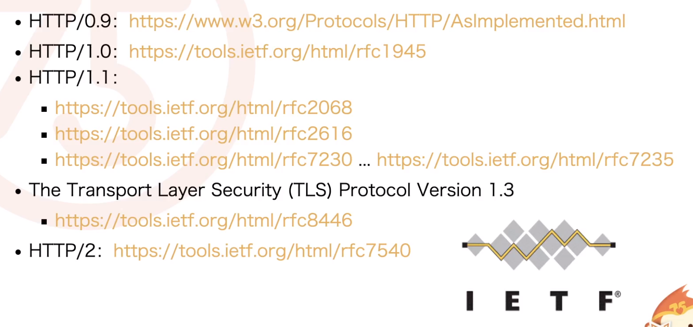

**Web标准概述**

Web是Word Wide Web（万维网）的简称，由Tim Berners-Lee在1989年发明。

《Information Management：A Proposal》

Web标准是构成Web基础、运行和发展的一系列标准的总称。

制定标准的组织：

- IETF(互联网工程任务组) 1986 TCP、IP协议

  

  - HTTP/0.9
  - HTTP/1.0 rfc1945参考文档，head，post版本号，描述和响应
  - HTTP1.1 持久性连接，强制性服务器头部，更好的缓存，分块编码 1999 2004更新 
  - TLS 加密协议
  - HTTP/2：
    - HTTP：一个连接，一个请求数据，文本协议，低效（静态服务器分片，合并请求）
    - 基于google speed协议制定新的标准

- ecma ECMA TC39 JavaScript标准 2015 ES6

- W3C（万维网联盟）：https://www.w3.org/TR/

  - BOM 标准

    - window
    - location
    - navigator
    - screen
    - history

  - DOM标准 文档对象模型 真正跨平台，语言无关的表示和操作网页的方式

  - DOM1，DOM2,DOM3（模块化思路）

    - DOM Core

    - DOM Views

    - DOM Events

    - DOM  Style

    - DOM Tranversal and Range

    - DOM HTML

    - DOM Mutation Observers

      ```html
      <!DOCTYPE html>
      <html>
      <head>
          <meta charset="UTF-8">
          <meta name="viewport" content="width=device-width, initial-scale=1.0">
          <meta http-equiv="X-UA-Compatible" content="ie=edge">
          <title></title>
      </head>
      <body>
          <input type="text" placeholder="添加项内容" id="input" />
          <ul id="target">
              <li>1</li>
              <li>2</li>
              <li>3</li>
          </ul>
          <button onclick="addNode()">添加</button>
          <button onclick="deleteNode()">删除最后一项</button>
          <button onclick="setBackgroundColor()">修改样式</button>
          <button onclick="addAttribute()">添加name属性</button>
          <button onclick="stopObserver()">停止监听</button>
      </body>
      </html>
      <script>
          // Select the node that will be observed for mutations
      var targetNode = document.getElementById('target');
      
      // Options for the observer (which mutations to observe)
      var config = { attributes: true, childList: true, subtree: true };
      
      // Callback function to execute when mutations are observed
      var callback = function(mutationsList) {
          for(var mutation of mutationsList) {
              if (mutation.type == 'childList') {
                  console.log('A child node has been added or removed.');
              }
              else if (mutation.type == 'attributes') {
                  console.log('The ' + mutation.attributeName + ' attribute was modified.');
              }
          }
      };
      
      // Create an observer instance linked to the callback function
      var observer = new MutationObserver(callback);
      
      // Start observing the target node for configured mutations
      observer.observe(targetNode, config);
      
      // Later, you can stop observing
      function stopObserver(){
          observer.disconnect();
      }
      
      function addNode(){
         var inputNode=document.getElementById('input');
         var value =inputNode.value;
         var liNode =document.createElement('li');
         liNode.innerHTML=value;
         targetNode.appendChild(liNode);
         inputNode.value=""
      }
      
      function deleteNode(){
         var children=targetNode.children;
         if(children.length>0){
             targetNode.removeChild(children[children.length-1]);
         }
      }
      function setBackgroundColor(){
          var r=Math.floor(Math.random()*255)
          var g=Math.floor(Math.random()*255)
          var b=Math.floor(Math.random()*255)
          targetNode.style.cssText=`background-color:rgb(${r},${g},${b})`
      }
      
      function addAttribute(){
          targetNode.setAttribute('name',Math.floor(Math.random()*10))
      }
      </script>
      ```

- whatwg 超文本应用技术组 2004年成立

  - HTML标准
  - DOM标准

  > ”HTML5设计原理“

- Memorandum of Understanding Between W3C and WHATWG

​     协议 （有时间在查查看。。。）

**总结**

对WEB标准的了解和掌握，现在还十分欠缺，学到太少太片面