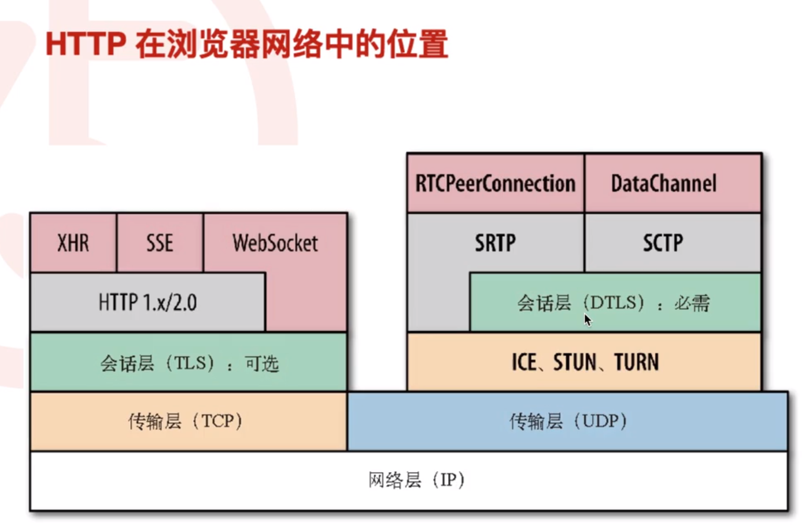
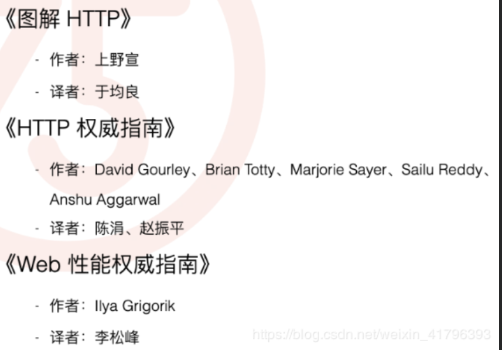

360前端星计划学习笔记（四）常用的HTTP知识
（基础，平时掌握少）
<!--more-->

### 常用的HTTP知识

#### HTTP在浏览器网络中的位置



HTTP是应用层协议

联网细节传输协议：TCP/UDP

浏览器Network中查看资源请求，请求头，响应等

#### 请求/响应报文

```
<method><request-URL><version>
<headers>

<entity-body>

<version><status><respon-phrase>
<headers>
    
<entity-body>
```

**请求报文**

 - 请求行
   - 请求类型
   - 要访问的资源
   - HTTP协议版本号
 - 请求头
   - 用来说明服务器要使用的附加信息（一些键值对）
   - 例如：User-Agent、 Accept、Content-Type、Connection
 - 空行
   - 分割请求头与请求体
 - 请求体
   - 可以添加任意的其他数据

**响应报文**

 - 状态行
   - 状态码
   - 状态消息 
   - HTTP协议版本号
 - 消息报头
   - 说明客户端要使用的一些附加信息
   - 如：Content-Type、charset、响应的时间
 - 响应正文
   - 返回给客户端的文本信息 

统一资源接口（**相关复习知识点RESTful**）

| 请求方法 | 描述                                                         |
| -------- | ------------------------------------------------------------ |
| GET      | 获取某个资源。 幂等（取多少次结果都没有变化）                |
| POST     | 创建一个新的资源                                             |
| PUT      | 替换某个已有的资源（更新操作） ， 幂等（更新多次只保存一个结果） |
| DELETE   | 删除某个资源                                                 |
| OPTIONS  | 根据返回判断是否有对其请求的权限                             |
| HEAD     | 主要用于确认 URL 的有效性以及资源更新的日期时间等,只返回head，不返回实体内容 |
| PATCH    | 新引入的，对PUT方法的补充，用来对已知资源进行局部更新        |

#### **状态码**

1** 请求已接受，需要继续处理

2** 请求已经正确处理

3** 重定向

4**客户端错误

5** 服务端错误

**常用状态码**

101： 切换协议，如将HTTP协议切换为WebSocket协议

206：返回部分内容，如：大文件下载

400：前端提交数据的字段名称和后台实体没有保持一致，无法解析请求

403：无权限访问，请求被拒绝

413： 请求实体太大，服务端限制了上传的文件大小

502： 作为网关或代理服务器时，上游服务器异常。（eg. Nginx->node ，如果node未启动等）

504 ：作为网关或代理服务器时，上游服务器处理超时

#### URL

受限字符：%.#?;:$+@&=以及非US-ASC II 字符集字符 一般通过Encode在传输

#### Header 分类

通用：Date，Connection

请求：User-Agent 浏览器等版本

响应：

- Server
- Last-Modified

实体：

- Content-Type
- Content-Length:100

扩展：

- X-Powered-By
- X-Cache：hit

#### **Cookie**

cookie:是网站为了标示用户身份而储存在用户本地终端（Client Side）上的数据（通常经过加密）cookie 数据始终在同源的 http 请求中携带（即使不需要），记会在浏览器和服务器间来回传递。

**Web安全**

- XSS 漏洞盗取 Cookie，设置 httponly，转义字符，CSP 内容安全策略
- CSRF 漏洞，设置 token/samesite，SameSite：可以对 Cookie 设置 SameSite 属性。该属性表示 Cookie 不随着跨域请求发送，可以很大程度减少 CSRF 的攻击，但是该属性目前并不是所有浏览器都兼容。

#### Session

- 服务器侧对应为 Session，基于 Cookie 存放用户信息
- Cookie 有效期为 Session（随浏览器进程退出而失效）

#### Content-type

标识返回内容的类型,标识提交数据的类型。

- application/x-www-form-urlencoded
- multipart/form-data
- application/json
- text/xml

#### 性能优化

- keep-alive

  - HTTP 1.0 原本不支持 Keep-Alive，后来扩充了 Connection: Keep-Alive
  - HTTP 1.1 默认支持 Keep-Alive，除非显式指明 Connection: close

- 减少网络传输大小

  - 主要是文本资源
  - 大约减少 60%
  - 文件过小不宜压缩（<1K）

- 缓存

  强制缓存优先于协商缓存进行，若强制缓存(Expires和Cache-Control)生效则直接使用缓存，若不生效则进行协商缓存(Last-Modified / If-Modified-Since和Etag / If-None-Match)，协商缓存由服务器决定是否使用缓存，若协商缓存失效，那么代表该请求的缓存失效，重新获取请求结果，再存入浏览器缓存中；生效则返回304，继续使用缓存，主要过程如下：

  

#### HTTP2&HTTP3

**HTTP2**

HTTP 2.0 相比于 HTTP 1.X，可以说是大幅度提高了 web 的性能。

HTTP2采用`二进制格式传输`，取代了HTTP1.x的文本格式，二进制格式解析更高效。
`多路复用`代替了HTTP1.x的序列和阻塞机制，所有的相同域名请求都通过同一个TCP连接并发完成。

- 二进制传输

  HTTP 2.0 中所有加强性能的核心点在于此。在之前的 HTTP 版本中，我们是通过文本的方式传输数据。在 HTTP 2.0 中引入了新的编码机制，所有传输的数据都会被分割，并采用二进制格式编码。

- 多路复用

  HTTP1.x中，并发多个请求需要多个TCP连接，浏览器为了控制资源会有6-8个TCP连接都限制。
  HTTP2中

   - 同域名下所有通信都在单个连接上完成，消除了因多个 TCP 连接而带来的延时和内存消耗。
   - 单个连接上可以并行交错的请求和响应，之间互不干扰

- Header 压缩

  在 HTTP 2.0 中，使用了 HPACK 压缩格式对传输的 header 进行编码，减少了 header 的大小。并在两端维护了索引表，用于记录出现过的 header ，后面在传输过程中就可以传输已经记录过的 header 的键名，对端收到数据后就可以通过键名找到对应的值。

- 服务端 Push

  在 HTTP 2.0 中，服务端可以在客户端某个请求后，主动推送其他资源。

**HTTP3**

 是基于QUIC协议（UDP）

#### HTTP抓包工具&发包工具

**HTTP抓包工具**

- Wireshark
- Fiddler
- Firebug for Firefox
- Chrome 开发者工具
- IE8+ 自带的开发者工具

**HTTP发包工具**

- telnet / curl
- Fiddler *
- Tamper for Firefox
- Postman for Chrome *
- Paw for OSX

#### 推荐书籍

