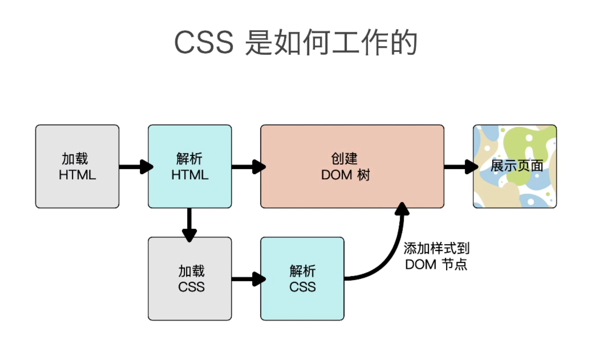
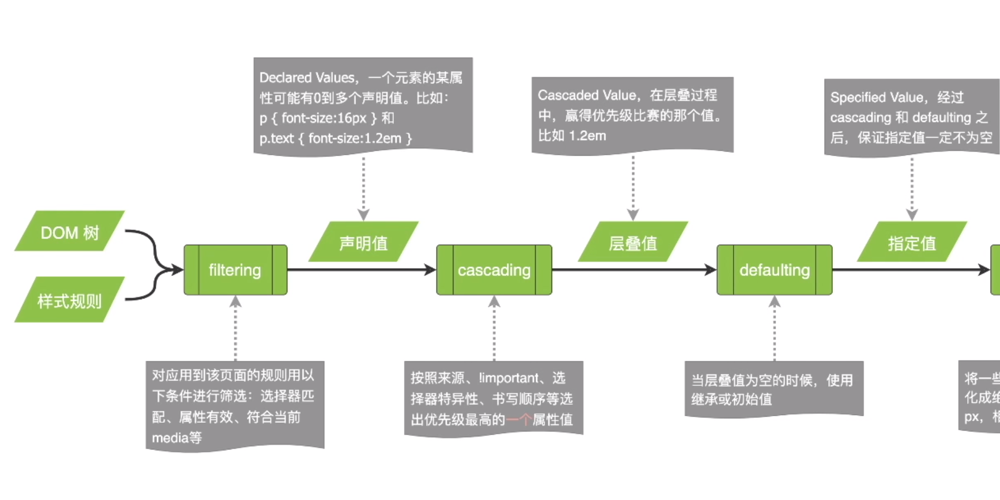
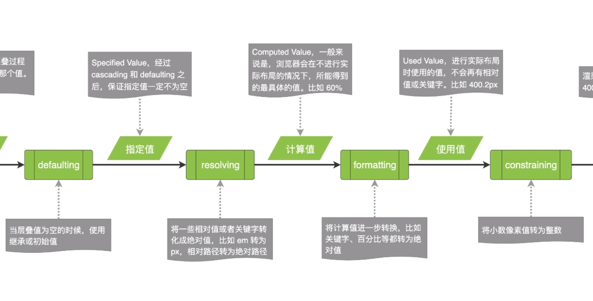
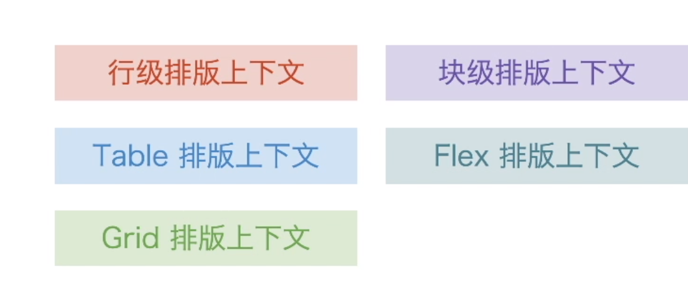

### 前端

什么是前端：

使用Web技术栈解决多端的图形界面人机交互问题--360奇舞讲师团


&lt!doctype html&gt
渲染模式和HTML版本
HTML语法：标签和属性不区分大小写，推荐小写，可以不闭合，image />,属性值用双引号包裹，可省略。
文本标签
引用：blockquote长引用,cite作品名等短引用，q前文引用
强调：strong 强调突出，重要严重紧急，em重音，突出的词
内容划分：head nav main article aside(导航链接，推荐，广告等，不属于页面主要内容) footer 
语义化：HTML中元素，属性，属性值都拥有某些含义。
谁在使用HTML，语义化好处
开发者：修改。维护页面-代码可读性，可维护性
浏览器：渲染页面
搜素引擎：提供关键词，排序-搜素引擎优化
屏幕阅读器：给盲人获得页面-提升无障碍性
传达内容，而不是样式
如何做到语义化：了解标签属性含义，思考什么标签最适合描述这个内容，尽量不用可视化工具生成代码而是手写代码

### CSS基础

Cascading style sheets

选择器 属性+属性值=声明
{；；} 声明块
选择器{；；} 规则
引入方式
外链（推荐，利于维护），嵌入，内联



**选择器Selector**

标签，类名，ID，DOM中的位置

通配选择器*

标签选择器：h1,p,img...

id 选择器：#ID值，唯一

类选择器：.done ,class的值可以多个，

属性选择器：eg.<input value="test" disabled/> [disabled]

​	根据属性值选择 eg. input[type="password"]

​	高级用法：a[href^=#]以#开头，$以什么结尾

伪类pseudo-classes

- 不基于标签和属性定位元素

- 两种伪类：

  - 状态伪类  

    a :link &:visited &:hover &:active,input:focus

  - 结构性伪类

     li:first-child &:last-child

组合器（combinator） 

直接组合  AB 同时满足A，B input.error

后代组合 A B 选中B，如果它是A的**子孙** article p

亲子组合 A>B 选中B，如果它是A**的子元素** article>p

组合可多级

选择器组 

**设置文字样式**

- 颜色：

  #16进制

  rgb:（0-255,0-255,0-255）

  HSL:  (Hue色相 0-360；Saturation：饱和度0-100%；Lightness：亮度0-100%) eg. hsl(44,60%,50%)

  颜色关键字：grey，black，white，

   alpha 透明度 0-1，rgba，hsla

- 字体 font-family 一般指定多个字体的值，尽可能的保证在各种设备上都能显示。
  - 通用字体族：serif 某一类字体，sans-Serif 无衬线体（Arial,黑体），Fantasy(手写体)，Monospace（等宽字体，编辑器里一般用）
  - 推荐：最后要写通用字体族；英文字体放在中文字体前面（中文一般包含英文字符，放在前面会无法使用英文）
  - Web Fonts  在服务器放置字体文件：.woff2,.ttf,
    - 中文字体文件一般比较大，会用字体处理工具，提取页面中用到的字符生成一个小的文件

- 字体大小font-size 
  - 关键字：small middle large
  - 长度：px em（相对于父元素 ）
  - 百分比 相对于父元素
- font-style: normal itail
- font-weight: 100-900,normal(400),bold(700),一般页面常用关键字，因为浏览器没有那么多字重的字体
- line-height 行字体基线的距离：①px,②1.6 自身字体大小的倍数

- font: style weight size family 可省略其他属性

**设置对齐**

- text-align: left center right justify(两端分散对齐)
- spacing ：letter-spacing 字母间间距，Word-spacing：词间距
- text-indent : 首行文字缩进
- text-decoration: none, underline, line-through, overline
- white-space :空格和换行行为 normal 多空行合并一个，nowrap 不换行，pre 保留原有空格,空行，pre-wrap:只有显示不下换行 pre-line 保留原有空行

### 继承布局

选择器的特异度（Specificity）

#nav .list li a:link 122

.hd ul.links a 022

高优先级会覆盖低优先级样式

**继承**

某些属性会自动继承其父元素的计算值，除非显式指定一个值

显示继承

```css
* {
	box-sizing: inherit
}
html {
    box-sizing: border-box;
}
some {
    box-sizing: content-box;
}
```

**初始值**

`background-color :transparent`

`background-color: initial` 显示重置为初始值

**CSS 求值过程**






- 过滤：规则匹配
- cascading层叠值:优先级排序
- cascaded value="" defaulting 
- resolving 将相对值，关键字转换为绝对值
- computed Value 从代码上即能推断
- formatting: 关键字，百分比转为绝对值 值 
- 使用值 进行实际时
- constaining 400.2px -400px
- 实际值

**布局Layout**

- 盒模型
  - content
    - width content box 宽度，取值 长度，百分比，auto（由内容计算）
    - height 容器有指定的高度，百分数才生效，循环依赖是不会生效的
  - padding
  - border
    - 三种属性
      - border-width
      - border-style
      - border-color
    - 四个方向
    - 可组合
    - 绘制三角形等
  - margin
    - 指定四个方向，值：长度，百分数(相对于容器的宽度)，auto，
    - 使用margin: auto 水平居中
    - margin collapse：折叠，垂直方向，取较大的值，负值是绝对值的大小
  - box-sizing: border-box
    - 指定的宽度包含border和padding的宽度
  - overflow: visible hidden scroll

- 块级

  Block Level Box 不和其他盒子并列摆放

  - 块级元素 生成块级盒子

    - body，article，div，main，section，h1-6p ul li

    - display:block

- 行级

  Inline Level Box 放置一行或拆分多行

  - 行级元素 生成行级盒子，内容分散在多个行盒

    - span em string cite code

    - display:inline

- 常规流

  ​	根元素、浮动和绝对定位的元素会脱离常规流

     其他元素都在常规流之内

  

  - 块级Block Formatting Context (BFC)

    流的容器 新的流摆放布局内容

    - 根元素
    - 浮动、绝对定位、inline-block
    - Flex和Grid子项
    - overflow值不为visible的块盒
    - 内部排版规则
      - 盒子从上到下
      - 垂直margin合并
      - 内部盒子的margin不会与外面合并
      - 不会和浮动元素重叠

  - 行级上下文Inline Formatting Context (IFC)

    - 只包含行级盒子的容器会创建IFC
    - 排版规则
      - text-aligin vertical-aligin
      - 避开浮动元素

  - table

  - flex

    - display: flex
    - 一种新的排版上下文
    - 摆放的流向flex-direction: row,row-reverse,column,column-reverse
    - 摆放顺序 order
    - 盒子宽高
    - 水平垂直对齐
    - flexibility 弹性
      - 可以设置子项的弹性，有剩余空间
      - flex-grow  扩展能力 都是1 内容的多的基准多，更宽一些
      - flex-shrink 收缩能力 flex-shrink:0不具备收缩能力
      - flex-basis 基本值展示 可以覆盖width，关键字：content 内容的宽度
      - flex 合并上述三个属性 flex: 1 1 auto
    - flex-wrap nowrap,wrap
    - 主轴 justify-content: flex-start, flex-end,center,space-between,space-around,space-evenly 相等的空格区分开
    - 侧轴 align-items strentch(default 占满容器高度 )，baseline基线对齐
      - 子元素特殊对齐align-self

  - grid

    ​	二维布局方式，划分网格

       display：grid 

    - grid-template

      - grid-template-columns: 30% 30% auto/100px 1fr 1fr (剩下的两列平分)
      - grid-template-rows :  100px auto/ 100px 1fr(剩余)

    - 设置子元素占用网格行列

      - 网格线    1 1 2, 3, 4

        ​                2			

      - 网格区域  grid-area 1/1/3/3

- 浮动

  - 文字环绕图片

- 绝对定位

  - position 
  - static 非定位元素 默认值
  - relative 不脱离文档流，相对于自身进行偏离
  - absolute 脱离常规流，不会对流内元素产生影响，相对于非static的祖先元素
  - fixed 相对于浏览器窗口定位，不随页面滚动发生位置变化

### 变形

**transform** 可设置多种变形函数

- translate 位移 元素移动不影响其他元素，按照自身原来位置进行计算摆放

- transform-origin 设置原点，旋转中心,默认自身中心点

- rotate 0.5turn 半圈 90deg

-  scale 自身坐标系

- skew 倾斜

- 3d变形 

  - perspective(100px)设置视角，人眼距离屏幕的距离

    ​    离屏幕更近，效果更明显

  - translate3d

**transition** 过渡

- transition-property 指定哪些属性变化需要过渡
- transition-duration 时间
- transition-timing-function 快慢 linear ease,ease-in,ease-out, ease-in-out, steps
- transition-delay 延迟

@keyframes down{ from 50% to}关键帧

animation：关键帧名字 duration ease infinite(无限)

- animation--name
- animation-duration 时间
- animation--timing-function 快慢 
- animation-delay 延迟
- animation-iteration-count 次数
- animation-direction 正序播放，逆序播放 
  - normal: from>to,alternate正反交替

### 响应式布局

**viewport** 通过meta设置视口 content="width=device-width"

**图片尺寸设置**：max-width: 100%

**背景图片：**

- background-size: cover 保证背景图片完整覆盖容器（展示内容类重要的图，商品图）
- background-size: contain 把图片缩放到容器内，完整的显示出来（装饰背景）

**media query**

​	@media screen and (min-width: 480px)

**使用不同尺寸的图片** img srcset="large.jpg 1200w" sizes="(max-width:320px) 400px" src="默认图片"

**字体大小**：rem做单位，用@media调整根节点html的font-size