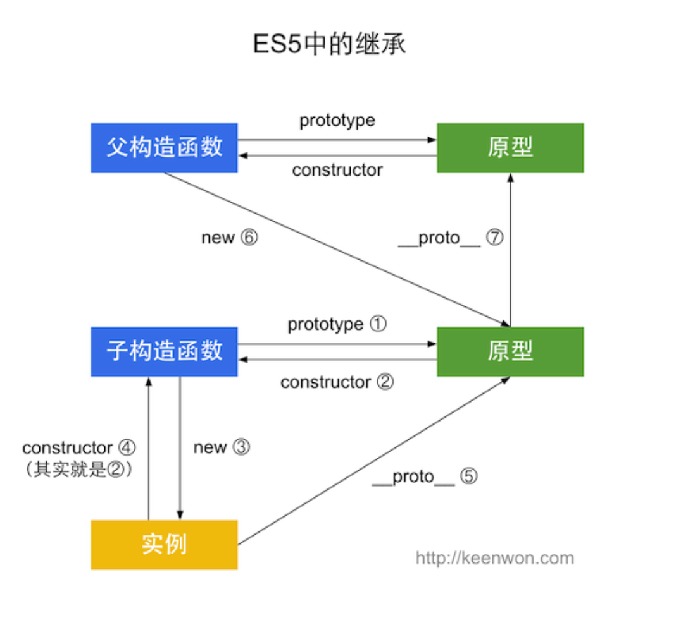
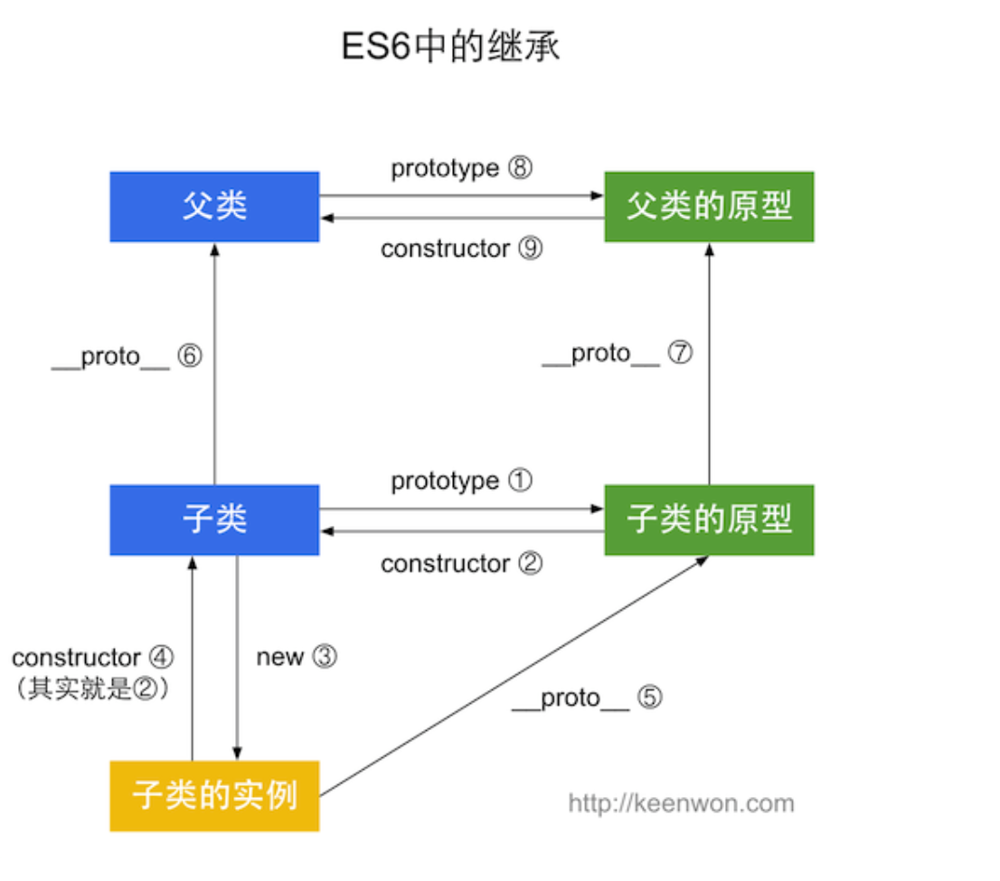

### ES5和ES6的类继承





ES6

```
class Colorpoint extends Point {
 2     constructor(x,y,color){
 3         super(x,y); //调用父类的constructor(x,y)
 4         this.color = color
 5     }
 6     toString(){
 7         //调用父类的方法
 8         return this.color + ' ' + super.toString(); 
 9     }
10 }
```

ES5 原型链实现继承

```js
 function SuperType(){
 2           this.property = true;
 3       }
 4       SuperType.prototype.getSuperValue = function(){
 5           return this.property;
 6       };
 7       function SubType(){
 8           this.subproperty = false;
 9       }
10       \\继承了SuperType
11       SubType.prototype = new SuperType();
```

- 原型链继承的问题

- - 最主要的问题来自包含引用类型值的原型，它会被所有实例共享
  - 第二个问题是，创造子类型的实例时，不能向超类型的构造函数中传递参数

借助构造函数

```js
function SuperType(){
 2     this.colors = ["red","blue","green"];
 3 }
 4 
 5 function SubType(){
 6     \\借调了超类型的构造函数
 7     SuperType.call(this);
 8 }
```

通过call或者apply方法，我们实际上是在将来新创建的SubType实例的环境下调用了SuperType构造函数。

优势：可以传递参数

缺点：

- 方法都在构造函数中定义，函数无法复用
- 在超类型中定义的方法，子类型不可见，结果所有类型都只能使用构造函数模式

组合继承

```js
function Supertype(name){
 2     this.name = name;
 3     this.colors = ["red","green","blue"];
 4 }
 5 
 6 Supertype.prototype.sayName = function(){
 7     console.log(this.name);
 8 };
 9 
10 function Subtype(name,age){
11     \\继承属性
12     Supertype.call(this,name);
13     this.age  = age;
14 }
15 
16 \\继承方法
17 Subtype.prototype = new Supertype();
```

缺点：无论在什么情况下，都会调用两次超类型构造函数，一次是在创建子类型原型的时候，一次是在子类型构造函数的内部

寄生组合式继承
定义：所谓寄生组合式继承，即通过借用构造函数来继承属性，通过原型链的混成形式来继承方法。其背后的基本思路是：不必为了指定子类型的原型而调用超类型的构造函数，我们所需要的无非就是超类型原型的一个副本而已。本质上，就是使用寄生式继承来继承超类型的原型，然后再将结果指定给子类型的原型。（引自《JavaScript高级程序设计》）

1.定义父类型

```
function Person(name){
    this.category = 'human';
    this.legNum = 2;
    this.name = name;
}

Person.prototype.sayHello = function(){
    console.log('Hi,i am ' + this.name);
}
```


2.定义继承方法

```
function inherit(subType,superType){
    //在new inheritFn 的时候将构造函数指向子类
    function inheritFn(){this.constructor = subType}
    inheritFn.prototype = superType.prototype;
    //将子类的原型指向父类原型的一个副本
    subType.prototype = new inheritFn();
}
```

