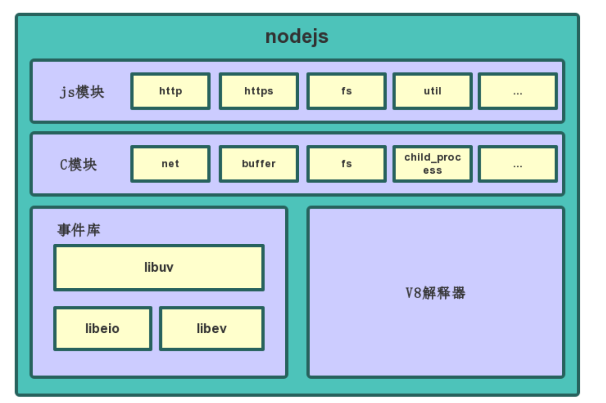
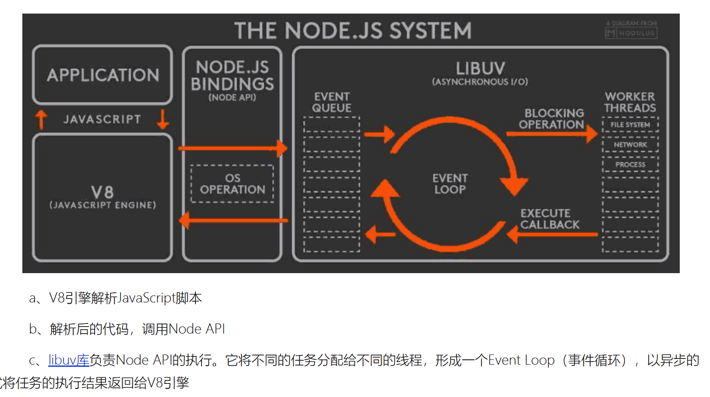

# NodeJS

## NodeJS 特点

 - 非阻塞式的异步I/O
   - Node.js中采用了非阻塞型I/O机制，因此在执行了访问文件的代码之后，Nodejs不会阻塞在那里等待文件获取完成，而是把这件事交给底层操作系统，使用回调函数的方式来处理异步的IO，立即转而执行其它的代码，
 - 事件轮询
   - Nodejs接收到的事件会放到事件队列中，而不是立即执行它，当NodeJS当前代码执行完后他会检查事件队列中是否有事件，如果有，他会取出来依次执行
 - 单线程
   - Node.js不为每个客户连接创建一个新的线程，而仅仅使用一个线程。当有用户连接了，就触发一个内部事件，通过非阻塞I/O、事件驱动机制，让Node.js程序宏观上也是并行的
   - 优点：不会死锁、不用像多线程那样处处在意同步问题、没有线程切换带来的性能上的开销
   - 缺点：多核CPU需单独开子线程、错误会使得整个应用退出、大量计算会占用CPU从而无法调用异步I/O
 - 擅长I/O密集型
   - 主要体现在Node利用事件轮询的方式处理事件，而不是单开一个线程来为每一个请求服务
 - 不擅长CPU密集型业务
   - 由于Node单线程，如果长时间运行计算将导致CPU不能释放，使得后续I/O无法发起。（解决办法是分解大型运算为多个小任务，不阻塞I/O发起）


### global对象
与在浏览器端不同，浏览器端将希望全局访问的对象挂到window上，而nodejs则将希望全局访问的对象挂到global对象上

 - CommonJS
 - Buffer、process、console
 - timer定时器相关

### setImmediate()、setTimeout(fn, 0) 与 process.nextTick()
两个都是传入一个回调函数，当同步事件执行完之后马上执行。

执行顺序依次是：
 - process.nextTick()
   - 将回调函数加入到 当前执行栈的尾部，任务队列之前
 - setTimeout(fn, 0)
   - 回调函数加入到 任务队列尾部。即使是0，也会又4ms的延时
 - setImmediate()
   - 将回调函数插入到任务队列的最末尾，也不会造成阻塞，但不妨碍其他的异步事件


```js
setImmediate(() => {
  console.log('setImmediate');
})

setTimeout(() => {
  console.log('setImmediate');
}, 0)

process.nextTick(() => {
  console.log('next');
})
```

### 为什么支持高并发

前提：I/O密集型任务

单线程的解释：主线程是一个，底层工作线程是多个

事件机制的底层依赖库：libuv/libeio,libev

- libuv：开发node过程中需要跨平台，首选为Linux使用libev（底层为epoll），备选Windows使用IOCP实现，用于**抽象libev和IOCP的高性能网络库**。

- - 非阻塞TCP、非阻塞命名管道、UDP、异步DNS
  - 异步文件系统、路径查找、ANSI转义、文件系统事件
  - 子进程生成、线程池调度、进程间IPC与套接字共享
  - 高分辨率时间、定时器

- epoll和IOCP的区别：

- - epoll用于Linux系统，IOCP用于Windows系统；
  - epoll是**同步非阻塞模型**：当事件资源满足时发出可处理通知消息（**主线程需要自己去处理**）；IOCP是**异步非阻塞模型**，当事件完成时发出通知消息（**工作线程帮主线程处理完了**）。





单线程的好处：

（1）多线程占用内存高

（2）多线程间切换使得CPU开销大

（3）多线程由内存同步开销

（4）编写单线程程序简单

（5）线程安全

 

4、单线程的劣势：

（1）CPU密集型任务占用CPU时间长

（2）无法利用CPU的多核

（3）单线程抛出异常使得程序停止

针对每个并发请求，服务端给请求注册一个激发事件（I/O），并给一个回调函数（这个过程没有阻塞新的连接请求）。

按顺序执行事件处理（I/O），处理完成后执行回调函数，接着执行下一个事件处理（I/O）。

事件处理（I/O）原理？

事件处理（即异步I/O处理）是由node工作线程去执行的（nodejs底层的libuv是由多线程的线程池并行I/O操作），且主线程是不需要等待返回的，只要发出指令后就可以执行其他事件，所有操作完成后执行回调。


NodeJS的优缺点

优点：

1、高并发；

2、适合I/O密集型应用。

缺点：

1、不适合CPU密集型应用，只支持单核CPU，不能充分利用CPU；

2、单进程，单线程，一旦代码某处出现bug，整个系统都崩溃；

如何解决CPU密集型？

原因，由于JavaScript单线程的原因，如果有长时间运行的计算（比如大循环），将会导致CPU时间片不能释放，使得后续I/O无法发起。

解决方案：分解大型运算任务为多个小任务，使得运算能够适时释放，不阻塞I/O调用的发起。

单进程、单线程解决方案

Nnigx反向代理，负载均衡，开多个进程，绑定多个端口；

开多个进程监听同一个端口，使用cluster模块。