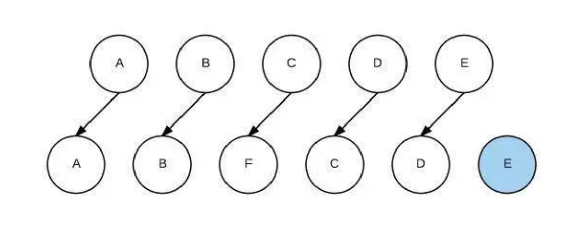
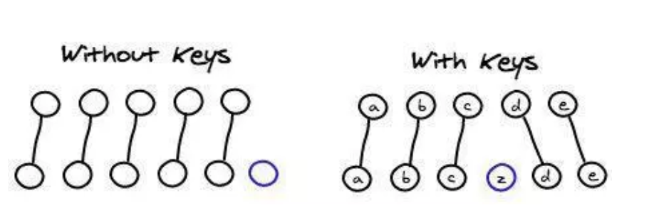
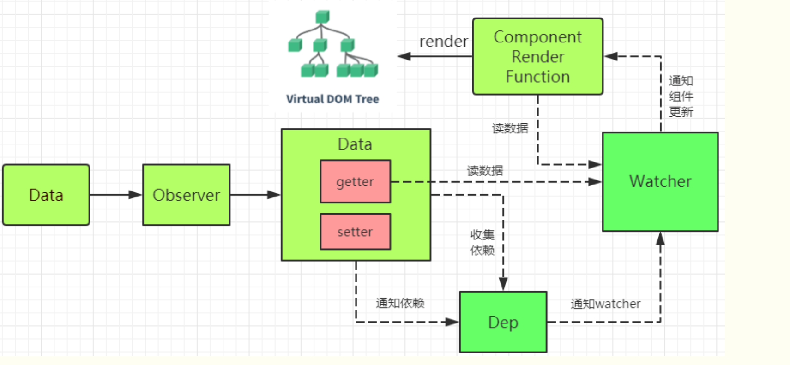

### v-bind和v-model的区别

1.v-bind用来绑定数据和属性以及表达式，缩写为'：'
2.v-model使用在表单中，实现双向数据绑定的，在表单元素外使用不起作用

### 什么是 mvvm？

MVVM 是 Model-View-ViewModel 的缩写。mvvm 是一种设计思想。Model 层代表数据模型，也可以在 Model 中定义数据修改和操作的业务逻辑；View 代表 UI 组件，它负责将数据模型转化成 UI 展现出来，ViewModel 是一个同步 View 和 Model 的对象。

在 MVVM 架构下，View 和 Model 之间并没有直接的联系，而是通过 ViewModel 进行交互，Model 和 ViewModel 之间的交互是双向的， 因此 View 数据的变化会同步到 Model 中，而 Model 数据的变化也会立即反应到 View 上。

ViewModel 通过双向数据绑定把 View 层和 Model 层连接了起来，而 View 和 Model 之间的同步工作完全是自动的，无需人为干涉，因此开发者只需关注业务逻辑，不需要手动操作 DOM, 不需要关注数据状态的同步问题，复杂的数据状态维护完全由 MVVM 来统一管理。

### mvvm 和 mvc 区别？

mvc 和 mvvm 其实区别并不大。都是一种设计思想。主要就是 mvc 中 Controller 演变成 mvvm 中的 viewModel。mvvm 主要解决了 mvc 中大量的 DOM 操作使页面渲染性能降低，加载速度变慢，影响用户体验。和当 Model 频繁发生变化，开发者需要主动更新到 View 。

### vue 的优点是什么？

- 低耦合。视图（View）可以独立于 Model 变化和修改，一个 ViewModel 可以绑定到不同的"View"上，当 View 变化的时候 Model 可以不变，当 Model 变化的时候 View 也可以不变。
- 可重用性。你可以把一些视图逻辑放在一个 ViewModel 里面，让很多 view 重用这段视图逻辑。
- 独立开发。开发人员可以专注于业务逻辑和数据的开发（ViewModel），设计人员可以专注于页面设计，使用 Expression Blend 可以很容易设计界面并生成 xml 代码。
- 可测试。界面素来是比较难于测试的，而现在测试可以针对 ViewModel 来写。

### 请详细说下你对 vue 生命周期的理解？

答：总共分为 8 个阶段创建前/后，载入前/后，更新前/后，销毁前/后。

- 创建前/后： 在 beforeCreate 阶段，vue 实例的挂载元素 el 还没有。
- 载入前/后：在 beforeMount 阶段，vue 实例的$el 和 data 都初始化了，但还是挂载之前为虚拟的 dom 节点，data.message 还未替换。在 mounted 阶段，vue 实例挂载完成，data.message 成功渲染。
- 更新前/后：当 data 变化时，会触发 beforeUpdate 和 updated 方法。
- 销毁前/后：在执行 destroy 方法后，对 data 的改变不会再触发周期函数，说明此时 vue 实例已经解除了事件监听以及和 dom 的绑定，但是 dom 结构依然存在

### 组件之间的传值？

1. 父组件与子组件传值

```html
//父组件通过标签上面定义传值
<template>
    <Main :obj="data"></Main>
</template>
<script>
    //引入子组件
    import Main form "./main"

    exprot default{
        name:"parent",
        data(){
            return {
                data:"我要向子组件传递数据"
            }
        },
        //初始化组件
        components:{
            Main
        }
    }
</script>


//子组件通过props方法接受数据
<template>
    <div>{{data}}</div>
</template>
<script>
    exprot default{
        name:"son",
        //接受父组件传值
        props:["data"]
    }
</script>
```

2. 子组件向父组件传递数据

```html
//子组件通过$emit方法传递参数
<template>
   <div v-on:click="events"></div>
</template>
<script>
    //引入子组件
    import Main form "./main"

    exprot default{
        methods:{
            events:function(){

            }
        }
    }
</script>


//

<template>
    <div>{{data}}</div>
</template>
<script>
    exprot default{
        name:"son",
        //接受父组件传值
        props:["data"]
    }
</script>
```

### active-class 是哪个组件的属性？

vue-router 模块的 router-link 组件。

### 嵌套路由怎么定义？

在实际项目中我们会碰到多层嵌套的组件组合而成，但是我们如何实现嵌套路由呢？因此我们需要在 VueRouter 的参数中使用 children 配置，这样就可以很好的实现路由嵌套。
index.html，只有一个路由出口

```html
<div id="app">
    <!-- router-view 路由出口, 路由匹配到的组件将渲染在这里 -->
    <router-view></router-view>
</div>
```

main.js，路由的重定向，就会在页面一加载的时候，就会将 home 组件显示出来，因为重定向指向了 home 组件，redirect 的指向与 path 的必须一致。children 里面是子路由，当然子路由里面还可以继续嵌套子路由。

```js
import Vue from 'vue'
import VueRouter from 'vue-router'
Vue.use(VueRouter)

//引入两个组件

import home from "./home.vue"
import game from "./game.vue"
//定义路由
const routes = [
    { path: "/", redirect: "/home" },//重定向,指向了home组件
    {
        path: "/home", component: home,
        children: [
            { path: "/home/game", component: game }
        ]
    }
]
//创建路由实例
const router = new VueRouter({routes})

new Vue({
    el: '#app',
    data: {
    },
    methods: {
    },
    router
})
```

home.vue，点击显示就会将子路由显示在出来，子路由的出口必须在父路由里面，否则子路由无法显示。

### 路由之间跳转？

- 声明式（标签跳转） `<router-link :to="index">`
- 编程式（ js 跳转） `router.push('index')`

### 懒加载（按需加载路由）（常考）

webpack 中提供了 require.ensure()来实现按需加载。以前引入路由是通过 import 这样的方式引入，改为 const 定义的方式进行引入。

- 不进行页面按需加载引入方式：

```js
import  home   from '../../common/home.vue'
```

- 进行页面按需加载的引入方式：

```js
const  home = r => require.ensure( [], () => r (require('../../common/home.vue')))
```

### vuex 是什么？怎么使用？哪种功能场景使用它？

vue 框架中状态管理。在 main.js 引入 store，注入。新建了一个目录 store，….. export 。场景有：单页应用中，组件之间的状态。音乐播放、登录状态、加入购物车

```js
// 新建 store.js
import vue from 'vue'
import vuex form 'vuex'
vue.use(vuex)
export default new vuex.store({
	//...code
})

//main.js
import store from './store'
...
```

### vue-router 有哪几种导航钩子?

三种

- 全局导航钩子
  - router.beforeEach(to, from, next),
  - router.beforeResolve(to, from, next),
  - router.afterEach(to, from ,next)
- 组件内钩子
  - beforeRouteEnter,
  - beforeRouteUpdate,
  - beforeRouteLeave
- 单独路由独享组件
  - beforeEnter

### 自定义指令(v-check, v-focus) 的方法有哪些? 它有哪些钩子函数? 还有哪些钩子函数参数

- 全局定义指令：在 vue 对象的 directive 方法里面有两个参数, 一个是指令名称, 另一个是函数。
- 组件内定义指令：directives
- 钩子函数: bind(绑定事件出发)、inserted(节点插入时候触发)、update(组件内相关更新)
- 钩子函数参数： el、binding

### 说出至少 4 种 vue 当中的指令和它的用法

v-if(判断是否隐藏)、v-for(把数据遍历出来)、v-bind(绑定属性)、v-model(实现双向绑定)

v-on 事件绑定

v-cloak 在浏览器加载慢的时候，可能会显示vue源码，可以通过设置dom的v-cloak 指令，并配合设置css [v-cloak]:{display:none;}

用key管理可复用的元素，v-for的key一般使用数值或者字符串类型的值

v-show v-if 切换时条件块中的事件监听器和子组件适当地被销毁和重建，是惰性的，频繁切换推荐使用v-show 

变异方法：通过将被监听的数组的变异方法进行包裹，实现push,pop,shift,unshift触发视图更新

对于filter，map等可以通过新数组赋值替换旧数组的方式触发视图更新，用一个含有相同元素的数组去替换原数组是高效的操作，依托于内部实现的启发式方法。

### vue 的双向绑定的原理是什么(常考)

vue.js 是采用数据劫持结合发布者-订阅者模式的方式，通过 Object.defineProperty()来劫持各个属性的 setter，getter，在数据变动时发布消息给订阅者，触发相应的监听回调。

具体步骤：
第一步：需要 observe 的数据对象进行递归遍历，包括子属性对象的属性，都加上 setter 和 getter 这样的话，给这个对象的某个值赋值，就会触发 setter，那么就能监听到了数据变化

第二步：compile 解析模板指令，将模板中的变量替换成数据，然后初始化渲染页面视图，并将每个指令对应的节点绑定更新函数，添加监听数据的订阅者，一旦数据有变动，收到通知，更新视图

第三步：Watcher 订阅者是 Observer 和 Compile 之间通信的桥梁，主要做的事情是:

- 在自身实例化时往属性订阅器(dep)里面添加自己
- 自身必须有一个 update()方法
- 待属性变动 dep.notice()通知时，能调用自身的 update() 方法，并触发 Compile 中绑定的回调，则功成身退。

第四步：MVVM 作为数据绑定的入口，整合 Observer、Compile 和 Watcher 三者，通过 Observer 来监听自己的 model 数据变化，通过 Compile 来解析编译模板指令，最终利用 Watcher 搭起 Observer 和 Compile 之间的通信桥梁，达到数据变化 -> 视图更新；视图交互变化(input) -> 数据 model 变更的双向绑定效果。

## vuex 相关

### vuex 有哪几种属性

有 5 种，分别是 state、getter、mutation、action、module

### vuex 的 store 特性是什么

- vuex 就是一个仓库，仓库里放了很多对象。其中 state 就是数据源存放地，对应于一般 vue 对象里面的 data
- state 里面存放的数据是响应式的，vue 组件从 store 读取数据，若是 store 中的数据发生改变，依赖这相数据的组件也会发生更新
- 它通过 mapState 把全局的 state 和 getters 映射到当前组件的 computed 计算属性

### vuex 的 getter 特性是什么

- getter 可以对 state 进行计算操作，它就是 store 的计算属性
- 虽然在组件内也可以做计算属性，但是 getters 可以在多给件之间复用
- 如果一个状态只在一个组件内使用，是可以不用 getters

### vuex 的 mutation 特性是什么

- action 类似于 muation, 不同在于：action 提交的是 mutation,而不是直接变更状态
- action 可以包含任意异步操作

### vue 中 ajax 请求代码应该写在组件的 methods 中还是 vuex 的 action 中

如果请求来的数据不是要被其他组件公用，仅仅在请求的组件内使用，就不需要放入 vuex 的 state 里

如果被其他地方复用，请将请求放入 action 里，方便复用，并包装成 promise 返回

### 不用 vuex 会带来什么问题

- 可维护性会下降，你要修改数据，你得维护 3 个地方
- 可读性下降，因为一个组件里的数据，你根本就看不出来是从哪里来的
- 增加耦合，大量的上传派发，会让耦合性大大的增加，本来 Vue 用 Component 就是为了减少耦合，现在这么用，和组件化的初衷相背

### vuex 原理

vuex 仅仅是作为 vue 的一个插件而存在，不像 Redux,MobX 等库可以应用于所有框架，vuex 只能使用在 vue 上，很大的程度是因为其高度依赖于 vue 的 computed 依赖检测系统以及其插件系统，

vuex 整体思想诞生于 flux,可其的实现方式完完全全的使用了 vue 自身的响应式设计，依赖监听、依赖收集都属于 vue 对对象 Property set get 方法的代理劫持。最后一句话结束 vuex 工作原理，vuex 中的 store 本质就是没有 template 的隐藏着的 vue 组件；

### 使用 Vuex 只需执行 Vue.use(Vuex)，并在 Vue 的配置中传入一个 store 对象的示例，store 是如何实现注入的？[美团](https://tech.meituan.com/vuex_code_analysis.html)

Vue.use(Vuex) 方法执行的是 install 方法，它实现了 Vue 实例对象的 init 方法封装和注入，使传入的 store 对象被设置到 Vue 上下文环境的$store 中。因此在 Vue Component 任意地方都能够通过 this.$store 访问到该 store。

### state 内部支持模块配置和模块嵌套，如何实现的？[美团](https://tech.meituan.com/vuex_code_analysis.html)

在 store 构造方法中有 makeLocalContext 方法，所有 module 都会有一个 local context，根据配置时的 path 进行匹配。所以执行如 dispatch('submitOrder', payload)这类 action 时，默认的拿到都是 module 的 local state，如果要访问最外层或者是其他 module 的 state，只能从 rootState 按照 path 路径逐步进行访问。

### 在执行 dispatch 触发 action(commit 同理)的时候，只需传入(type, payload)，action 执行函数中第一个参数 store 从哪里获取的？[美团](https://tech.meituan.com/vuex_code_analysis.html)

store 初始化时，所有配置的 action 和 mutation 以及 getters 均被封装过。在执行如 dispatch('submitOrder', payload)的时候，actions 中 type 为 submitOrder 的所有处理方法都是被封装后的，其第一个参数为当前的 store 对象，所以能够获取到 { dispatch, commit, state, rootState } 等数据。

### Vuex 如何区分 state 是外部直接修改，还是通过 mutation 方法修改的？[美团](https://tech.meituan.com/vuex_code_analysis.html)

Vuex 中修改 state 的唯一渠道就是执行 commit('xx', payload) 方法，其底层通过执行 this.\_withCommit(fn) 设置\_committing 标志变量为 true，然后才能修改 state，修改完毕还需要还原\_committing 变量。外部修改虽然能够直接修改 state，但是并没有修改\_committing 标志位，所以只要 watch 一下 state，state change 时判断是否\_committing 值为 true，即可判断修改的合法性。

### 调试时的"时空穿梭"功能是如何实现的？[美团](https://tech.meituan.com/vuex_code_analysis.html)

devtoolPlugin 中提供了此功能。因为 dev 模式下所有的 state change 都会被记录下来，'时空穿梭' 功能其实就是将当前的 state 替换为记录中某个时刻的 state 状态，利用 store.replaceState(targetState) 方法将执行 this.\_vm.state = state 实现。

## axios

### axios 是什么？怎么使用？描述使用它实现登录功能的流程

axios 是请求后台资源的模块。 npm i axios -S

如果发送的是跨域请求，需在配置文件中 config/index.js 进行配置

## vue v-for里的key作用

没有key



有key



因为vue组件高度复用增加Key可以标识组件的唯一性，为了更好地区别各个组件 key的作用主要是为了高效的更新虚拟DOM

当vue用v-for更新已渲染过的元素列表时，默认用”就地复用“策略，如果数据项的顺序被改变，vue不会移动dom元素来匹配数据项的顺序，而是简单复用此处每个元素，并且确保它在特定索引下显示已被渲染过的每个元素。

### Vue diff算法

https://www.cnblogs.com/wind-lanyan/p/9061684.html

其核心是基于两个简单的假设：1. 两个相同的组件产生类似的DOM结构，不同的组件产生不同的DOM结构。2. 同一层级的一组节点，他们可以通过唯一的id进行区分。

1. **如果节点类型不同，直接干掉前面的节点，再创建并插入新的节点，不会再比较这个节点以后的子节点了。**

2. **如果节点类型相同，则会重新设置该节点的属性，从而实现节点的更新。**

   基本过程：

   

```js
function updateChildren (parentElm, oldCh, newCh, insertedVnodeQueue, removeOnly) {
    var oldStartIdx = 0;
    var newStartIdx = 0;
    var oldEndIdx = oldCh.length - 1;
    var oldStartVnode = oldCh[0];
    var oldEndVnode = oldCh[oldEndIdx];
    var newEndIdx = newCh.length - 1;
    var newStartVnode = newCh[0];
    var newEndVnode = newCh[newEndIdx];
    var oldKeyToIdx, idxInOld, vnodeToMove, refElm;

    // removeOnly is a special flag used only by <transition-group>
    // to ensure removed elements stay in correct relative positions
    // during leaving transitions
    var canMove = !removeOnly;

    {
      checkDuplicateKeys(newCh);
    }
    // 如果索引正常
    while (oldStartIdx <= oldEndIdx && newStartIdx <= newEndIdx) {
        // 当前的开始旧节点没有定义，进入下一个节点
      if (isUndef(oldStartVnode)) {
        oldStartVnode = oldCh[++oldStartIdx]; // Vnode has been moved left
        // 当前的结束旧节点没有定义，进入上一个节点
      } else if (isUndef(oldEndVnode)) {
        oldEndVnode = oldCh[--oldEndIdx];
        // 如果旧的开始节点与新的开始节点相同，则开始更新该节点，然后进入下一个节点
      } else if (sameVnode(oldStartVnode, newStartVnode)) {
　　　　　// 更新节点
        patchVnode(oldStartVnode, newStartVnode, insertedVnodeQueue);
        oldStartVnode = oldCh[++oldStartIdx];
        newStartVnode = newCh[++newStartIdx];
        // 如果旧的结束节点与新的开始节点相同，则开始更新该节点，然后进入下一个节点
      } else if (sameVnode(oldEndVnode, newEndVnode)) {
        patchVnode(oldEndVnode, newEndVnode, insertedVnodeQueue);
        oldEndVnode = oldCh[--oldEndIdx];
        newEndVnode = newCh[--newEndIdx];
        // 如果旧的开始节点与新的结束节点相同，更新节点后把旧的开始节点移置节点末尾
      } else if (sameVnode(oldStartVnode, newEndVnode)) { // Vnode moved right
        patchVnode(oldStartVnode, newEndVnode, insertedVnodeQueue);
        canMove && nodeOps.insertBefore(parentElm, oldStartVnode.elm, nodeOps.nextSibling(oldEndVnode.elm));
        oldStartVnode = oldCh[++oldStartIdx];
        newEndVnode = newCh[--newEndIdx];
        // 如果旧的结束节点与新的开始节点相同，更新节点后把旧的结束节点移置节点开头
      } else if (sameVnode(oldEndVnode, newStartVnode)) { // Vnode moved left
        patchVnode(oldEndVnode, newStartVnode, insertedVnodeQueue);
        canMove && nodeOps.insertBefore(parentElm, oldEndVnode.elm, oldStartVnode.elm);
        oldEndVnode = oldCh[--oldEndIdx];
        newStartVnode = newCh[++newStartIdx];
      } else {
          // 如果旧的节点没有定义key，则创建key
        if (isUndef(oldKeyToIdx)) { oldKeyToIdx = createKeyToOldIdx(oldCh, oldStartIdx, oldEndIdx); }
        idxInOld = isDef(newStartVnode.key)
          ? oldKeyToIdx[newStartVnode.key]
          : findIdxInOld(newStartVnode, oldCh, oldStartIdx, oldEndIdx);
        // 如果没有定义index,则创建新的新的节点元素
        if (isUndef(idxInOld)) { // New element
          createElm(newStartVnode, insertedVnodeQueue, parentElm, oldStartVnode.elm);
        } else {
          vnodeToMove = oldCh[idxInOld];
          if (sameVnode(vnodeToMove, newStartVnode)) {
            patchVnode(vnodeToMove, newStartVnode, insertedVnodeQueue);
            oldCh[idxInOld] = undefined;
            canMove && nodeOps.insertBefore(parentElm, vnodeToMove.elm, oldStartVnode.elm);
          } else {
            // same key but different element. treat as new element
            createElm(newStartVnode, insertedVnodeQueue, parentElm, oldStartVnode.elm);
          }
        }
        newStartVnode = newCh[++newStartIdx];
      }
    }
    // 如果旧节点的开始index大于结束index,则创建新的节点  如果新的开始节点index大于新的结束节点则删除旧的节点
    if (oldStartIdx > oldEndIdx) {
      refElm = isUndef(newCh[newEndIdx + 1]) ? null : newCh[newEndIdx + 1].elm;
      addVnodes(parentElm, refElm, newCh, newStartIdx, newEndIdx, insertedVnodeQueue);
    } else if (newStartIdx > newEndIdx) {
      removeVnodes(parentElm, oldCh, oldStartIdx, oldEndIdx);
    }
  }
  
  // 判断是不是相同的Vnode
function sameVnode (a, b) {
 // 如果key相同、都不是或者是注释节点、都有定义data、都是或者都不是input类型的
  return (
    a.key === b.key && (
      (
        a.tag === b.tag &&
        a.isComment === b.isComment &&
        isDef(a.data) === isDef(b.data) &&
        sameInputType(a, b)
      ) || (
        isTrue(a.isAsyncPlaceholder) &&
        a.asyncFactory === b.asyncFactory &&
        isUndef(b.asyncFactory.error)
      )
    )
  )
}
// 如果是input类型 判断是否相同
function sameInputType (a, b) {
  if (a.tag !== 'input') { return true }
  var i;
  var typeA = isDef(i = a.data) && isDef(i = i.attrs) && i.type;
  var typeB = isDef(i = b.data) && isDef(i = i.attrs) && i.type;
  return typeA === typeB || isTextInputType(typeA) && isTextInputType(typeB)
}
// 创建key
function createKeyToOldIdx (children, beginIdx, endIdx) {
  var i, key;
  var map = {};
  for (i = beginIdx; i <= endIdx; ++i) {
    key = children[i].key;
    if (isDef(key)) { map[key] = i; }
  }
  return map
}
 function findIdxInOld (node, oldCh, start, end) {
    for (var i = start; i < end; i++) {
      var c = oldCh[i];
      if (isDef(c) && sameVnode(node, c)) { return i }
    }
  }

  function patchVnode (oldVnode, vnode, insertedVnodeQueue, removeOnly) {
    // 如果oldVnode与vnode完全相等直接返回
    if (oldVnode === vnode) {
      return
    }

    var elm = vnode.elm = oldVnode.elm;

    if (isTrue(oldVnode.isAsyncPlaceholder)) {
      if (isDef(vnode.asyncFactory.resolved)) {
        hydrate(oldVnode.elm, vnode, insertedVnodeQueue);
      } else {
        vnode.isAsyncPlaceholder = true;
      }
      return
    }

    // reuse element for static trees.
    // note we only do this if the vnode is cloned -
    // if the new node is not cloned it means the render functions have been
    // reset by the hot-reload-api and we need to do a proper re-render.
    // 如果是静态节点，key一致则直接使用旧节点的组件实例
    if (isTrue(vnode.isStatic) &&
      isTrue(oldVnode.isStatic) &&
      vnode.key === oldVnode.key &&
      (isTrue(vnode.isCloned) || isTrue(vnode.isOnce))
    ) {
      vnode.componentInstance = oldVnode.componentInstance;
      return
    }

    var i;
    var data = vnode.data;
    // 更新旧节点的组件实例属性
    if (isDef(data) && isDef(i = data.hook) && isDef(i = i.prepatch)) {
      i(oldVnode, vnode);
    }

    var oldCh = oldVnode.children;
    var ch = vnode.children;
    if (isDef(data) && isPatchable(vnode)) {
      for (i = 0; i < cbs.update.length; ++i) { cbs.update[i](oldVnode, vnode); }
      if (isDef(i = data.hook) && isDef(i = i.update)) { i(oldVnode, vnode); }
    }
    // 如果text为空
    if (isUndef(vnode.text)) {
        //新旧子集都有定义
      if (isDef(oldCh) && isDef(ch)) {
          // 如果新的子集不等于旧的子集则更新子集
        if (oldCh !== ch) { updateChildren(elm, oldCh, ch, insertedVnodeQueue, removeOnly); }
      } else if (isDef(ch)) {
          // 如果只有新子集有定义，则添加新的子集
        if (isDef(oldVnode.text)) { nodeOps.setTextContent(elm, ''); }
        addVnodes(elm, null, ch, 0, ch.length - 1, insertedVnodeQueue);
      } else if (isDef(oldCh)) {
          // 如果只有旧的子集有定义则删除旧的子集
        removeVnodes(elm, oldCh, 0, oldCh.length - 1);
      } else if (isDef(oldVnode.text)) {
          // 如果只有旧子集的text有定义 则把text置空
        nodeOps.setTextContent(elm, '');
      }
      // 如果旧的text不等于新的text则更新为新的text
    } else if (oldVnode.text !== vnode.text) {
      nodeOps.setTextContent(elm, vnode.text);
    }
    // 如果data有定义
    if (isDef(data)) {
      if (isDef(i = data.hook) && isDef(i = i.postpatch)) { i(oldVnode, vnode); }
    }
  }
```


### Vue响应式原理（Vue 双向绑定原理）

- 侦测数据的变化

- 收集视图依赖了哪些数据

- 数据变化时，自动“通知”需要更新的视图部分，并进行更新

  

- 数据劫持 / 数据代理

- 依赖收集

- 发布订阅模式

1.数据劫持：Vue通过设定对象属性的 setter/getter 方法来监听数据的变化，通过getter进行依赖收集，而每个setter方法就是一个观察者，在数据变更的时候通知订阅者更新视图。

```js
class Vue {
    /* Vue构造类 */
    constructor(options) {
        this._data = options.data;
        observer(this._data);
    }
}
function observe (obj) { // 我们来用它使对象变成可观察的
  // 判断类型
  if (!obj || typeof obj !== 'object') {
    return
  }
  Object.keys(obj).forEach(key => {
    defineReactive(obj, key, obj[key])
  })
  function defineReactive (obj, key, value) {
    // 递归子属性
    observe(value)
    Object.defineProperty(obj, key, {
      enumerable: true, //可枚举（可以遍历）
      configurable: true, //可配置（比如可以删除）
      get: function reactiveGetter () {
        console.log('get', value) // 监听
        return value
      },
      set: function reactiveSetter (newVal) {
        observe(newVal) //如果赋值是一个对象，也要递归子属性
        if (newVal !== value) {
          console.log('set', newVal) // 监听
          render()
          value = newVal
        }
      }
    })
  }
}
```

2.订阅者，观察者（事件发布订阅模式）

Dep,它用来收集依赖、删除依赖和向依赖发送消息等。

它的主要作用是用来存放 Watcher 观察者对象。我们可以把**Watcher理解成一个中介的角色，数据发生变化时通知它，然后它再通知其他地方。**

```js
class Dep {
    constructor () {
        /* 用来存放Watcher对象的数组 */
        this.subs = [];
    }
    /* 在subs中添加一个Watcher对象 */
    addSub (sub) {
        this.subs.push(sub);
    }
    /* 通知所有Watcher对象更新视图 */
    notify () {
        this.subs.forEach((sub) => {
            sub.update();
        })
    }
}
```

##### 观察者 Watcher

##### 1.为什么引入Watcher

Vue 中定义一个 Watcher 类来表示观察订阅依赖。至于为啥引入Watcher，《深入浅出vue.js》给出了很好的解释:

当属性发生变化后，我们要通知用到数据的地方，而使用这个数据的地方有很多，而且类型还不一样，既有可能是模板，也有可能是用户写的一个watch,这时需要抽象出一个能集中处理这些情况的类。然后，我们在依赖收集阶段只收集这个封装好的类的实例进来，通知也只通知它一个，再由它负责通知其他地方。

```js
class Watcher {
  constructor(obj, key, cb) {
    // 将 Dep.target 指向自己
    // 然后触发属性的 getter 添加监听
    // 最后将 Dep.target 置空
    Dep.target = this
    this.cb = cb
    this.obj = obj
    this.key = key
    this.value = obj[key]
    Dep.target = null
  }
  update() {
    // 获得新值
    this.value = this.obj[this.key]
   // 我们定义一个 cb 函数，这个函数用来模拟视图更新，调用它即代表更新视图
    this.cb(this.value)
  }
}
```

##### 收集依赖

所谓的依赖，其实就是Watcher。至于如何收集依赖，总结起来就一句话，**在getter中收集依赖，在setter中触发依赖。**先收集依赖，即把用到该数据的地方收集起来，然后等属性发生变化时，把之前收集好的依赖循环触发一遍就行了。

改造后的observe

```js
function observe (obj) {
  // 判断类型
  if (!obj || typeof obj !== 'object') {
    return
  }
  Object.keys(obj).forEach(key => {
    defineReactive(obj, key, obj[key])
  })
  function defineReactive (obj, key, value) {
    observe(value)  // 递归子属性
    let dp = new Dep() //新增
    Object.defineProperty(obj, key, {
      enumerable: true, //可枚举（可以遍历）
      configurable: true, //可配置（比如可以删除）
      get: function reactiveGetter () {
        console.log('get', value) // 监听
     // 将 Watcher 添加到订阅
       if (Dep.target) {
         dp.addSub(Dep.target) // 新增
       }
        return value
      },
      set: function reactiveSetter (newVal) {
        observe(newVal) //如果赋值是一个对象，也要递归子属性
        if (newVal !== value) {
          console.log('set', newVal) // 监听
          render()
          value = newVal
     // 执行 watcher 的 update 方法
          dp.notify() //新增
        }
      }
    })
  }
}

class Vue {
    constructor(options) {
        this._data = options.data;
        observer(this._data);
        /* 新建一个Watcher观察者对象，这时候Dep.target会指向这个Watcher对象 */
        new Watcher();
        console.log('模拟视图渲染');
    }
}
```



### 自定义指令

Vue.directive 全局注册，directives:{} 局部注册

### 绑定样式

数组语法：:class="[class1,class2]";

对象语法:  :class="{style1:true,style2:true}"

数组也可以使用对象，实现固定某种class，另一个动态切换

:class="[{class1:isActive},class2]"

绑定内联样式中的多重值是什么？

<div :style="{display:['-webkit-box','-ms-flexbox','flex]}">
</div>

这样写只会渲染数组中最后一个被浏览器支持的值。

### 事件修饰符

1. stop 阻止事件冒泡
2. capture 事件捕获，事件流改为捕获模式，在父级元素上设置，若有多个该修饰符，则由外向内触发
3. self 只会触发自己范围内的事件，为跳过冒泡和捕获事件，只有直接作用在该元素的事件才执行，如果不是，冒泡跳过该元素
4. once 只会触发一次
5. prevent 阻止默认事件的发生
6. passive：执行默认行为，为什么需要？浏览器只有等内核线程执行到事件监听器对应的JavaScript代码时，才能知道内部是否会调用preventDefault，来阻止默认行为，所以浏览器本身没有办法对这类场景进行优化，这种场景下，用户的手势事件无法快速产生，会导致页面无法快速执行滑动逻辑，从而让用户感觉页面卡顿，加上passive后，浏览器不用每次事件发生都去查询，一般用在滚动监听@scroll，@touchmove
7. 顺序很重要，：click.prevent.self,会阻止所以的单击，:click.self.prevent,只会阻止对于元素自身的单击

### 按键修饰符

keydown,keyup,keypress

1. .enter

2. .tab

3. .delete

4. .esc

5. .space

6. .up

7. .down

8. .left

9. .right

   例如：输入完成回车触发，：keyup.enter="xxxx" methods:{xxxx:function(){}}

### 系统修饰符

1. .ctrl

2. .alt

3. .shift

4. .meta

   与keyup事件一起用时，事件触发时修饰符必须处于按下状态，keyup.ctrl,按下Ctrl释放其他键时触发

**exact 修饰符如何使用？**

@click.ctrl.exact="onctrlclick" // 只有Ctrl按下触发， 同时按下其他键不会触发

为什么在HTML中监听事件？ 在HTML模板中可以直观定位JavaScript代码中对应的方法，无需再javascript中手动绑定事件，viewModel的代码更为纯粹的逻辑，和dom完全解耦

### 数据双向绑定

v-model

常用修饰符.lazy,.trim,.number

**如何在组件上实现双向绑定**：vue.template：‘<input :value="value" @input="$emit('input',$event.target.value)">’ props:['value']

### 为什么data返回的是一个方法

一个组件的data选项必须是一个函数，因此每个实例可以维护一份被返回对象的独立的拷贝

### 插槽slot

1. 插槽内容:

   组件的一块HTML模板，<slot>承载分发内容的出口，父组件中<child>html content</child>，子组件<a>ddd<slot></slot>

2. 编译作用域:

   插槽跟模板一样可以访问相同的实例的属性，而不能访问子组件的作用域

3. 默认内容：

   为插槽设置默认内容<slot>默认显示</slot>

4. 具名插槽v-slot(#)指令取代了slot和slot-scope，向具名插槽提供内容时，<slot name="xx"></slot> <template v-slot="xx"></template>

5. 作用域插槽 <slot :user="user">绑定特性，让user在父级的插槽内容中可用，但vue2.6.0废弃

6. 解构插槽：<current-user v-slot=“{user,userName:name（// 重命名）}” 

## Vue-Router

hash模式url里面永远带着#号，我们在开发当中默认使用这个模式。那么什么时候要用history模式呢？如果用户考虑url的规范那么就需要使用history模式，因为history模式没有#号，是个正常的url适合推广宣传。当然其功能也有区别，比如我们在开发app的时候有分享页面，那么这个分享出去的页面就是用vue或是react做的，咱们把这个页面分享到第三方的app里，有的app里面url是不允许带有#号的，所以要将#号去除那么就要使用history模式，但是使用history模式还有一个问题就是，在访问二级页面的时候，做刷新操作，会出现404错误，那么就需要和后端人配合让他配置一下apache或是nginx的url重定向，重定向到你的首页路由上就ok啦。

history:pushState与replaceState

##### 路由传参：query,param

query key=value的形式，通过vm.$route.query, this.$router.push({path:'',query:{xxx:123}})

而params同样通过$route.params,在定义路由时以占位符（:参数名）将需要传递的参数指定到路由地址中 /info/:email/:password, 使用$router.push({name:'info',params:{email:'xxx',password:'xxx'}}),或者$router.push({path:'/info/${this.email}/${this.password}'})

$router.push()// 控制跳转

replace

go

注意：当传递的参数为一个对象并且path和params共同使用时，对象中params属性不会起作用，需要采用命名路由的方式进行跳转，或者直接使用带参数的全路径

#### 组件与VueRouter解耦

布尔解耦：

定义路由时使用props:true,**只能实现基于param方式进行传参的解耦**

对象模式解耦：

props:{name:'xxxx'}

函数模式解耦：

props:(route)=>{

id:route.query.id,

name:'xxx'

}

#### 打包后资源访问不到的问题

dist文件夹放在后端一起打包时，index.html显示为空，主要通过修改config/index.js 将assetsPublicPath设置为:'./'

#### history模式手动刷新会出现404，需要后端配置支持


