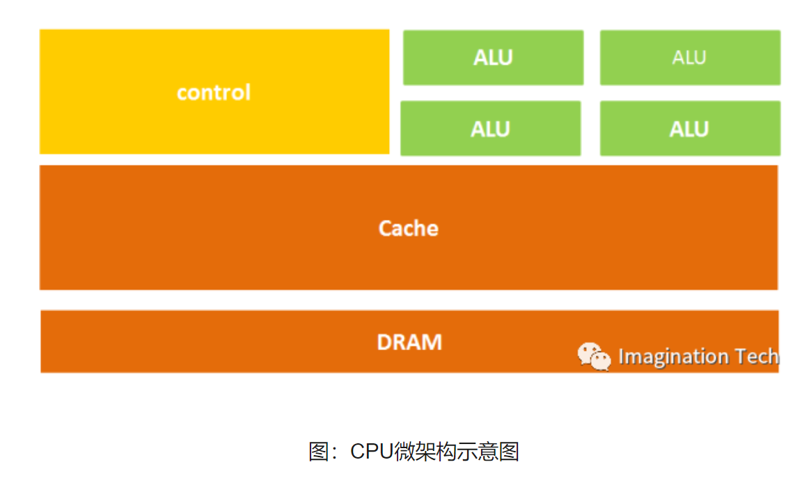
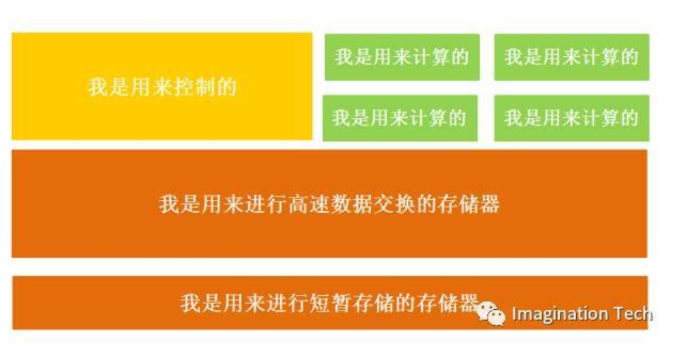
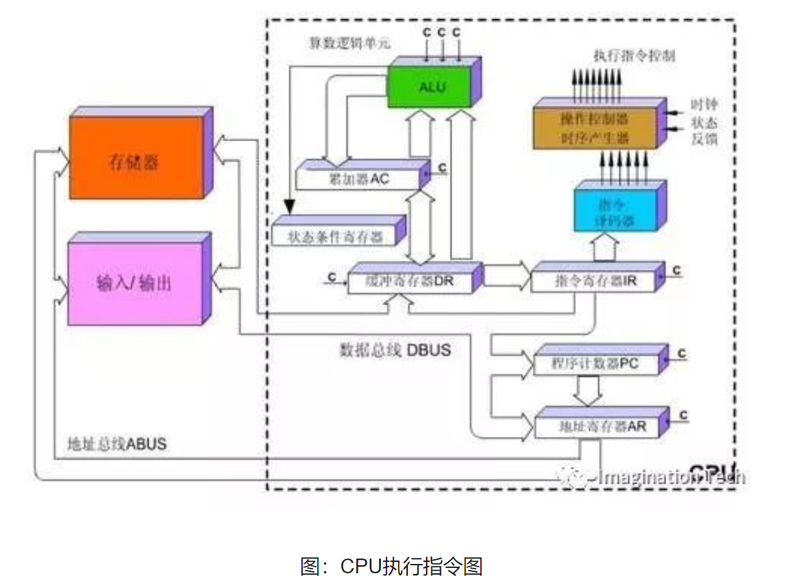
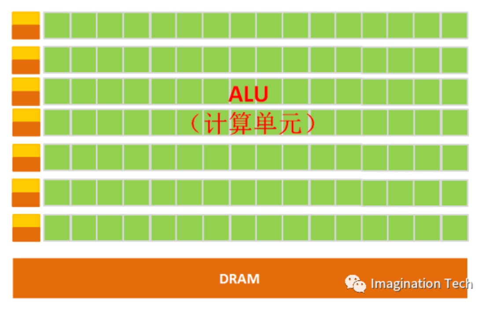

# 操作系统

参考资源：https://frank-lam.github.io/fullstack-tutorial/#/%E6%93%8D%E4%BD%9C%E7%B3%BB%E7%BB%9F

### CPU组成
CPU是由运算器和控制器这两个部分组成的。

1、运算器由算术逻辑单元（ALU）、累加器、状态寄存器、通用寄存器组等组成。算术逻辑运算单元（ALU）的基本功能为加、减、乘、除四则运算，与、或、非、异或等逻辑操作，以及移位、求补等操作。

计算机运行时，运算器的操作和操作种类由控制器决定。运算器处理的数据来自存储器；处理后的结果数据通常送回存储器，或暂时寄存在运算器中。与Control Unit共同组成了CPU的核心部分。

2、控制器分组合逻辑控制器和微程序控制器，两种控制器各有长处和短处。组合逻辑控制器设计麻烦，结构复杂，一旦设计完成，就不能再修改或扩充，但它的速度快。

微程序控制器设计方便，结构简单，修改或扩充都方便，修改一条机器指令的功能，只需重编所对应的微程序；

要增加一条机器指令，只需在控制存储器中增加一段微程序，但是，它是通过执行一段微程。具体对比如下：组合逻辑控制器又称硬布线控制器，由逻辑电路构成，完全靠硬件来实现指令的功能。

### 什么是CPU

参考资料：https://www.sohu.com/a/201309334_468740

CPU( Central Processing Unit, 中央处理器)就是机器的“大脑”，也是布局谋略、发号施令、控制行动的“总司令官”。

CPU的结构主要包括运算器（ALU, Arithmetic and Logic Unit）、控制单元（CU, Control Unit）、寄存器（Register）、高速缓存器（Cache）和它们之间通讯的数据、控制及状态的总线。

简单来说就是：计算单元、控制单元和存储单元

计算单元主要执行算术运算、移位等操作以及地址运算和转换；存储单元主要用于保存运算中产生的数据以及指令等；控制单元则对指令译码，并且发出为完成每条指令所要执行的各个操作的控制信号。

所以一条指令在CPU中执行的过程是这样的：读取到指令后，通过指令总线送到控制器（黄色区域）中进行译码，并发出相应的操作控制信号；然后运算器（绿色区域）按照操作指令对数据进行计算，并通过数据总线将得到的数据存入数据缓存器（大块橙色区域）。过程如下图所示：

因为CPU的架构中需要大量的空间去放置存储单元（橙色部分）和控制单元（黄色部分），相比之下计算单元（绿色部分）只占据了很小的一部分，所以它在大规模并行计算能力上极受限制，而更擅长于逻辑控制。

另外，因为遵循冯诺依曼架构（存储程序，顺序执行），CPU就像是个一板一眼的管家，人们吩咐的事情它总是一步一步来做。但是随着人们对更大规模与更快处理速度的需求的增加，这位管家渐渐变得有些力不从心。

于是，大家就想，能不能把多个处理器放在同一块芯片上，让它们一起来做事，这样效率不就提高了吗？

没错，GPU便由此诞生了。

### 什么是GPU

并行计算(Parallel Computing)是指同时使用多种计算资源解决计算问题的过程，是提高计算机系统计算速度和处理能力的一种有效手段。它的基本思想是用多个处理器来共同求解同一问题，即将被求解的问题分解成若干个部分，各部分均由一个独立的处理机来并行计算。

并行计算可分为时间上的并行和空间上的并行。

时间上的并行是指流水线技术。

空间上的并行是指多个处理机并发的执行计算，即通过网络将两个以上的处理机连接起来，达到同时计算同一个任务的不同部分，或者单个处理机无法解决的大型问题。

GPU全称为Graphics Processing Unit，中文为图形处理器，就如它的名字一样，GPU最初是用在个人电脑、工作站、游戏机和一些移动设备（如平板电脑、智能手机等）上运行绘图运算工作的微处理器。

但GPU无法单独工作，必须由CPU进行控制调用才能工作。CPU可单独作用，处理复杂的逻辑运算和不同的数据类型，但当需要大量的处理类型统一的数据时，则可调用GPU进行并行计算。

注：GPU中有很多的运算器ALU和很少的缓存cache，缓存的目的不是保存后面需要访问的数据的，这点和CPU不同，而是为线程thread提高服务的。如果有很多线程需要访问同一个相同的数据，缓存会合并这些访问，然后再去访问dram。

GPU就是用很多简单的计算单元去完成大量的计算任务，纯粹的人海战术。这种策略基于一个前提，任务之间是互相独立的。

GPU是为了图像处理而生的，但是我们通过前面的介绍可以发现，它在结构上并没有专门为图像服务的部件，只是对CPU的结构进行了优化与调整，所以现在GPU不仅可以在图像处理领域大显身手，它还被用来科学计算、密码破解、数值分析，海量数据处理（排序，Map-Reduce等），金融分析等需要大规模并行计算的领域。

### CPU和GPU的区别

CPU需要很强的通用性来处理各种不同的数据类型，同时又要逻辑判断又会引入大量的分支跳转和中断的处理。这些都使得CPU的内部结构异常复杂。而GPU面对的则是类型高度统一的、相互无依赖的大规模数据和不需要被打断的纯净的计算环境。