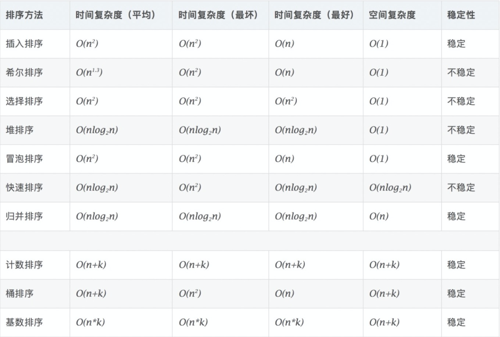

### 冒泡排序

每次两两比较，大的放到后面，第 i 轮找出 第 n - i 轮大的数

```js
function bubbleSort(arr) {
    // 外层，需要遍历的次数
    for(let i = 1; i < arr.length; i ++) {
        // 内层，每次比较
        for(let j = 0; j < arr.length - i; j ++) {
            if(arr[j] > arr[j + 1]) {
                let temp = arr[j]
                arr[j] = arr[j + 1]
                arr[j + 1] = temp;
            }
        }
    }
}
```


### 选择排序

每一轮从数组的未排序部分加一开始，找到一个最小的值的索引，然后与未排序将其放到未排序部分的最左位置。

```js
function selectionSort(arr) {
    // 选多少次
    for(let i = 0; i < arr.length - 1; i ++) {
        let minIndex = i;
        // 在arr[i + 1, ] 中找最小值索引， i+1 代表有序的下一个数，我们默认第一个元素是最小的
        for(let j = i + 1; j < arr.length; j ++) {
            if(arr[j] < arr[minIndex]) {
                minIndex = j;
            }
        }
        if(minIndex != i) {
            // 交换
            let temp = arr[minIndex]
            arr[minIndex] = arr[i]
            arr[i] = temp;
        }
    }
}
```

### 插入排序

为当前元素保存一个副本，依次向前遍历前面的元素是否比自己大，如果比自己大就直接把前一个元素赋值到当前元素的位置，当前某位置的元素不再比当前元素大的时候，将当前元素的值赋值到这个位置。

```js
function insertSort(arr) {
    for(let i = 1; i < arr.length; i++) {
        let j, temp = arr[i];
        for(j = i; j > 0 && arr[j - 1] > temp; j --) {
            arr[j] = arr[j - 1];
        }
        arr[j] = temp;
    }
}
```


### 快排

```js
/**
 * 将数组arr分为两部分，前一部分整体小于后一部分
 */
function partition(arr, left, right) {
    // 交换数组最左元素与数组的中间元素
    let midIndex = ((left + right) / 2) >> 0;
    swap(arr, left, midIndex)
    // 基准元素
    const flagItem = arr[left];
    let i = left + 1,
        j = right;
    while (true) {
        while (i <= right && arr[i] < flagItem) {
            i++;
        }
        while (j >= left && arr[j] > flagItem) {
            j--;
        }
        if (i > j) {
            break;
        } else {
            swap(arr, i, j);
            i++;
            j--;
        }
    }
    swap(arr, left, j);
    return j;
}

function quickSort(arr, left = 0, right = arr.length - 1) {
    if (left >= right) {
        return;
    }
    const mid = partition(arr, left, right);
    quickSort(arr, left, mid - 1);
    quickSort(arr, mid + 1, right);
}
```

### 归并排序

```cpp
/**
 * 归并数组的两个有序部分
 * 
 * 将arr[left, mid], arr[mid, right]两部分归并
 */
template <typename T>
void __merge(T arr[], int left,int mid, int right){
  
  T tempArr[right - left + 1]; //创建临时空间
  for (int i = left; i <= right; i++) {
    tempArr[i - left] = arr[i];
  }

  // i，j分别为数组两部分的游标
  int i = left, j = mid + 1;
  for(int k = left; k <= right; k++) {

    //考虑越界的情况
    if( i > mid ) {
      arr[k] = tempArr[j - left];
      j ++;
    } 
    else if(j > right) {
      arr[k] = tempArr[i - left];
      i ++;
    }
    //不越界
    else if(tempArr[i - left] < tempArr[j - left]) {
      arr[k] = tempArr[i - left];
      i ++;
    } else {
      arr[k] = tempArr[j - left];
      j ++;
    }
  }
}


/**
 * 递归使用归并排序，队arr[left, right]范围进行排序
 */
template <typename T>
void __mergeSort(T arr[], int left, int right){

  if (left >= right) {
    return;
  }

  int mid = (left + right) / 2;
  __mergeSort(arr, left, mid);
  __mergeSort(arr, mid + 1, right);
  //将两个数组进行归并
  if(arr[mid] > arr[mid+1]) { //这个判断可以很大程度提升再接近有序时的性能
    __merge(arr, left, mid, right);
  }
}
```

### 堆排序

```cpp
/**
 * shiftDown 沿着树不断调整位子 
 * 比较左右子树，是否有比自己大的，如果有就和大的那个交换位置
 * 使得大的再上，小的在下
 * 为了维持堆的特性，还得把那个交换到子树上的较小元素拿去尝试对他进行shiftDown
 */
template <typename T>
void __shiftDown(T arr, int pos, int len) {
  while(2 * pos + 1 < len){
    int j = pos * 2 + 1;  //默认左孩子
    if(j + 1 < len) { //如果有右孩子
      if(arr[j + 1] > arr[j]) {
        j += 1;
      }
    }
    if(arr[pos] < arr[j]) {
      swap(arr[pos], arr[j]);
      pos = j;  //--这步容易忘，因为是循环，所以每次都要对pos进行shiftDown--
    } else {
      break;
    }
  }
}
/**
 * 通用堆排序
 */
template <typename T>
void heapSort(T arr[], int n)
{
  //Heapify
  for(int i = (n-1)/2; i >= 0; i-- ) {
    __shiftDown(arr, i, n);
  }
  //出堆，放到数组末尾
  for(int i = n - 1; i > 0; i--){
    swap(arr[i], arr[0]);
    __shiftDown(arr, 0, i);
  }
}
```
