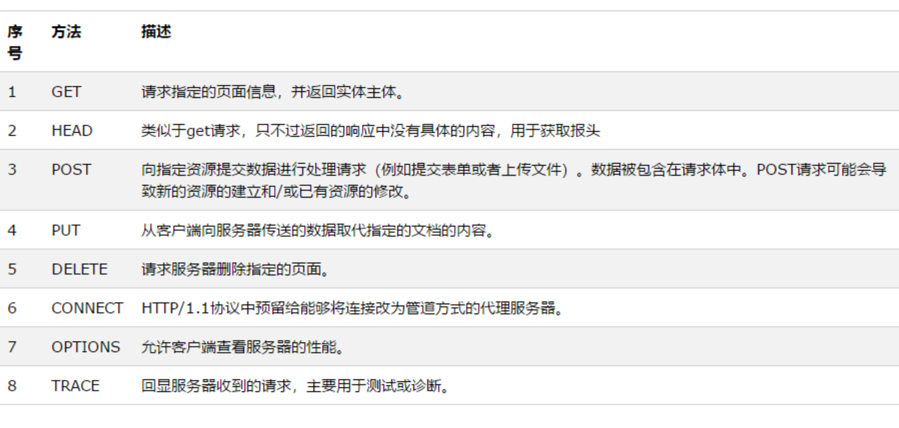
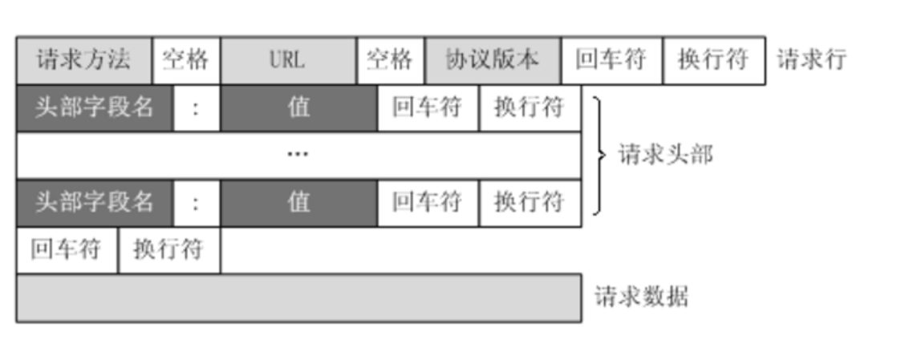
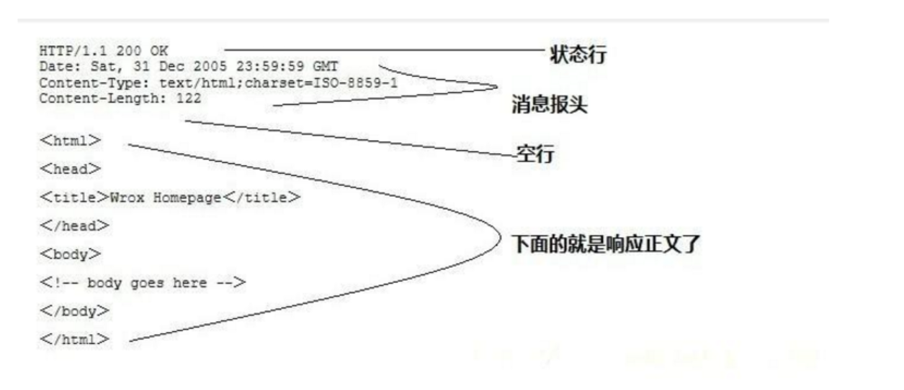

# HTTP

HTTP是Hyper Text Transfer Protocol（超文本传输协议）的缩写。它是一个应用层协议，由请求和响应构成，是一个标准的客户端服务器模型。HTTP是一个无状态的协议。

### HTTP 协议的特点

- 无连接
  - 限制每次连接只处理一个请求
- 无状态
  - 协议对于事务处理没有记忆能力。
- 简单快速
  - 客户向服务器请求服务时，只需传送请求方法和路径。
- 灵活
  - HTTP允许传输任意类型的数据对象。正在传输的类型由Content-Type加以标记。

### 请求报文
 - 请求行
   - 请求类型
   - 要访问的资源
   - HTTP协议版本号
 - 请求头
   - 用来说明服务器要使用的附加信息（一些键值对）
   - 例如：User-Agent、 Accept、Content-Type、Connection
 - 空行
   - 分割请求头与请求体
 - 请求体
   - 可以添加任意的其他数据

### 响应报文
 - 状态行
   - 状态码
   - 状态消息 
   - HTTP协议版本号
 - 消息报头
   - 说明客户端要使用的一些附加信息
   - 如：Content-Type、charset、响应的时间
 - 响应正文
   - 返回给客户端的文本信息 

### HTTP 方法
 - GET
   - 获取资源
 - POST
   - 传输资源
 - PUT
   - 更新资源
 - DELETE
   - 删除资源
 - HEAD
   - 获取报文首部

### Post 和 Get 的区别

 - GET在浏览器回退时是无害的，而POST会再次提交
 - Get请求能缓存，Post不能
 - Post相对Get相对安全一些，因为Get请求都包含在URL中，而且会被浏览器保存记录，Post不会。但是再抓包的情况下都是一样的。
 - Post 可以通过 request body来传输比 Get 更多的数据 
 - URL有长度限制，会影响 Get 请求，但是这个长度限制是浏览器规定的
 - Post 支持更多的编码类型且不对数据类型限制
 - POST，浏览器先发送header，服务器响应100 continue，浏览器再发送data，服务器响应200 ok(返回数据)

先引入副作用和幂等的概念。
副作用指对服务器上的资源做改变，搜索是无副作用的，注册是副作用的。
幂等指发送 M 和 N 次请求（两者不相同且都大于 1），服务器上资源的状态一致，比如注册 10 个和 11 个帐号是不幂等的，对文章进行更改 10 次和 11 次是幂等的。
在规范的应用场景上说，Get 多用于无副作用，幂等的场景，例如搜索关键字。Post 多用于副作用，不幂等的场景，例如注册。

### 常见状态码

#### 1XX 指示信息
表示请求已接收，继续处理

#### 2XX 成功
 - **200** OK
 - 204 No content，表示请求成功，但响应报文不含实体的主体部分
 - 205 Reset Content，表示请求成功，但响应报文不含实体的主体部分，但是与 204 响应不同在于要求请求方重置内容
 - **206** Partial Content，进行范围请求

#### 3XX 重定向
 - **301** 永久性重定向，表示资源已被分配了新的 URL
 - **302** 临时性重定向，表示资源临时被分配了新的 URL
 - 303 表示资源存在着另一个 URL，应使用 GET 方法获取资源
 - **304** 未修改，重定位到浏览器。自从上次请求后，请求的网页未修改过。服务器返回此响应时，不会返回网页内容。如果网页自请求者上次请求后再也没有更改过，您应将服务器配置为返回此响应（称为 If-Modified-Since HTTP 标头）。服务器可以告诉 Googlebot 自从上次抓取后网页没有变更，进而节省带宽和开销。
 - 307 临时重定向，和302含义类似，但是期望客户端保持请求方法不变向新的地址发出请求

#### 4XX 客户端错误
 - **404** 在服务器上没有找到请求的资源
 - **403** forbidden，表示对请求资源的访问被服务器拒绝
 - 400 请求报文存在语法错误
 - 401  表示发送的请求需要有通过 HTTP 认证的认证信息

#### 5XX 服务器错误
 - **500** 表示服务器端在执行请求时发生了错误
 - 501 表示服务器不支持当前请求所需要的某个功能
 - **503** 表明服务器暂时处于超负载或正在停机维护，无法处理请求

### HTTP持久连接（HTTP1.1支持）

HTTP协议采用“请求-应答”模式，并且HTTP是基于TCP进行连接的。普通模式（非keep-alive）时，每个请求或应答都需要建立一个连接，完成之后立即断开。

当使用`Conection: keep-alive`模式（又称持久连接、连接重用）时，keep-alive使客户端道服务器端连接持续有效，即不关闭底层的TCP连接，当出现对服务器的后继请求时，keep-alive功能避免重新建立连接。

### HTTP管线化 （HTTP1.1支持）

管线化后，请求和响应不再是依次交替的了。他可以支持一次性发送多个请求，并一次性接收多个响应。

 - 只有get与head请求可以进行管线化，POST有限制
 - 初次创建连接时不应该启动管线机制，因为服务器不一定支持该协议

### HTTP数据协商
在客户端向服务端发送请求的时候，客户端会申明可以接受的数据格式和数据相关的一些限制是什么样的；服务端在接受到这个请求时他会根据这个信息进行判断到底返回怎样的数据。

#### 请求
 - Accept 
   - 在请求中使用Accept可申明想要的数据格式
 - Accept-Encoding
   - 告诉服务端使用什么的方式来进行压缩
   - 例如：gzip、deflate、br
 - Accept-Language
   - 描述语言信息
 - User-Agent
   - 用来描述客户端浏览器相关信息
   - 可以用来区分PC端页面和移动端页面

#### 响应
 - Content-Type
   - 对应Accept，从请求中的Accept支持的数据格式中选一种来返回
 - Content-Encoding
   - 对应 Accept-Encoding，指服务端到底使用的是那种压缩方式
 - Content-Language
   - 对应Accept-Language

#### form 表单中enctype数据类型
 - `application/x-www-form-urlencoded`
   - key=value&key=value 格式
 - `multipart/form-data`
   - 用于提交文件
   - multipart表示请求是由多个部分组成（因为上传文件的时候文件不能以字符串形式提交，需要单独分出来）
   - boundary 用来分隔不同部分
 - `text/plain`

### HTTP Redirect 重定向
 - 302 暂时重定向
   - 浏览器每次访问都要先去目标网址访问，再重定向到新的网址
 - 301 永久重定向
   - 当浏览器收到的HTTP状态码为301时，下次访问对应网址就直接调整到新的网址，不会再访问原网址

### [HTTP CSP 内容安全策略](https://developer.mozilla.org/zh-CN/docs/Web/Security/CSP)

CSP Content-Security-Policy
 - 限制资源获取
 - 报告资源获取越权

例子：
 - `Content-Security-Policy: default-src http: https:` 表示只允许通过http、https的方式加载资源
 - `'Content-Security-Policy': 'default-src' \'self\'; form-action\'self\' '` 表示只能加载本域下的资源，只能向本域发送表单请求

## HTTP2
HTTP 2.0 相比于 HTTP 1.X，可以说是大幅度提高了 web 的性能。

HTTP2采用`二进制格式传输`，取代了HTTP1.x的文本格式，二进制格式解析更高效。
`多路复用`代替了HTTP1.x的序列和阻塞机制，所有的相同域名请求都通过同一个TCP连接并发完成。

### 二进制传输
HTTP 2.0 中所有加强性能的核心点在于此。在之前的 HTTP 版本中，我们是通过文本的方式传输数据。在 HTTP 2.0 中引入了新的编码机制，所有传输的数据都会被分割，并采用二进制格式编码。

### 多路复用
HTTP1.x中，并发多个请求需要多个TCP连接，浏览器为了控制资源会有6-8个TCP连接都限制。
HTTP2中
 - 同域名下所有通信都在单个连接上完成，消除了因多个 TCP 连接而带来的延时和内存消耗。
 - 单个连接上可以并行交错的请求和响应，之间互不干扰

在 HTTP 2.0 中，有两个非常重要的概念，分别是帧（frame）和流（stream）。

帧代表着最小的数据单位，每个帧会标识出该帧属于哪个流，流也就是多个帧组成的数据流。

**多路复用，就是在一个 TCP 连接中可以存在多条流。** 换句话说，也就是可以发送多个请求，对端可以通过帧中的标识知道属于哪个请求。通过这个技术，可以避免 HTTP 旧版本中的队头阻塞问题，极大的提高传输性能。

### Header 压缩

在 HTTP 1.X 中，我们使用文本的形式传输 header，在 header 携带 cookie 的情况下，可能每次都需要重复传输几百到几千的字节。

在 HTTP 2.0 中，使用了 HPACK 压缩格式对传输的 header 进行编码，减少了 header 的大小。并在两端维护了索引表，用于记录出现过的 header ，后面在传输过程中就可以传输已经记录过的 header 的键名，对端收到数据后就可以通过键名找到对应的值。

### 服务端 Push
在 HTTP 2.0 中，服务端可以在客户端某个请求后，主动推送其他资源。

可以想象以下情况，某些资源客户端是一定会请求的，这时就可以采取服务端 push 的技术，提前给客户端推送必要的资源，这样就可以相对减少一点延迟时间。当然在浏览器兼容的情况下你也可以使用 prefetch。

### HTTP首部

|     通用字段      |                       作用                       |
| :---------------: | :----------------------------------------------: |
|   Cache-Control   |                  控制缓存的行为                  |
|    Connection     | 浏览器想要优先使用的连接类型，比如  `keep-alive` |
|       Date        |                   创建报文时间                   |
|      Pragma       |                     报文指令                     |
|        Via        |                代理服务器相关信息                |
| Transfer-Encoding |                   传输编码方式                   |
|      Upgrade      |                要求客户端升级协议                |
|      Warning      |               在内容中可能存在错误               |

|      请求字段       |                作用                |
| :-----------------: | :--------------------------------: |
|       Accept        |        能正确接收的媒体类型        |
|   Accept-Charset    |         能正确接收的字符集         |
|   Accept-Encoding   |      能正确接收的编码格式列表      |
|   Accept-Language   |        能正确接收的语言列表        |
|       Expect        |        期待服务端的指定行为        |
|        From         |           请求方邮箱地址           |
|        Host         |            服务器的域名            |
|      If-Match       |          两端资源标记比较          |
|  If-Modified-Since  | 本地资源未修改返回 304（比较时间） |
|    If-None-Match    | 本地资源未修改返回 304（比较标记） |
|     User-Agent      |             客户端信息           |
|    Max-Forwards     |    限制可被代理及网关转发的次数    |
| Proxy-Authorization |      向代理服务器发送验证信息      |
|        Range        |        请求某个内容的一部分        |
|       Referer       |    表示浏览器所访问的前一个页面    |
|         TE          |            传输编码方式          |

|      响应字段      |            作用            |
| :----------------: | :------------------------: |
|   Accept-Ranges    |   是否支持某些种类的范围   |
|        Age         | 资源在代理缓存中存在的时间 |
|        ETag        |          资源标识          |
|      Location      |   客户端重定向到某个 URL   |
| Proxy-Authenticate |  向代理服务器发送验证信息  |
|       Server       |         服务器名字         |
|  WWW-Authenticate  |   获取资源需要的验证信息   |

|     实体字段     |              作用              |
| :--------------: | :----------------------------: |
|      Allow       |       资源的正确请求方式       |
| Content-Encoding |         内容的编码格式         |
| Content-Language |         内容使用的语言         |
|  Content-Length  |       request body 长度        |
| Content-Location |       返回数据的备用地址       |
|   Content-MD5    | Base64加密格式的内容 MD5检验值 |
|  Content-Range   |         内容的位置范围         |
|   Content-Type   |         内容的媒体类型         |
|     Expires      |         内容的过期时间         |
|  Last_modified   |       内容的最后修改时间       |

### http请求的方法

用来表明Request-URL指定的资源不同的操作方式

http1.0 Get ,Post,Head

http1.1新增了5种，options,put ,delete,trace,connect

1、OPTIONS
返回服务器针对特定资源所支持的HTTP请求方法，也可以利用向web服务器发送‘*’的请求来测试服务器的功能性
2、HEAD
向服务器索与GET请求相一致的响应，只不过响应体将不会被返回。这一方法可以再不必传输整个响应内容的情况下，就可以获取包含在响应小消息头中的元信息。
3、GET
向特定的资源发出请求。注意：GET方法不应当被用于产生“副作用”的操作中，例如在Web Application中，其中一个原因是GET可能会被网络蜘蛛等随意访问。Loadrunner中对应get请求函数：web_link和web_url
4、POST
向指定资源提交数据进行处理请求（例如提交表单或者上传文件）。数据被包含在请求体中。POST请求可能会导致新的资源的建立和/或已有资源的修改。 Loadrunner中对应POST请求函数：web_submit_data,web_submit_form
5、PUT
向指定资源位置上传其最新内容
6、DELETE
请求服务器删除Request-URL所标识的资源
7、TRACE
回显服务器收到的请求，主要用于测试或诊断
8、CONNECT
HTTP/1.1协议中预留给能够将连接改为管道方式的代理服务器。
注意：
1）方法名称是区分大小写的，当某个请求所针对的资源不支持对应的请求方法的时候，服务器应当返回状态码405（Mothod Not Allowed）；当服务器不认识或者不支持对应的请求方法时，应返回状态码501（Not Implemented）。
2）HTTP服务器至少应该实现GET和HEAD/POST方法，其他方法都是可选的，此外除上述方法，特定的HTTP服务器支持扩展自定义的方法。
HTTP工作原理
HTTP协议定义Web客户端如何从Web服务器请求Web页面，以及服务器如何把Web页面传送给客户端。HTTP协议采用了请求/响应模型。客户端向服务器发送一个请求报文，请求报文包含请求的方法、URL、协议版本、请求头部和请求数据。服务器以一个状态行作为响应，响应的内容包括协议的版本、成功或者错误代码、服务器信息、响应头部和响应数据。

请求Request

请求消息Response

