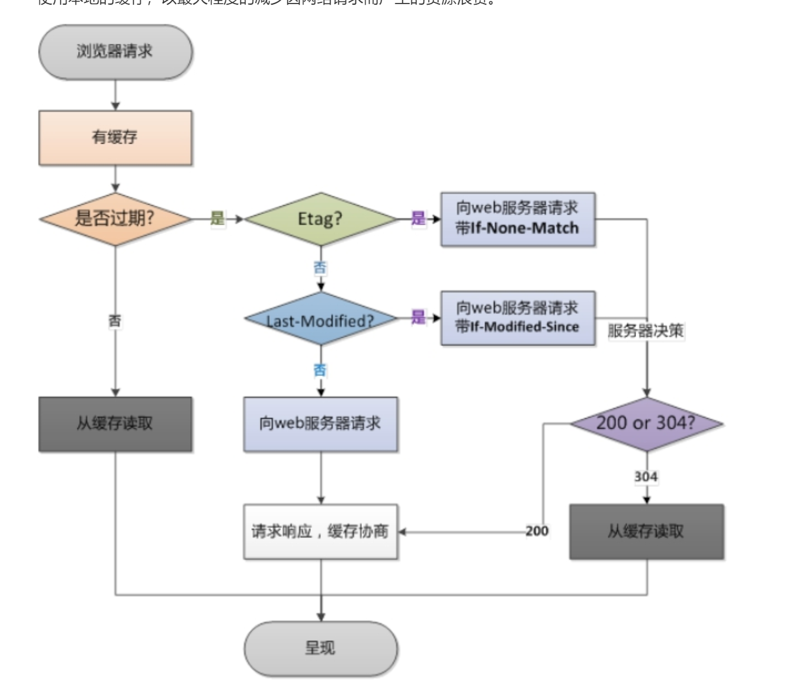
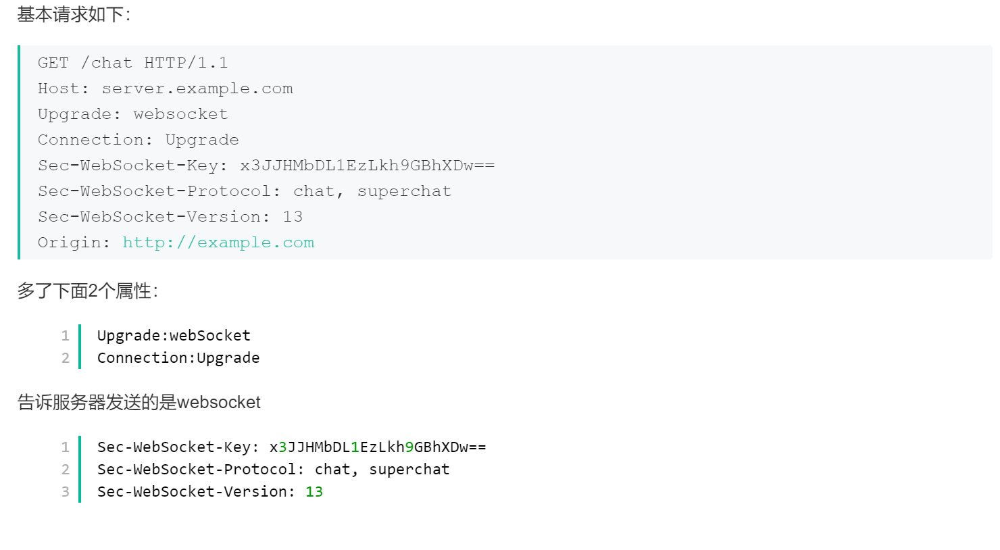
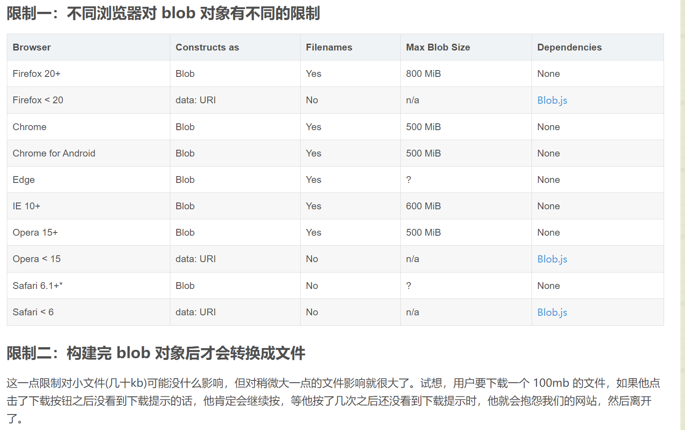

### 1.http和https

#### 基本概念

http是超文本传输协议，是一个客户端和服务端请求和应答的标准（TCP）

https是在http下加入SSL层，主要作用是建立一个信息安全通道，来确保数组的传输，确保网站真实性。

#### 主要区别

Https协议需要ca证书，费用较高。

http是超文本传输协议，信息是明文传输，https则是具有安全性的ssl加密传输协议。

使用不同的链接方式，端口也不同，一般而言，http协议的端口为80，https的端口为443

http的连接很简单，是无状态的；HTTPS协议是由SSL+HTTP协议构建的可进行加密传输、身份认证的网络协议，比http协议安全。

#### https 协议的工作原理

客户端使用https url 访问服务器，要求Web服务器建立ssl链接。

web服务器接收到客户端的请求之后，会将网站的证书（证书中包含了公钥），返回或者说传输给客户端。

客户端和web服务器端开始协商SSL链接的安全等级，也就是加密等级。

客户端浏览器通过双方协商一致的安全等级，建立会话密钥，然后通过网站的公钥来加密会话密钥，并传送给网站。

web服务器通过自己的私钥解密出会话密钥。

web服务器通过会话密钥加密与客户端之间的通信。

#### https优缺点

##### (1)https协议的优点

1. 使用HTTPS协议可认证用户和服务器，确保数据发送到正确的客户机和服务器；
2. HTTPS协议是由SSL+HTTP协议构建的可进行加密传输、身份认证的网络协议，要比http协议安全，可防止数据在传输过程中不被窃取、改变，确保数据的完整性。
3. HTTPS是现行架构下最安全的解决方案，虽然不是绝对安全，但它大幅增加了中间人攻击的成本。

##### (2)https协议的缺点

1. https握手阶段比较费时，会使页面加载时间延长50%，增加10%~20%的耗电。
2. https缓存不如http高效，会增加数据开销。
3. SSL证书也需要钱，功能越强大的证书费用越高。
4. SSL证书需要绑定IP，不能再同一个ip上绑定多个域名，ipv4资源支持不了这种消耗。

#### http2.0

简要概括：http2.0是基于1999年发布的http1.0之后的首次更新。

提升访问速度（可以对于，请求资源所需时间更少，访问速度更快，相比http1.0）

允许多路复用：多路复用允许同时通过单一的HTTP/2连接发送多重请求-响应信息。改善了：在http1.1中，浏览器客户端在同一时间，针对同一域名下的请求有一定数量限制（连接数量），超过限制会被阻塞。

二进制分帧：HTTP2.0会将所有的传输信息分割为更小的信息或者帧，并对他们进行二进制编码

首部压缩

服务器端推送

#### http状态码

100  Continue  继续。客户端应继续其请求

101  Switching Protocols  切换协议。服务器根据客户端的请求切换协议。只能切换到更高级的协议，例如，切换到HTTP的新版本协议

200  OK  请求成功。一般用于GET与POST请求

201  Created  已创建。成功请求并创建了新的资源

202  Accepted  已接受。已经接受请求，但未处理完成

203  Non-Authoritative Information  非授权信息。请求成功。但返回的meta信息不在原始的服务器，而是一个副本

204  No Content  无内容。服务器成功处理，但未返回内容。在未更新网页的情况下，可确保浏览器继续显示当前文档

205  Reset Content  重置内容。服务器处理成功，用户终端（例如：浏览器）应重置文档视图。可通过此返回码清除浏览器的表单域

206  Partial Content  部分内容。服务器成功处理了部分GET请求

300  Multiple Choices  多种选择。请求的资源可包括多个位置，相应可返回一个资源特征与地址的列表用于用户终端（例如：浏览器）选择

301  Moved Permanently  永久移动。请求的资源已被永久的移动到新URI，返回信息会包括新的URI，浏览器会自动定向到新URI。今后任何新的请求都应使用新的URI代替

302  Found  临时移动。与301类似。但资源只是临时被移动。客户端应继续使用原有URI

303  See Other  查看其它地址。与301类似。使用GET和POST请求查看

304  Not Modified  未修改。所请求的资源未修改，服务器返回此状态码时，不会返回任何资源。客户端通常会缓存访问过的资源，通过提供一个头信息指出客户端希望只返回在指定日期之后修改的资源

305  Use Proxy  使用代理。所请求的资源必须通过代理访问

306  Unused  已经被废弃的HTTP状态码

307  Temporary Redirect  临时重定向。与302类似。使用GET请求重定向

400  Bad Request  客户端请求的语法错误，服务器无法理解

401  Unauthorized  请求要求用户的身份认证

402  Payment Required  保留，将来使用

403  Forbidden  服务器理解请求客户端的请求，但是拒绝执行此请求

404  Not Found  服务器无法根据客户端的请求找到资源（网页）。通过此代码，网站设计人员可设置"您所请求的资源无法找到"的个性页面

405  Method Not Allowed  客户端请求中的方法被禁止

406  Not Acceptable  服务器无法根据客户端请求的内容特性完成请求

407  Proxy Authentication Required  请求要求代理的身份认证，与401类似，但请求者应当使用代理进行授权

408  Request Time-out  服务器等待客户端发送的请求时间过长，超时

409  Conflict  服务器完成客户端的PUT请求是可能返回此代码，服务器处理请求时发生了冲突

410  Gone  客户端请求的资源已经不存在。410不同于404，如果资源以前有现在被永久删除了可使用410代码，网站设计人员可通过301代码指定资源的新位置

411  Length Required  服务器无法处理客户端发送的不带Content-Length的请求信息

412  Precondition Failed  客户端请求信息的先决条件错误

413  Request Entity Too Large  由于请求的实体过大，服务器无法处理，因此拒绝请求。为防止客户端的连续请求，服务器可能会关闭连接。如果只是服务器暂时无法处理，则会包含一个Retry-After的响应信息

414  Request-URI Too Large  请求的URI过长（URI通常为网址），服务器无法处理

415  Unsupported Media Type  服务器无法处理请求附带的媒体格式

416  Requested range not satisfiable  客户端请求的范围无效

417  Expectation Failed  服务器无法满足Expect的请求头信息

500  Internal Server Error  服务器内部错误，无法完成请求

501  Not Implemented  服务器不支持请求的功能，无法完成请求

502  Bad Gateway  作为网关或者代理工作的服务器尝试执行请求时，从远程服务器接收到了一个无效的响应

503  Service Unavailable  由于超载或系统维护，服务器暂时的无法处理客户端的请求。延时的长度可包含在服务器的Retry-After头信息中

504  Gateway Time-out  充当网关或代理的服务器，未及时从远端服务器获取请求

505  HTTP Version not supported  服务器不支持请求的HTTP协议的版本，无法完成处理


总结：

301比较常用的场景是使用域名跳转。

302用来做临时跳转 比如未登陆的用户访问用户中心重定向到登录页面。

状态码200：请求已成功，请求所希望的响应头或数据体将随此响应返回。即返回的数据为全量的数据，如果文件不通过GZIP压缩的话，文件是多大，则要有多大传输量。

状态码304：如果客户端发送了一个带条件的 GET 请求且该请求已被允许，而文档的内容（自上次访问以来或者根据请求的条件）并没有改变，则服务器应当返回这个状态码。即客户端和服务器端只需要传输很少的数据量来做文件的校验，如果文件没有修改过，则不需要返回全量的数据。

#### http请求头

| 协议头              | 说明                                                         |
| ------------------- | ------------------------------------------------------------ |
| Accept              | 可接受的响应内容类型（Content-Types）。                      |
| Accept-Charset      | 可接受的字符集                                               |
| Accept-Encoding     | 可接受的响应内容的编码方式。                                 |
| Accept-Language     | 可接受的响应内容语言列表。                                   |
| Accept-Datetime     | 可接受的按照时间来表示的响应内容版本                         |
| Authorization       | 用于表示HTTP协议中需要认证资源的认证信息                     |
| Cache-Control       | 用来指定当前的请求/回复中的，是否使用缓存机制。              |
| Connection          | 客户端（浏览器）想要优先使用的连接类型                       |
| Cookie              | 由之前服务器通过Set-Cookie（见下文）设置的一个HTTP协议Cookie |
| Content-Length      | 以8进制表示的请求体的长度                                    |
| Content-MD5         | 请求体的内容的二进制 MD5 散列值（数字签名），以 Base64 编码的结果 |
| Content-Type        | 请求体的MIME类型 （用于POST和PUT请求中）                     |
| Date                | 发送该消息的日期和时间（以[RFC 7231](https://www.nowcoder.com/tutorial/96/24304825a0c04ea9a53cdb09cb664834#section-7.1.1.1)中定义的"HTTP日期"格式来发送） |
| Expect              | 表示客户端要求服务器做出特定的行为                           |
| From                | 发起此请求的用户的邮件地址                                   |
| Host                | 表示服务器的域名以及服务器所监听的端口号。如果所请求的端口是对应的服务的标准端口（80），则端口号可以省略。 |
| If-Match            | 仅当客户端提供的实体与服务器上对应的实体相匹配时，才进行对应的操作。主要用于像 PUT 这样的方法中，仅当从用户上次更新某个资源后，该资源未被修改的情况下，才更新该资源。 |
| If-Modified-Since   | 允许在对应的资源未被修改的情况下返回304未修改                |
| If-None-Match       | 允许在对应的内容未被修改的情况下返回304未修改（ 304 Not Modified ），参考 超文本传输协议 的实体标记 |
| If-Range            | 如果该实体未被修改过，则向返回所缺少的那一个或多个部分。否则，返回整个新的实体 |
| If-Unmodified-Since | 仅当该实体自某个特定时间以来未被修改的情况下，才发送回应。   |
| Max-Forwards        | 限制该消息可被代理及网关转发的次数。                         |
| Origin              | 发起一个针对[跨域资源共享](http://itbilu.com/javascript/js/VkiXuUcC.html)的请求（该请求要求服务器在响应中加入一个Access-Control-Allow-Origin的消息头，表示访问控制所允许的来源）。 |
| Pragma              | 与具体的实现相关，这些字段可能在请求/回应链中的任何时候产生。 |
| Proxy-Authorization | 用于向代理进行认证的认证信息。                               |
| Range               | 表示请求某个实体的一部分，字节偏移以0开始。                  |
| Referer             | 表示浏览器所访问的前一个页面，可以认为是之前访问页面的链接将浏览器带到了当前页面。Referer其实是Referrer这个单词，但RFC制作标准时给拼错了，后来也就将错就错使用Referer了。 |
| TE                  | 浏览器预期接受的传输时的编码方式：可使用回应协议头Transfer-Encoding中的值（还可以使用"trailers"表示数据传输时的分块方式）用来表示浏览器希望在最后一个大小为0的块之后还接收到一些额外的字段。 |
| User-Agent          | 浏览器的身份标识字符串                                       |
| Upgrade             | 要求服务器升级到一个高版本协议。                             |
| Via                 | 告诉服务器，这个请求是由哪些代理发出的。                     |
| Warning             | 一个一般性的警告，表示在实体内容体中可能存在错误。           |

#### 缓存

https://segmentfault.com/a/1190000008956069

| 获取资源形式 | 状态码   | 发送请求到服务器    |                                  |
| ------------ | -------- | ------------------- | -------------------------------- |
| 强缓存       | 从缓存取 | 200（from cache）   | 否，直接从缓存取                 |
| 协商缓存     | 从缓存取 | 304（not modified） | 是，通过服务器来告知缓存是否可用 |

强缓存相关字段有expires，cache-control。如果cache-control与expires同时存在的话，cache-control的优先级高于expires。

协商缓存相关字段有Last-Modified/If-Modified-Since，Etag/If-None-Match



####  GET和POST的区别

get参数通过url传递，post放在request body中。

get请求在url中传递的参数是有长度限制的，而post没有。

get比post更不安全，因为参数直接暴露在url中，所以不能用来传递敏感信息。

get请求只能进行url编码，而post支持多种编码方式

get请求会浏览器主动cache，而post支持多种编码方式。

get请求参数会被完整保留在浏览历史记录里，而post中的参数不会被保留。

GET和POST本质上就是TCP链接，并无差别。但是由于HTTP的规定和浏览器/服务器的限制，导致他们在应用过程中体现出一些不同。

GET产生一个TCP数据包；POST产生两个TCP数据包。

### 2.TCP和UDP

#### TCP三次握手

第一次握手：C客户端请求连接S，S可以确认自己可以接受C发送的报文段

第二次握手：C可以确定S收到了自己发送的报文段并且自己可以接受S发送的报文

第三次握手：S可以确定C收到了自己发送的报文段

#### TCP和UDP的区别

（1）TCP是面向连接的，udp是无连接的即发送数据前不需要先建立链接。

（2）TCP提供可靠的服务。也就是说，通过TCP连接传送的数据，无差错，不丢失，不重复，且按序到达;UDP尽最大努力交付，即不保证可靠交付。 并且因为tcp可靠，面向连接，不会丢失数据因此适合大数据量的交换。

（3）TCP是面向字节流，UDP面向报文，并且网络出现拥塞不会使得发送速率降低（因此会出现丢包，对实时的应用比如IP电话和视频会议等）。

（4）TCP只能是1对1的，UDP支持1对1,1对多。

（5）TCP的首部较大为20字节，而UDP只有8字节。

（6）TCP是面向连接的可靠性传输，而UDP是不可靠的。

### 3.WebSocket

#### 基本概念

(1)什么是WebSocket?

WebSocket是HTML5中的协议，支持持久连续，http协议不支持持久性连接。Http1.0和HTTP1.1都不支持持久性的链接，HTTP1.1中的keep-alive，将多个http请求合并为1个

(2)WebSocket是什么样的协议，具体有什么优点？

HTTP的生命周期通过Request来界定，也就是Request一个Response，那么在Http1.0协议中，这次Http请求就结束了。在Http1.1中进行了改进，是的有一个connection：Keep-alive，也就是说，在一个Http连接中，可以发送多个Request，接收多个Response。但是必须记住，在Http中一个Request只能对应有一个Response，而且这个Response是被动的，不能主动发起。

WebSocket是基于Http协议的，或者说借用了Http协议来完成一部分握手，在握手阶段与Http是相同的。我们来看一个websocket握手协议的实现，基本是2个属性，upgrade，connection。



### 4.浏览器BOM

#### 常用属性

什么是Bom? Bom是浏览器对象。有哪些常用的Bom属性呢？

(1)location对象

location.href-- 返回或设置当前文档的URL
location.search -- 返回URL中的查询字符串部分。例如 http://www.dreamdu.com/dreamdu.php?id=5&name=dreamdu 返回包括(?)后面的内容?id=5&name=dreamdu
location.hash -- 返回URL#后面的内容，如果没有#，返回空
location.host -- 返回URL中的域名部分，例如[www.dreamdu.com](http://www.dreamdu.com/)
location.hostname -- 返回URL中的主域名部分，例如dreamdu.com
location.pathname -- 返回URL的域名后的部分。例如 http://www.dreamdu.com/xhtml/ 返回/xhtml/
location.port -- 返回URL中的端口部分。例如 http://www.dreamdu.com:8080/xhtml/ 返回8080
location.protocol -- 返回URL中的协议部分。例如 http://www.dreamdu.com:8080/xhtml/ 返回(//)前面的内容http:
location.assign -- 设置当前文档的URL
location.replace() -- 设置当前文档的URL，并且在history对象的地址列表中移除这个URL location.replace(url);
location.reload() -- 重载当前页面

(2)history对象

history.go() -- 前进或后退指定的页面数 history.go(num);
history.back() -- 后退一页
history.forward() -- 前进一页

(3)Navigator对象

navigator.userAgent -- 返回用户代理头的字符串表示(就是包括浏览器版本信息等的字符串)
navigator.cookieEnabled -- 返回浏览器是否支持(启用)cookie

### 5.Cookie、sessionStorage、localStorage

#### 区别

共同点：都是保存在浏览器端，并且是同源的

Cookie：cookie数据始终在同源的http请求中携带（即使不需要），即cookie在浏览器和服务器间来回传递。而sessionStorage和localStorage不会自动把数据发给服务器，仅在本地保存。cookie数据还有路径（path）的概念，可以限制cookie只属于某个路径下,存储的大小很小只有4K左右。 （key：可以在浏览器和服务器端来回传递，存储容量小，只有大约4K左右）

sessionStorage：仅在当前浏览器窗口关闭前有效，自然也就不可能持久保持，localStorage：始终有效，窗口或浏览器关闭也一直保存，因此用作持久数据；cookie只在设置的cookie过期时间之前一直有效，即使窗口或浏览器关闭。（key：本身就是一个回话过程，关闭浏览器后消失，session为一个回话，当页面不同即使是同一页面打开两次，也被视为同一次回话）

localStorage：localStorage 在所有同源窗口中都是共享的；cookie也是在所有同源窗口中都是共享的。（key：同源窗口都会共享，并且不会失效，不管窗口或者浏览器关闭与否都会始终生效）

补充说明一下cookie的作用：

保存用户登录状态。例如将用户id存储于一个cookie内，这样当用户下次访问该页面时就不需要重新登录了，现在很多论坛和社区都提供这样的功能。 cookie还可以设置过期时间，当超过时间期限后，cookie就会自动消失。因此，系统往往可以提示用户保持登录状态的时间：常见选项有一个月、三个 月、一年等。

跟踪用户行为。例如一个天气预报网站，能够根据用户选择的地区显示当地的天气情况。如果每次都需要选择所在地是烦琐的，当利用了cookie后就会显得很人性化了，系统能够记住上一次访问的地区，当下次再打开该页面时，它就会自动显示上次用户所在地区的天气情况。因为一切都是在后台完成，所以这样的页面就像为某个用户所定制的一样，使用起来非常方便定制页面。如果网站提供了换肤或更换布局的功能，那么可以使用cookie来记录用户的选项，例如：背景色、分辨率等。当用户下次访问时，仍然可以保存上一次访问的界面风格。

1、生命周期：

Cookie：可设置失效时间，否则默认为关闭浏览器后失效

Localstorage:除非被手动清除，否则永久保存

Sessionstorage：仅在当前网页会话下有效，关闭页面或浏览器后就会被清除

2、存放数据：

Cookie：4k左右

Localstorage和sessionstorage：可以保存5M的信息

3、http请求：

Cookie：每次都会携带在http头中，如果使用cookie保存过多数据会带来性能问题

其他两个：仅在客户端即浏览器中保存，不参与和服务器的通信

4、易用性：

Cookie：需要程序员自己封装，原生的cookie接口不友好

其他两个：即可采用原生接口，亦可再次封装

5、应用场景：

从安全性来说，因为每次http请求都回携带cookie信息，这样子浪费了带宽，所以cookie应该尽可能的少用，此外cookie还需要指定作用域，不可以跨域调用，限制很多，但是用户识别用户登陆来说，cookie还是比storage好用，其他情况下可以用storage，localstorage可以用来在页面传递参数，sessionstorage可以用来保存一些临时的数据，防止用户刷新页面后丢失了一些参数，

#### Cookie如何防范XSS攻击

XSS（跨站脚本攻击）是指攻击者在返回的HTML中嵌入javascript脚本，为了减轻这些攻击，需要在HTTP头部配上，set-cookie：

httponly-这个属性可以防止XSS,它会禁止javascript脚本来访问cookie。

secure - 这个属性告诉浏览器仅在请求为https的时候发送cookie。

结果应该是这样的：Set-Cookie=<cookie-value>.....

#### Cookie和session

1. cookie数据存放在客户的浏览器上，session数据放在服务器上。

2. cookie不是很安全，别人可以分析存放在本地的COOKIE并进行COOKIE欺骗
   考虑到安全应当使用session。

3. session会在一定时间内保存在服务器上。当访问增多，会比较占用你服务器的性能
   考虑到减轻服务器性能方面，应当使用COOKIE。

4. 单个cookie保存的数据不能超过4K，很多浏览器都限制一个站点最多保存20个cookie。

### 6.网络攻击与防护

#### CSRF&XSS

##### CSRF：

跨站请求伪造，可以理解为攻击者盗用了用户的身份，以用户的名义发送了恶意请求，比如用户登录了一个网站后，立刻在另一个ｔａｂ页面访问量攻击者用来制造攻击的网站，这个网站要求访问刚刚登陆的网站，并发送了一个恶意请求，这时候CSRF就产生了，比如这个制造攻击的网站使用一张图片，但是这种图片的链接却是可以修改数据库的，这时候攻击者就可以以用户的名义操作这个数据库，

在受害者访问一个网站时，其 Cookie 还没有过期的情况下，攻击者伪造一个链接地址发送受害者并欺骗让其点击，从而形成 CSRF 攻击。

防御CSRF 攻击主要有三种策略：验证 HTTP Referer 字段；在请求地址中添加 token 并验证；在 HTTP 头中自定义属性并验证

##### XSS：

跨站脚本攻击，是说攻击者通过注入恶意的脚本，在用户浏览网页的时候进行攻击，

中文名为跨站脚本, 是发生在目标用户的浏览器层面上的，当渲染DOM树的过程成发生了不在预期内执行的JS代码时，就发生了XSS攻击。大多数XSS攻击的主要方式是嵌入一段远程或者第三方域上的JS代码。实际上是在目标网站的作用域下执行了这段js代码。

比如获取cookie，或者其他用户身份信息，可以分为存储型和反射型，存储型是攻击者输入一些数据并且存储到了数据库中，其他浏览者看到的时候进行攻击，反射型的话不存储在数据库中，往往表现为将攻击代码放在url地址的请求参数中，

XSS防御的总体思路是：对输入(和URL参数)进行过滤，对输出进行编码。也就是对提交的所有内容进行过滤，对url中的参数进行过滤，过滤掉会导致脚本执行的相关内容；然后对动态输出到页面的内容进行html编码，使脚本无法在浏览器中执行。虽然对输入过滤可以被绕过，但是也还是会拦截很大一部分的XSS攻击。

防御的话为cookie设置httpOnly属性，对用户的输入进行检查，进行特殊字符过滤

### 7.其他问题

#### 状态码产生原因及解决方案

(1)400状态码：请求无效

产生原因：

前端提交数据的字段名称和字段类型与后台的实体没有保持一致

前端提交到后台的数据应该是json字符串类型，但是前端没有将对象JSON.stringify转化成字符串。

解决方法：

对照字段的名称，保持一致性

将obj对象通过JSON.stringify实现序列化

(2)401状态码：当前请求需要用户验证

(3)403状态码：服务器已经得到请求，但是拒绝执行


#### fetch发送2次请求的原因

fetch发送post请求的时候，总是发送2次，第一次状态码是204，第二次才成功？

原因很简单，因为你用fetch的post请求的时候，导致fetch 第一次发送了一个Options请求，询问服务器是否支持修改的请求头，如果服务器支持，则在第二次中发送真正的请求。


#### 点击下载后台图片或资源

##### 1.使用canvas

```javascript
downloadIamge(imgsrc, name) {//下载图片地址和图片名  
  let image = new Image();  
  // 解决跨域 Canvas 污染问题  
  image.setAttribute("crossOrigin", "anonymous");  
  image.onload = function() {  
    let canvas = document.createElement("canvas");  
    canvas.width = image.width;  
    canvas.height = image.height;  
    let context = canvas.getContext("2d");  
    context.drawImage(image, 0, 0, image.width, image.height);  
    let url = canvas.toDataURL("image/png"); //得到图片的base64编码数据  
    let a = document.createElement("a"); // 生成一个a元素  
    let event = new MouseEvent("click"); // 创建一个单击事件  
    a.download = name || "photo"; // 设置图片名称  
    a.href = url; // 将生成的URL设置为a.href属性  
    a.dispatchEvent(event); // 触发a的单击事件  
  };  
  image.src = imgsrc;  
},  

```

##### 2.blob方式下载

```js
  fetch('http://somehost/somefile.zip').then(res => res.blob().then(blob => {  
  var a = document.createElement('a');  
  var url = window.URL.createObjectURL(blob);  
  var filename = 'myfile.zip';  
  a.href = url;  
  a.download = filename;  
  a.click();  
  window.URL.revokeObjectURL(url);  
}))  

```



##### 3.需要权限校验

```
fetch('http://somehost/check-permission', options).then(res => {  
  if (res.code === 0) {  
  var a = document.createElement('a');  
  var url = res.data.url;  
  var filename = 'myfile.zip';  
  a.href = url;  
  a.download = filename;  
  a.click();  
  } else {  
  alert('You have no permission to download the file!');  
  }  
});
```

